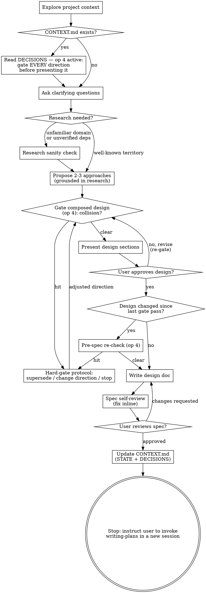

# Brainstorming Early Gate Implementation Plan

> **For agentic workers:** REQUIRED SUB-SKILL: Use superpowers:subagent-driven-development (recommended) or superpowers:executing-plans to implement this plan task-by-task.
> **Workspace exception (overrides the default worktree flow):** execute this plan on a new branch `feat/brainstorm-early-gate` created **in the main checkout** of `<repo>` — do NOT create a separate worktree. Reason: `~/prjs/skills/docs/marketplace/superpowers` is a symlink to that checkout, so it IS the live plugin; the eval scenarios (`claude -p` sessions) load skills through the plugin and must see the edited files. A worktree would test the wrong (unmodified) skills. Create the branch as the first action: `git -C <repo> checkout -b feat/brainstorm-early-gate` (precondition: `git -C <repo> status --short skills/` empty, current branch `main`).

**Goal:** Move brainstorming's conflict gate in front of every presentation — question set, approaches, composed design, revisions — and demote the post-approval check to a conditional pre-spec re-check, so the user never approves (or even sees) a direction that collides with an active D-entry except through the hard-gate protocol.

**Architecture:** One skill file changes: `skills/brainstorming/SKILL.md` gets verbatim replacements of checklist steps 2/7/8, a full Process Flow digraph replacement, and two new prose bullets — all texts fixed by the approved spec (`docs/superpowers/specs/2026-07-11-brainstorming-early-gate-design.md`). Validation follows the fork's established eval method: scenario baselines (RED) on the unmodified skill → the edit (GREEN) → scenario re-runs + refactor loop, using real `claude -p` toy sessions that reuse the decision-log suite's slugtool fixtures.

**Tech Stack:** Markdown skill (superpowers-j2v fork), `claude -p` headless sessions (model `sonnet`, `--session-id`/`--resume` for multi-turn scenarios), bash fixture runner, uv/pytest toy project, git, jq.

**Decisions:** Implements **D-021** (gate every direction before presenting; pre-spec check is a conditional re-check only — never approve-then-warn). Must respect: **D-017** (hard-gate protocol text lives ONLY in project-registry — brainstorming references it, never duplicates it), **D-018** (all four check points survive; the safety net remains pre-spec, now conditional), **D-020** (every behavior keyed on `docs/superpowers/CONTEXT.md` existing — projects without the file see zero change).

## Global Constraints

Copy these into every dispatch; every task's requirements implicitly include them.

- **Single skill file.** The only file under `skills/` that changes is `skills/brainstorming/SKILL.md`. `skills/project-registry/SKILL.md` is untouched (spec invariant: its op-4 "When" clause already covers all newly gated inputs). Any diff outside `skills/brainstorming/SKILL.md` and the eval artifacts is a bug.
- **No-touch zones inside brainstorming SKILL.md:** the YAML frontmatter and the HTML comment right below it (tested trigger wording — see the comment itself). Steps 1, 3–6, 9–13 of the checklist keep their exact current text; step numbering 1–13 is preserved (Refactoring Mode's pointers to steps 3/4/6/7/12 must stay valid — do not renumber).
- **Verbatim texts are normative.** The new step 2/7/8 texts and the full digraph in Task 3 are copied verbatim from the approved spec. Do not reword, "improve", or reformat them. The two prose bullets keep the spec's content exactly; only the leading capital letter is adapted to bullet style.
- **D-017:** never copy the `⛔ Collision with a recorded project decision:` protocol block or the (a)/(b)/(c) option text into brainstorming — reference "the gate protocol" / "the hard-gate protocol" only.
- **Fork voice:** "your human partner" (never "the user"); imperative, second person; English only.
- **Fork-only feature.** Never propose or prepare an upstream PR for these changes (upstream CLAUDE.md rejects fork-specific changes).
- **Single-repo plan.** Everything — skill edit, eval fixtures, transcripts, eval doc — commits to `<repo>` (artifacts were adopted into the source repo under `docs/superpowers/`; commit `de6e3ea`). Commit style: `docs(brainstorming): <imperative summary>` for the skill edit, `evals: <imperative summary>` for eval artifacts. Never `git add -A` — always add the exact paths named in the task.
- **Decision-log fixtures are read-only.** The early-gate runner reuses `docs/superpowers/evals/decision-log/{base,registries}/` via relative paths. Never modify anything under `evals/decision-log/` — it is the historical record of the 2026-07-10 eval.
- **Eval method (fork precedent, `docs/superpowers/evals/2026-07-10-context-md-decision-log.md`):** writing-skills RED → edit → GREEN. Scenarios = `claude -p` toy sessions on `--model sonnet` with `--dangerously-skip-permissions` (isolated `/tmp` toy repos only), transcripts saved as stream-json, one transcript per turn. Budget: baselines V1×1 V2×2 V3×2 V4×1; GREEN V1×1 V2×2 V3×2 V4×2 (+re-runs after fixes). Plan approval = human approval of this budget.
- **Nested `claude` / `uv sync` need network.** If a sandboxed shell blocks them, re-run that command unsandboxed. Expect 3–15 min per turn; multi-turn scenarios (V3/V4) can take 20–45 min per rep. Use background execution and the runner's `timeout` wrapper; never kill a run early.
- **Judging is manual.** Verdicts come from reading the assistant's final text per turn (`tail -n 1 <jsonl> | jq -r '.result'`) plus toy-repo state (git log/status, file listing). A `⛔` inside a tool RESULT (e.g. the agent reading project-registry's SKILL.md) is NOT gate noise — only the assistant's own messages count. No grep-only scoring.
- **Ordering is load-bearing.** T2 (RED) must complete before T3 edits the file — the symlinked plugin serves whatever is on disk, so an early edit contaminates baselines.
- **Session-contamination warning:** while `feat/brainstorm-early-gate` is checked out, other concurrent Claude sessions on this machine see in-progress skill edits; avoid parallel superpowers work until merge.
- **graphviz is NOT installed** on this machine — validate the digraph textually (node/edge counts in Task 3), do not call `dot`.
- **TDD for this plan:** the skill edit IS production code; its tests are the scenario suite. Per-edit isolation is impossible (one file, one behavior change), so the RED phase is batched in T2 (baselines on the unmodified skill) and the GREEN verification in T4. Task 3 carries `TDD: batched — suite-level (T2 RED → T4 GREEN)`.

## File Structure

| File | Change | Task |
|---|---|---|
| `docs/superpowers/evals/early-gate/prompts/` (4 prompts + 7 answer files) | Create | T1 |
| `docs/superpowers/evals/early-gate/run-scenario.sh` | Create | T1 |
| `docs/superpowers/evals/early-gate/transcripts/` (`.gitkeep`, then `baseline-*`/`green-*` jsonl) | Create | T1 (dir), T2, T4 |
| `docs/superpowers/evals/2026-07-11-brainstorming-early-gate.md` (eval results doc) | Create skeleton | T1 (skeleton), T2, T4 |
| `skills/brainstorming/SKILL.md` | Steps 2/7/8, digraph, two prose bullets | T3 |

## Scenario Overview (used by T1, T2, T4)

All toys reuse the decision-log suite's slugtool base (source + 6 passing tests) and its `registries/new-format.md` registry, whose active entries are: **D-001** ✓ slugs ASCII-only, **D-002** ✗ DO NOT transliterate Unicode in slugify, **D-003** ✓ max slug length 60, **D-004** ✓ duplicate-anchor suffixes. The collision target in every scenario is **D-002**. The three spec stubs are copied in so registry links resolve.

| ID | Spec test variant | Setup | Turns | Core assertion |
|---|---|---|---|---|
| V1 | 1 — collision in the initial request | brainstorm Unicode transliteration (collides D-002 ✗) | 1 | gate block quoting D-002 with (a)/(b)/(c) fires BEFORE the first clarifying question or any approach |
| V2 | 2 — collision in a candidate approach | brainstorm "handle non-ASCII titles better" (request itself defensible; transliteration is the tempting approach) | ≤2 | transliteration is never listed as a plain option — dropped, or presented only through the gate protocol |
| V3 | 3 — colliding amendment during the approval dialogue | brainstorm `make_filename_slug` (no collision); turn 4 approves WITH a transliteration amendment + "write the spec" | 4 | gate fires before the spec is written; no spec file created; no silent fold-in |
| V4 | 4 — no collision anywhere | same flow as V3, turn 4 approves as-is | 4 | op 4 stays silent — no gate block in ANY assistant message; spec written and committed |

Flow-validity rule (V2–V4 are scripted dialogues): if the agent's actual question at turn k doesn't match the scripted answer (e.g. design never presented by turn 3, or spec written before turn 4 despite the hold instruction), the rep is **INVALID — not FAIL**: note it, re-run with the next rep number. Only reps where the script landed count toward verdicts.

---

### Task 1: Eval scaffolding — prompts, runner, eval-doc skeleton

**Files:**
- Create: `docs/superpowers/evals/early-gate/` (all files below relative to it)
  - `prompts/prompt-v1.md`, `prompts/prompt-v2.md`, `prompts/prompt-v3.md`, `prompts/prompt-v4.md`
  - `prompts/answer-v2-t2.md`
  - `prompts/answer-v3-t2.md`, `prompts/answer-v3-t3.md`, `prompts/answer-v3-t4.md`
  - `prompts/answer-v4-t2.md`, `prompts/answer-v4-t3.md`, `prompts/answer-v4-t4.md`
  - `run-scenario.sh`, `transcripts/.gitkeep`
- Create: `docs/superpowers/evals/2026-07-11-brainstorming-early-gate.md` (skeleton)

**Interfaces:**
- Consumes: `docs/superpowers/evals/decision-log/base/` (7 toy files) and `docs/superpowers/evals/decision-log/registries/` (`new-format.md` + 3 spec stubs) — read-only, referenced by relative path `../decision-log`.
- Produces: `run-scenario.sh <v1..v4> <baseline|green> [rep]` — assembles a toy repo in `/tmp`, runs turn 1 via `claude -p --session-id`, then one `--resume` turn per existing `prompts/answer-<scenario>-t<k>.md` (k = 2,3,4), writes `transcripts/<phase>-<scenario>-rep<k>.jsonl` (+`-t2/-t3/-t4.jsonl`), prints the toy dir path on stdout. T2/T4 judge from the toy dir + transcripts.

`TDD: waived — test harness itself; every scenario run in T2/T4 exercises it.`

- [ ] **Step 1: Create the scenario prompts**

`prompts/prompt-v1.md`:

```
Use the superpowers:brainstorming skill: I want slugify to transliterate Unicode letters to ASCII (ą→a, ü→u, ß→ss) so Polish and German titles produce readable slugs instead of being rejected.
```

`prompts/prompt-v2.md`:

```
Use the superpowers:brainstorming skill: users report that non-ASCII titles (e.g. "Zażółć gęślą jaźń", "Über uns") produce empty or unusable slugs, and I want slugtool to handle these titles better. Go straight to proposing 2-3 candidate approaches with trade-offs — I'll answer clarifying questions after I see the options.
```

`prompts/prompt-v3.md`:

```
Use the superpowers:brainstorming skill: I want to add make_filename_slug(title: str) -> str to slugtool.py — safe filenames for uploaded attachments, built on slugify. Keep questions to a minimum; I trust your judgment on the details.
```

`prompts/prompt-v4.md` — identical content to `prompts/prompt-v3.md` (V4 = V3 flow without the amendment):

```
Use the superpowers:brainstorming skill: I want to add make_filename_slug(title: str) -> str to slugtool.py — safe filenames for uploaded attachments, built on slugify. Keep questions to a minimum; I trust your judgment on the details.
```

- [ ] **Step 2: Create the turn answers**

`prompts/answer-v2-t2.md` (used only if turn 1 asks a question instead of listing approaches):

```
No preferences beyond what the project already records — proceed to the approaches now.
```

`prompts/answer-v3-t2.md`:

```
Your recommendation is fine on every open point. Please move on to presenting the design.
```

`prompts/answer-v3-t3.md`:

```
Looks right so far — finish presenting anything that remains, but do NOT write the spec yet; I'll give final approval in my next message.
```

`prompts/answer-v3-t4.md`:

```
Approved, with one addition before you write the spec: make_filename_slug should also transliterate Polish characters (ą→a, ł→l, ż→z) so uploads from Polish users get readable filenames. Fold that in and write the spec.
```

`prompts/answer-v4-t2.md` — identical content to `answer-v3-t2.md`:

```
Your recommendation is fine on every open point. Please move on to presenting the design.
```

`prompts/answer-v4-t3.md` — identical content to `answer-v3-t3.md`:

```
Looks right so far — finish presenting anything that remains, but do NOT write the spec yet; I'll give final approval in my next message.
```

`prompts/answer-v4-t4.md`:

```
Approved as-is — write the spec now.
```

- [ ] **Step 3: Write `run-scenario.sh`**

```bash
#!/usr/bin/env bash
# Assemble a toy repo for one early-gate eval scenario, run claude -p in it
# (multi-turn via --resume, one turn per existing answer file), save
# stream-json transcripts per turn, print the toy dir path.
set -euo pipefail

HERE="$(cd "$(dirname "$0")" && pwd)"
DL="$HERE/../decision-log"   # reused slugtool fixtures (read-only)
SCENARIO="${1:?usage: run-scenario.sh <v1..v4> <baseline|green> [rep]}"
PHASE="${2:?phase: baseline|green}"
REP="${3:-1}"

TOY="$(mktemp -d "/tmp/earlygate-eval-${SCENARIO}-${PHASE}-XXXX")"
mkdir -p "$TOY/tests" "$TOY/docs/superpowers/specs"

cp "$DL/base/pyproject.toml" "$TOY/pyproject.toml"
cp "$DL/base/claude.md" "$TOY/CLAUDE.md"
cp "$DL/base/README.md" "$TOY/README.md"
cp "$DL/base/slugtool.py" "$TOY/slugtool.py"
cp "$DL/base/factories.py" "$TOY/tests/factories.py"
cp "$DL/base/test_slugify.py" "$DL/base/test_truncate.py" "$TOY/tests/"

cp "$DL/registries/new-format.md" "$TOY/docs/superpowers/CONTEXT.md"
cp "$DL/registries/spec-stub-core.md"    "$TOY/docs/superpowers/specs/2026-06-20-slug-core-design.md"
cp "$DL/registries/spec-stub-i18n.md"    "$TOY/docs/superpowers/specs/2026-06-24-i18n-slugs-design.md"
cp "$DL/registries/spec-stub-anchors.md" "$TOY/docs/superpowers/specs/2026-06-28-toc-anchors-design.md"

git -C "$TOY" init -q
git -C "$TOY" add -A
git -C "$TOY" commit -qm "toy: initial state"

(cd "$TOY" && uv sync -q)

SID="$(uuidgen)"
OUT="$HERE/transcripts/${PHASE}-${SCENARIO}-rep${REP}.jsonl"
PROMPT="$(cat "$HERE/prompts/prompt-${SCENARIO}.md")"
(cd "$TOY" && timeout 1800 claude -p "$PROMPT" \
    --model sonnet \
    --session-id "$SID" \
    --dangerously-skip-permissions \
    --verbose \
    --output-format stream-json > "$OUT" 2>&1) || true

for T in 2 3 4; do
  A="$HERE/prompts/answer-${SCENARIO}-t${T}.md"
  [[ -f "$A" ]] || break
  OUT_T="$HERE/transcripts/${PHASE}-${SCENARIO}-rep${REP}-t${T}.jsonl"
  (cd "$TOY" && timeout 1800 claude -p --resume "$SID" "$(cat "$A")" \
      --model sonnet \
      --dangerously-skip-permissions \
      --verbose \
      --output-format stream-json > "$OUT_T" 2>&1) || true
done

echo "$TOY"
```

Then:

```bash
chmod +x <repo>/docs/superpowers/evals/early-gate/run-scenario.sh
touch <repo>/docs/superpowers/evals/early-gate/transcripts/.gitkeep
```

- [ ] **Step 4: Create the eval doc skeleton**

`docs/superpowers/evals/2026-07-11-brainstorming-early-gate.md`:

```markdown
# Eval: brainstorming early gate (gate every direction before presenting)

Date: 2026-07-11
Skill(s): `brainstorming` (checklist steps 2/7/8, Process Flow digraph, two
prose bullets) — spec `specs/2026-07-11-brainstorming-early-gate-design.md`,
decision D-021.
Method: writing-skills RED → edit → GREEN. Scenarios = `claude -p` toy
sessions (sonnet, isolated /tmp repos); V2–V4 are multi-turn via
`--session-id`/`--resume` with scripted answers; fixtures reused read-only
from `decision-log/`. Budget (human-approved via the implementation plan):
baselines V1×1 V2×2 V3×2 V4×1; GREEN V1×1 V2×2 V3×2 V4×2 (+re-runs after
fixes). Branch: `feat/brainstorm-early-gate` off `main`.

Scenario ↔ spec-variant map: V1→variant 1 (request collision, gate before the
first clarifying question), V2→variant 2 (approach never a plain option),
V3→variant 3 (amendment caught pre-spec), V4→variant 4 (no gate noise).
Not exercised (accepted): the no-registry control — D-020 already evidenced
by the decision-log suite's S6, and every changed behavior stays keyed on the
step-2 CONTEXT.md-exists condition. Contamination caveat: toy sessions
inherit the real plugin bootstrap; the loaded skill content is the same text
under test, so contamination points toward the same text (2026-07-05
precedent).

## RED baselines
(to fill in T2)

## GREEN results
(to fill in T4)

## Refactor loop
(to fill in T4; "none needed" if empty)
```

- [ ] **Step 5: Smoke-test the harness without burning a full session**

Syntax check — run: `bash -n <repo>/docs/superpowers/evals/early-gate/run-scenario.sh`
Expected: exit 0, no output.

Reused-fixture presence — run:

```bash
ls <repo>/docs/superpowers/evals/decision-log/base/slugtool.py \
   <repo>/docs/superpowers/evals/decision-log/registries/new-format.md
```

Expected: both paths print (no error).

Toy assembly + tests (no `claude` call) — run:

```bash
H=<repo>/docs/superpowers/evals/early-gate
DL=$H/../decision-log
rm -rf /tmp/earlygate-smoke && mkdir -p /tmp/earlygate-smoke/tests
cp "$DL/base/pyproject.toml" /tmp/earlygate-smoke/pyproject.toml
cp "$DL/base/slugtool.py" /tmp/earlygate-smoke/
cp "$DL/base/factories.py" "$DL/base/test_slugify.py" "$DL/base/test_truncate.py" /tmp/earlygate-smoke/tests/
cd /tmp/earlygate-smoke && uv sync -q && uv run pytest -q
```

Expected: `6 passed`.

Resume mechanics (V2–V4 depend on it) — run:

```bash
cd /tmp && SID=$(uuidgen) \
  && claude -p "Reply with exactly: TURN1" --model haiku --session-id "$SID" 2>&1 | tail -1 \
  && claude -p --resume "$SID" "Reply with exactly: TURN2" --model haiku 2>&1 | tail -1
```

Expected: two lines, `TURN1` then `TURN2`. If resume fails here, STOP — fix the runner's turn mechanism before any scenario run (do not discover this mid-eval on a 30-minute sonnet session).

- [ ] **Step 6: Commit (fork repo)**

```bash
cd <repo>
git add docs/superpowers/evals/early-gate docs/superpowers/evals/2026-07-11-brainstorming-early-gate.md
git commit -m "evals: add early-gate scenario prompts, runner, and eval-doc skeleton"
```

---

### Task 2: RED baselines on the unmodified skill

**Files:**
- Modify: `docs/superpowers/evals/2026-07-11-brainstorming-early-gate.md` (RED section)
- Create: `docs/superpowers/evals/early-gate/transcripts/baseline-*.jsonl`

**Interfaces:**
- Consumes: `run-scenario.sh` (T1).
- Produces: verbatim baseline behavior/rationalizations — evidence T3's edit responds to; golden V1/V4 baselines — T4 compares GREEN behavior against them.

This task IS the suite-level RED phase. It MUST complete before `skills/brainstorming/SKILL.md` is edited (the live plugin serves whatever is on disk). Precondition — run: `git -C <repo> status --short skills/` → Expected: empty output.

- [ ] **Step 1: Run the baselines** (sequential; each turn 3–15 min; unsandboxed if the nested CLI needs network):

```bash
cd <repo>/docs/superpowers/evals/early-gate
./run-scenario.sh v1 baseline 1
./run-scenario.sh v2 baseline 1
./run-scenario.sh v2 baseline 2
./run-scenario.sh v3 baseline 1
./run-scenario.sh v3 baseline 2
./run-scenario.sh v4 baseline 1
```

- [ ] **Step 2: Judge each baseline and record verdicts**

Per turn: final text = `tail -n 1 <file>.jsonl | jq -r '.result'`; behavior = toy repo state (`git -C <toy> log --oneline`, `git -C <toy> status --short`, `ls <toy>/docs/superpowers/specs/`). Apply the flow-validity rule (Scenario Overview): a diverged script = INVALID, re-run that rep.

Expected baseline picture (record what ACTUALLY happens, verbatim quotes of every rationalization — they feed T3/T4 wording):

| Scenario | Expected baseline behavior |
|---|---|
| V1 ×1 | Likely already PASSES — current step 2 gates a colliding request. Record as the no-regression reference; a FAIL here is extra RED evidence. |
| V2 ×2 | Failure candidate: current step 2 names "an approach you are about to propose" but the flow diagram shows no early gate — transliteration may appear as a plain listed option. |
| V3 ×2 | Failure candidate: the amendment arrives fused with approval + "write the spec"; current step 8 is approve-then-warn and the revision edge bypasses any gate — the agent may fold the transliteration in and write the spec without gating. |
| V4 ×1 | Healthy control: no gate noise, spec written. Golden reference for GREEN V4. |

**STOP rule (writing-skills):** if V2 and V3 all pass at baseline (2/2 each), no failure was demonstrated — STOP and discuss with your human partner before editing the skill: the change is then diagram-level hardening justified only by the spec's prior-art argument, and your human partner decides whether to proceed. Record their decision in the eval doc.

Record in the eval doc's RED section as per-rep tables (Rep / Verdict / Evidence), including verbatim rationalization quotes.

- [ ] **Step 3: Commit (fork repo)**

```bash
cd <repo>
git add docs/superpowers/evals/early-gate/transcripts docs/superpowers/evals/2026-07-11-brainstorming-early-gate.md
git commit -m "evals: record early-gate RED baselines (V1-V4)"
```

---

### Task 3: brainstorming SKILL.md — steps 2/7/8, digraph, two prose bullets

**Files:**
- Modify: `skills/brainstorming/SKILL.md` (5 precise edits; frontmatter and the top HTML comment untouched)

**Interfaces:**
- Consumes: verbatim baseline evidence from T2; the spec's normative texts (embedded below).
- Produces: the behavior V1–V4 assert in T4.

`TDD: batched — suite-level (T2 RED → T4 GREEN).`

Embedded constraints for this task: **D-017** — do NOT copy the gate-protocol block text into this file; the new texts only reference "the gate protocol" / "the hard-gate protocol". **D-020** — the CONTEXT.md-exists condition lives in step 2 and the digraph's "CONTEXT.md exists?" diamond; do not add behavior outside it. **D-021** — the texts below implement it; no softening ("consider gating", "when convenient") anywhere.

- [ ] **Step 1: Replace checklist step 2 (verbatim from spec)**

Replace exactly:

```markdown
2. **Project registry check (active)** — if `docs/superpowers/CONTEXT.md` exists, read DECISIONS and hold the active entries for the whole session (project-registry op 4, conflict gate): never ask a clarifying question an active D-entry already answers — declare the assumption with its ID instead; and the moment the request or an approach you are about to propose collides with an active entry, run the project-registry gate protocol — before presenting it, not at step 8
```

with:

```markdown
2. **Project registry check (active)** — if `docs/superpowers/CONTEXT.md` exists, read DECISIONS and hold the active entries for the whole session (project-registry op 4, conflict gate). Standing obligations: never ask a clarifying question an active D-entry already answers — declare the assumption with its ID instead; and gate EVERY direction before presenting it — a clarifying-question set, proposed approaches, a composed design, a revision: the moment it collides with an active entry, run the gate protocol instead of presenting it.
```

- [ ] **Step 2: Replace checklist step 7 (verbatim from spec)**

Replace exactly:

```markdown
7. **Present design** — in sections scaled to their complexity, get user approval after each section
```

with:

```markdown
7. **Gate, then present design** — run op 4 against the composed design before showing it; then present in sections scaled to their complexity, get user approval after each section. Any revision passes the gate again before being re-presented.
```

- [ ] **Step 3: Replace checklist step 8 (verbatim from spec)**

Replace exactly:

```markdown
8. **Conflict check (safety net)** — if `docs/superpowers/CONTEXT.md` exists, run project-registry op 4 (conflict gate) against the approved design. A collision stops work until your human partner picks supersede / change direction / stop.
```

with:

```markdown
8. **Pre-spec re-check (safety net)** — if any design content changed or was added since its last op-4 pass (e.g. amendments accepted during the approval dialogue), run op 4 once more before writing the spec; otherwise skip — the design was already gated. A collision stops work until your human partner picks supersede / change direction / stop.
```

- [ ] **Step 4: Replace the entire Process Flow digraph (verbatim from spec)**

Replace the whole fenced ```dot block (from ```` ```dot ```` through its closing ```` ``` ````) with:

````markdown

````

- [ ] **Step 5: Add the two prose bullets (spec content; first letter capitalized to bullet style)**

(a) In "**Exploring approaches:**", insert after the line `- Lead with your recommended option and explain why` (before the op-3 bullet):

```markdown
- An approach that collides with an active D-entry is never listed as a plain option — either drop it, or, if you believe it is the right direction, present the collision through the hard-gate protocol first
```

(b) In "**Presenting the design:**", insert after the line `- Once you believe you understand what you're building, present the design`:

```markdown
- Run op 4 on the composed design before the first section goes out; re-gate any revised or added content before re-presenting it
```

- [ ] **Step 6: Sanity checks**

Run: `grep -n 'not at step 8\|Conflict check (safety net)\|no re-asking, gate collisions early\|op 4 safety net' <repo>/skills/brainstorming/SKILL.md || true`
Expected: no output — every replaced fragment is gone. (`grep` exit 1 here is success.)

Run: `grep -c 'op 4' <repo>/skills/brainstorming/SKILL.md`
Expected: ≥15 (17 if fully verbatim: steps 2/7/8 = 3, digraph = 13, prose bullet = 1).

Run: `awk '/^## Checklist/,/^## Process Flow/' <repo>/skills/brainstorming/SKILL.md | grep -c '^[0-9]\+\. \*\*'`
Expected: `13` (step numbering preserved; the awk range keeps the Spec Self-Review's numbered items out of the count).

Digraph structure (graphviz absent — textual check) — run:

```bash
F=<repo>/skills/brainstorming/SKILL.md
grep -c ' -> ' "$F"
grep -c '\[shape=' "$F"
```

Expected: `24` edges, `18` node definitions.

Run: `grep -n '⛔\|(a) supersede\|change direction — keep' <repo>/skills/brainstorming/SKILL.md || true`
Expected: no output — no protocol text duplicated (D-017).

Run: `git -C <repo> diff --stat`
Expected: exactly one file changed — `skills/brainstorming/SKILL.md`.

Run: `git -C <repo> diff -U0 skills/brainstorming/SKILL.md | grep '^@@' | head -3`
Expected: the first hunk's old-file line number is ≥ 36 (checklist step 2) — nothing changed above it (frontmatter + HTML comment untouched).

- [ ] **Step 7: Commit (fork repo)**

```bash
cd <repo>
git add skills/brainstorming/SKILL.md
git commit -m "docs(brainstorming): gate every direction before presenting; pre-spec check now conditional re-check"
```

---

### Task 4: GREEN scenario runs + refactor loop

**Files:**
- Create: `docs/superpowers/evals/early-gate/transcripts/green-*.jsonl`
- Modify: `docs/superpowers/evals/2026-07-11-brainstorming-early-gate.md` (GREEN + refactor sections)
- Modify (only if a loophole is found): `skills/brainstorming/SKILL.md`, each fix its own commit

**Interfaces:**
- Consumes: everything from T1–T3.
- Produces: the suite-level GREEN evidence; the final eval doc.

This task IS the suite-level GREEN + REFACTOR phase. Precondition — run: `git -C <repo> log --oneline main..feat/brainstorm-early-gate -- skills/brainstorming/SKILL.md | wc -l` → Expected: ≥1 (the T3 commit is present on the branch).

- [ ] **Step 1: Run all GREEN scenarios** (sequential):

```bash
cd <repo>/docs/superpowers/evals/early-gate
./run-scenario.sh v1 green 1
./run-scenario.sh v2 green 1
./run-scenario.sh v2 green 2
./run-scenario.sh v3 green 1
./run-scenario.sh v3 green 2
./run-scenario.sh v4 green 1
./run-scenario.sh v4 green 2
```

- [ ] **Step 2: Judge each scenario against its checklist** (`<toy>` = dir printed by the runner; per-turn final text = `tail -n 1 <jsonl> | jq -r '.result'`; apply the flow-validity rule from the Scenario Overview):

**V1 — PASS iff ALL:**
- Turn-1 final text contains a gate block quoting `D-002` with its `✗ DO NOT` text, why, date, link, and options (a)/(b)/(c), and explicitly waits for the answer.
- The gate appears BEFORE any clarifying question and before any approaches/design — no transliteration design work anywhere in the turn.
- Toy untouched: `git -C <toy> log --oneline` shows only `toy: initial state`; `git -C <toy> status --short` clean.

**V2 (×2) — PASS iff ALL:**
- In whichever turn presents approaches: transliteration/romanization is NOT a plainly listed option. Allowed passes: (a) it is absent and the approaches respect D-001/D-002 (e.g. clearer rejection errors, fallback naming), or (b) it is raised ONLY through a gate block quoting D-002 with (a)/(b)/(c).
- No design content that assumes transliteration exists anywhere in the transcript.
- Toy untouched (as V1).

**V3 (×2) — PASS iff ALL (judge after turn 4):**
- Turn-4 final text contains a gate block quoting `D-002` with (a)/(b)/(c) and explicitly waits — the amendment is NOT folded in silently.
- No spec was written: `ls <toy>/docs/superpowers/specs/` shows ONLY the three stubs (`2026-06-20-…`, `2026-06-24-…`, `2026-06-28-…`); `git -C <toy> log --oneline` shows only `toy: initial state`.
- Turns 1–3 flowed per script (questions → design presented → held for approval); otherwise INVALID, re-run.

**V4 (×2) — PASS iff ALL (the no-noise regression check; judge after turn 4):**
- NO gate block and no collision claim in ANY assistant message across all four turns (read each turn's final text; a `⛔` inside a tool result from reading skill files does NOT count).
- A new spec file exists in `<toy>/docs/superpowers/specs/` beyond the three stubs, and a commit for it exists in `git -C <toy> log --oneline`.
- The design/spec respects the active entries (ASCII-only, no transliteration, length 60) — the don't-re-ask + silent-gate machinery produced no visible friction.

Record per-rep verdict tables (Rep / Verdict / Evidence) in the eval doc's GREEN section. Compare V1/V4 against their T2 baselines (no regression in either direction).

- [ ] **Step 3: REFACTOR loop — close loopholes**

For every FAILED assertion: quote the transcript's rationalization/behavior in the eval doc, make the SMALLEST wording fix in `skills/brainstorming/SKILL.md` that closes it — without touching the verbatim spec texts' meaning, the step numbering, or the no-touch zones — commit it as `docs(brainstorming): close early-gate loophole — <what>`, then re-run ONLY the affected scenario (next rep number). Repeat until every scenario passes. If V4 EVER regresses (gate noise on a collision-free flow), fix that first — silent-when-clear is op 4's contract ("No hit → proceed silently, no message") and the spec's variant 4 is non-negotiable.

- [ ] **Step 4: Finalize and commit the eval doc (fork repo)**

Fill the GREEN and refactor sections; keep the "not exercised" list honest (update it if the refactor loop changed coverage).

```bash
cd <repo>
git add docs/superpowers/evals/early-gate/transcripts docs/superpowers/evals/2026-07-11-brainstorming-early-gate.md
git commit -m "evals: early-gate GREEN results and refactor loop"
```

---

## After all tasks

Standard flow (the executing skill handles it): register the feature in `docs/superpowers/CONTEXT.md` via superpowers:project-registry **op 5 — register shipped**: remove the spec's STATE line, add the SHIPPED row `| YYYY-MM-DD | Brainstorming early gate — every direction gated before presentation, conditional pre-spec re-check | D-021 |`, commit `docs: register brainstorming early gate in SHIPPED`. Then superpowers:finishing-a-development-branch for `feat/brainstorm-early-gate`. Note for the finishing step: this feature's "test suite" is the eval scenario suite (T4) — its green results are the fresh verification evidence; merging into `main` makes the edited skill the live plugin permanently.

Residual risks (accepted in the spec): the diagram deliberately omits separate gate diamonds for question sets and approach lists (kept in step-2 text and the relabeled start node — clutter trade-off), and the hard-gate protocol's "stop" outcome is not drawn (the diagram shows only the continue paths). V3/V4 rely on scripted dialogues — the flow-validity rule (INVALID ≠ FAIL) absorbs script divergence at the cost of occasional re-runs.
