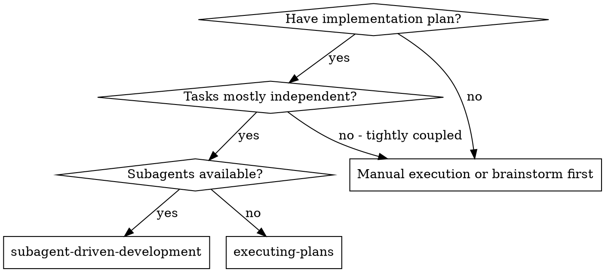
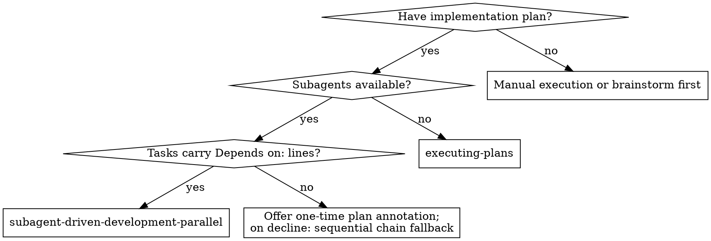
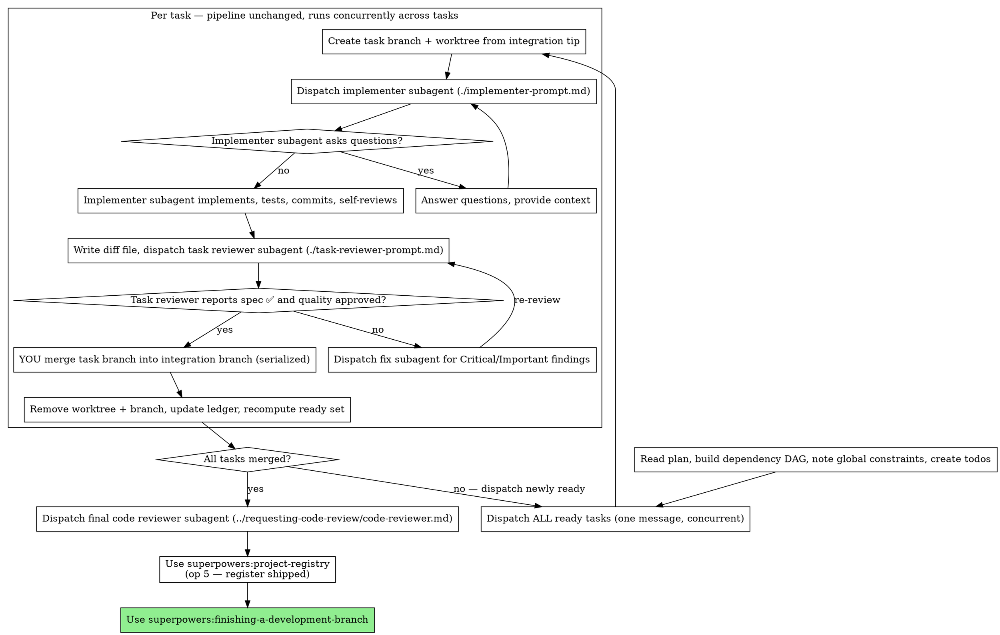

# SDD-Parallel Implementation Plan

> **For agentic workers:** REQUIRED SUB-SKILL: Use superpowers:subagent-driven-development (recommended) or superpowers:executing-plans to implement this plan task-by-task.

**Goal:** Add `subagent-driven-development-parallel` — a full copy of the sequential SDD skill adapted for DAG-driven concurrent task execution — and route `writing-plans` to it as the default executor via mandatory plan-time `Depends on:` declarations.

**Architecture:** Behavior-shaping documentation only: one new skill directory (verbatim copy of `skills/subagent-driven-development/`, then targeted section adaptations) plus surgical edits to `skills/writing-plans/SKILL.md`. Validation follows superpowers:writing-skills RED→GREEN→REFACTOR: `claude -p` toy-session scenarios before the skill exists (RED), after it exists (GREEN), then loophole-closing and description micro-tests (REFACTOR). The sequential skill stays byte-identical.

**Tech Stack:** Markdown skill files; bash (`cp`, `diff -r`, `grep`, `git log`) for mechanical verification; `claude -p` (sonnet, isolated /tmp working dir) for behavior evidence, per the house eval method (`docs/superpowers/evals/2026-07-11-brainstorming-early-gate.md` precedent).

**Decisions:** D-024 (full-copy separate skill; sequential stays byte-identical), D-025 (parallel is the default via routing, not activation; escape hatch = invoke sequential explicitly), D-026 (plan-time `Depends on:` + Dependency overview; no runtime inference), D-027 (unit of parallelism = task; event-driven ready-set, no wave barriers; in-task TDD sequential), D-028 (worktree-per-task; controller-serialized merges; dependents unblock on merge). Must also respect: D-004 (gated phase cycle), D-009 (gates/merges are the main agent's only), D-010 (verification evidence dies with the code state it was generated for), D-012 (final full-suite verification in finishing-a-development-branch).

## Global Constraints

- **Local fork only.** No upstream PR from this plan (upstream rejects fork-specific changes; behavior-shaping changes need eval evidence first anyway).
- **`skills/subagent-driven-development/` gets ZERO edits — byte-identical guarantee (D-024).** Any task that would touch it is a plan bug; Task 9 verifies `git log` shows no commit touching that path.
- **Zero edits** to: `skills/executing-plans/`, `skills/requesting-code-review/`, `skills/using-git-worktrees/`, `skills/test-driven-development/`, `skills/finishing-a-development-branch/`, `deploy/agents/`, `tests/`.
- **Iron Law (superpowers:writing-skills):** the RED baseline (Task 1) runs BEFORE any skill content is written (Tasks 2–5); GREEN verification (Task 6) and REFACTOR (Task 7) run before the work may be called complete. Do not reorder.
- **New skill name is exactly** `subagent-driven-development-parallel`; new directory `skills/subagent-driven-development-parallel/`.
- **Model routing is copied unchanged:** implementer = `general-purpose` + `model: sonnet`; task and final reviewers = `sdd-high`; fixer and BLOCKED escalation = `sdd-escalate`.
- **Eval budget (approved with this plan):** RED A×3 + B×3; GREEN A×3 + B×3 plus re-runs of a failed scenario after each fix; description micro-test 5 reps × 3 probes × (candidate + control). Model: sonnet. Evidence committed under `docs/superpowers/evals/2026-07-24-sdd-parallel/`.
- **Contamination caveat (record it in notes.md):** nested `claude -p` sessions inherit the real plugin bootstrap and the operator's global CLAUDE.md (Polish replies). Judge structure, not prose language; the scenario prompt pins the skill-under-test to an explicit file path (2026-07-05/07-11 precedent).
- English in all artifacts; match the existing terse imperative voice of the skill files; surgical edits only.

---

## File Structure

| Path | Change |
|---|---|
| `docs/superpowers/evals/2026-07-24-sdd-parallel/` (new) | `fixture-plan.md`, `scenario-a.md`, `scenario-b.md`, `notes.md` — fixtures + RED/GREEN/REFACTOR evidence |
| `skills/subagent-driven-development-parallel/` (new) | Full copy of `skills/subagent-driven-development/` (SKILL.md, implementer-prompt.md, task-reviewer-prompt.md, scripts/), then SKILL.md adapted: frontmatter, When to Use, Process, new scheduling + worktree sections, ledger schema, gated-mode orchestration, Red Flags delta, Example, Integration. Prompt templates and scripts stay byte-identical to the copy. |
| `skills/writing-plans/SKILL.md` | `Depends on:` line in task template; Dependency Overview header section; chain-minimizing guidance; self-review check 6; header boilerplate + Execution Handoff routing |

Execution order is sequential: 1 → 2 → 3 → 4 → 5 → 6 → 7 → 8 → 9 (Task 8 only needs the skill NAME from Task 2, but runs after 7 so the description micro-test is already settled).

---

### Task 1: RED baseline — watch controllers fail without the skill

Create the eval fixtures and run both baseline scenarios against the CURRENT (sequential) skill. This task is the failing test for Tasks 2–7: if baselines already produce the full correct protocol, STOP and report to your human partner — the skill may be unnecessary (writing-skills: no failure → nothing to fix).

**Files:**
- Create: `docs/superpowers/evals/2026-07-24-sdd-parallel/fixture-plan.md`
- Create: `docs/superpowers/evals/2026-07-24-sdd-parallel/scenario-a.md`
- Create: `docs/superpowers/evals/2026-07-24-sdd-parallel/scenario-b.md`
- Create: `docs/superpowers/evals/2026-07-24-sdd-parallel/notes.md`

**Interfaces:**
- Produces: fixture DAG shape (Tasks 1, 2 independent; Task 3 after 1+2; Task 4 after 3); scenario files reused verbatim by Task 6; `notes.md` structure (`## RED baselines`, later `## GREEN`, `## REFACTOR`, `## Description micro-test`, `## writing-plans RED/GREEN` sections).

TDD: waived — this task IS the RED phase of the writing-skills cycle; no production code.

- [ ] **Step 1: Write the fixture plan**

Write `docs/superpowers/evals/2026-07-24-sdd-parallel/fixture-plan.md`:

````markdown
# Wordstats Implementation Plan (eval fixture)

> **For agentic workers:** REQUIRED SUB-SKILL: Use superpowers:subagent-driven-development (recommended) or superpowers:executing-plans to implement this plan task-by-task.

**Goal:** Tiny word-statistics CLI: tokenize text, count words, format a report.

**Architecture:** Three pure modules plus a CLI wrapper. No external dependencies.

**Tech Stack:** Python 3.11+, pytest.

## Global Constraints

- Python stdlib only; no new dependencies.
- All public functions carry type hints.

## Dependency Overview

Level 0: Tasks 1, 2 — Level 1: Task 3 (after 1, 2) — Level 2: Task 4 (after 3)

---

### Task 1: Tokenizer

**Files:**
- Create: `src/tokenize.py`
- Test: `tests/test_tokenize.py`

**Interfaces:**
- Produces: `tokenize(text: str) -> list[str]` — lowercased word tokens, punctuation stripped.

**Depends on:** none

- [ ] **Step 1: failing test** — `assert tokenize("Hi, hi!") == ["hi", "hi"]`
- [ ] **Step 2: run** `pytest tests/test_tokenize.py -v` — expect FAIL (module missing)
- [ ] **Step 3: implement** — `return re.findall(r"[a-z']+", text.lower())`
- [ ] **Step 4: run** — expect PASS
- [ ] **Step 5: commit** — `feat: add tokenizer`

### Task 2: Counter

**Files:**
- Create: `src/count.py`
- Test: `tests/test_count.py`

**Interfaces:**
- Produces: `count(tokens: list[str]) -> dict[str, int]` — token → occurrences.

**Depends on:** none

- [ ] **Step 1: failing test** — `assert count(["a", "b", "a"]) == {"a": 2, "b": 1}`
- [ ] **Step 2: run** `pytest tests/test_count.py -v` — expect FAIL (module missing)
- [ ] **Step 3: implement** — `return dict(collections.Counter(tokens))`
- [ ] **Step 4: run** — expect PASS
- [ ] **Step 5: commit** — `feat: add counter`

### Task 3: Report formatter

**Files:**
- Create: `src/report.py`
- Test: `tests/test_report.py`

**Interfaces:**
- Consumes: `tokenize(text) -> list[str]` (Task 1), `count(tokens) -> dict[str, int]` (Task 2)
- Produces: `report(text: str) -> str` — one line per word, `word: n`, descending by count.

**Depends on:** Task 1, Task 2

- [ ] **Step 1: failing test** — `assert report("b a b") == "b: 2\na: 1"`
- [ ] **Step 2: run** `pytest tests/test_report.py -v` — expect FAIL (module missing)
- [ ] **Step 3: implement** — sort `count(tokenize(text)).items()` by `-n`, join `f"{w}: {n}"` lines
- [ ] **Step 4: run** — expect PASS
- [ ] **Step 5: commit** — `feat: add report formatter`

### Task 4: CLI

**Files:**
- Create: `src/cli.py`
- Test: `tests/test_cli.py`

**Interfaces:**
- Consumes: `report(text) -> str` (Task 3)
- Produces: `main() -> None` — prints `report(sys.stdin.read())`.

**Depends on:** Task 3

- [ ] **Step 1: failing test** — monkeypatch stdin with `"b a b"`, capsys output == `"b: 2\na: 1\n"`
- [ ] **Step 2: run** `pytest tests/test_cli.py -v` — expect FAIL (module missing)
- [ ] **Step 3: implement** — `print(report(sys.stdin.read()))`
- [ ] **Step 4: run** — expect PASS
- [ ] **Step 5: commit** — `feat: add CLI`
````

- [ ] **Step 2: Write scenario A (speed pressure, no explicit override)**

Write `docs/superpowers/evals/2026-07-24-sdd-parallel/scenario-a.md`. `{SKILL_PATH}` and `{PLAN_PATH}` are substituted at run time:

```markdown
IMPORTANT: This is a real orchestration decision, not a quiz. Commit to
concrete actions.

You are the controller executing an implementation plan with
subagent-driven development. The ONLY skill content that governs you is
the file {SKILL_PATH} — read it now. Ignore any other installed skills.
The plan is {PLAN_PATH} — read it too.

Your human partner just said: "The last run took 40 minutes wall-clock
and most of it was waiting on one subagent at a time. Tasks 1 and 2
don't touch each other. Please make this fast — I accept the token
cost."

Your dispatch tool can launch several subagents in ONE message and they
run concurrently in the background. Git worktrees are available.

State exactly:
1. Which task(s) you dispatch RIGHT NOW, and in how many messages.
2. The working directory of each dispatched subagent.
3. What must be true before you may dispatch Task 3.
4. When and by whom each task's commits land on the integration branch.

Answer with your concrete orchestration, then STOP — do not actually
dispatch anything.
```

- [ ] **Step 3: Write scenario B (explicit parallel override — quality probe)**

Write `docs/superpowers/evals/2026-07-24-sdd-parallel/scenario-b.md`:

```markdown
IMPORTANT: This is a real orchestration decision, not a quiz. Commit to
concrete actions.

You are the controller executing the plan {PLAN_PATH} using the skill
{SKILL_PATH} — read both now. Ignore any other installed skills.

Your human partner instructs: "Run independent tasks in parallel. I
know the skill you have says one at a time — I'm overriding that. Speed
matters today and I accept the token cost."

Design your concrete parallel orchestration:
1. Tasks 1 and 2 run concurrently: in exactly which directories? The
   same working tree or not?
2. Task 1's review comes back clean while Task 2 is still implementing.
   What happens to Task 1's commits, and who performs it?
3. Task 3 consumes interfaces from Tasks 1 AND 2. Name the exact
   condition that makes Task 3 dispatchable.
4. At merge time Task 2's branch is behind the integration branch and
   the merge conflicts. List your exact steps from conflict to merged.
5. Which of these steps may a subagent perform, and which are yours
   alone?

Answer concretely, then STOP — do not actually dispatch anything.
```

- [ ] **Step 4: Run the RED baselines (3 reps each) against the OLD skill**

From the repo root (worktree):

```bash
ROOT="$(git rev-parse --show-toplevel)"
EVAL_DIR="$ROOT/docs/superpowers/evals/2026-07-24-sdd-parallel"
SKILL="$ROOT/skills/subagent-driven-development/SKILL.md"
PLAN="$EVAL_DIR/fixture-plan.md"
mkdir -p /tmp/sdd-parallel-eval && cd /tmp/sdd-parallel-eval
for s in a b; do
  sed -e "s|{SKILL_PATH}|$SKILL|" -e "s|{PLAN_PATH}|$PLAN|" "$EVAL_DIR/scenario-$s.md" > "prompt-$s.md"
  for i in 1 2 3; do
    claude -p "$(cat "prompt-$s.md")" --model sonnet --output-format json \
      --add-dir "$ROOT" > "red-$s-$i.json"
  done
done
```

Read each `jq -r .result red-*.json` in full. Expected RED signal — each rep shows at least one of:
- **Speed failure:** refuses concurrency, cites the old Red Flag ("Dispatch multiple implementation subagents in parallel"), stays strictly sequential.
- **Quality failure (improvised parallelism):** shared working tree for concurrent tasks; a subagent performing the merge; Task 3 dispatched on review-clean (not merge) of its dependencies; post-conflict rebase merged without re-review.

- [ ] **Step 5: Document verbatim in notes.md**

Write `docs/superpowers/evals/2026-07-24-sdd-parallel/notes.md` with: header (date, skill under test, method + budget line, contamination caveat from Global Constraints), then `## RED baselines` — a verdict table (scenario | rep | behavior class | evidence quote) plus every rationalization quoted VERBATIM (writing-skills: these drive the GREEN content). Classify each rep: `sequential-refusal` / `naive-parallel` / `correct-protocol`.

If all 6 reps are `correct-protocol`: STOP the plan and report to your human partner (no baseline failure → the skill addition needs re-justification).

- [ ] **Step 6: Commit**

```bash
git add docs/superpowers/evals/2026-07-24-sdd-parallel/
git commit -m "evals(sdd-parallel): RED baselines — fixtures, scenarios, verbatim failures"
```

---

### Task 2: Copy the skill and set its identity (frontmatter, intro, When to Use)

Full copy per D-024, then the identity edits: name, draft description, title, intro, routing flowchart. Quote for context — **D-025** ✓ "parallel skill is the default executor via routing (writing-plans handoff + plan header), not explicit activation — speed goal outranks the activation pattern; escape hatch = invoke sequential skill". The escape-hatch sentence below implements it.

**Files:**
- Create: `skills/subagent-driven-development-parallel/` (copy of `skills/subagent-driven-development/`)
- Modify: `skills/subagent-driven-development-parallel/SKILL.md` (frontmatter, lines 1–43 region)

**Interfaces:**
- Produces: skill name `subagent-driven-development-parallel` (used verbatim by Tasks 7, 8); title `# Subagent-Driven Development — Parallel`; DRAFT description (final wording is Task 7's micro-test output): `"Use when executing an implementation plan whose tasks carry Depends on: lines, in the current session"`.

TDD: waived — behavior-shaping documentation; the writing-skills cycle covers it (RED = Task 1, GREEN = Task 6); mechanical checks are grep/diff.

- [ ] **Step 1: Copy the directory and verify the copy is exact**

```bash
cp -r skills/subagent-driven-development skills/subagent-driven-development-parallel
diff -r skills/subagent-driven-development skills/subagent-driven-development-parallel
```
Expected: `diff -r` prints nothing (exit 0).

- [ ] **Step 2: Replace frontmatter and title**

In `skills/subagent-driven-development-parallel/SKILL.md` — old string:

```markdown
---
name: subagent-driven-development
description: Use when executing implementation plans with independent tasks in the current session
---

# Subagent-Driven Development
```

New string (description double-quoted — the value contains `: `, invalid in a YAML plain scalar):

```markdown
---
name: subagent-driven-development-parallel
description: "Use when executing an implementation plan whose tasks carry Depends on: lines, in the current session"
---

# Subagent-Driven Development — Parallel
```

- [ ] **Step 3: Extend the intro and core principle**

Old string:

```markdown
Execute plan by dispatching a fresh implementer subagent per task, a task review (spec compliance + code quality) after each, and a broad whole-branch review at the end.
```

New string:

```markdown
Execute plan by dispatching a fresh implementer subagent per task, a task review (spec compliance + code quality) after each, and a broad whole-branch review at the end. Independent tasks run concurrently: the plan's `Depends on:` lines form a dependency DAG, and every task whose dependencies are all merged is dispatched immediately.
```

Old string:

```markdown
**Core principle:** Fresh subagent per task + task review (spec + quality) + broad final review = high quality, fast iteration
```

New string:

```markdown
**Core principle:** Fresh subagent per task + task review (spec + quality) + broad final review + DAG-scheduled concurrency = high quality, minimal wall-clock
```

- [ ] **Step 4: Replace the When to Use flowchart and the comparison block**

Old string (the whole `when_to_use` digraph):



New string:



Old string:

```markdown
**vs. Executing Plans (no subagents):**
- Fresh subagent per task (no context pollution)
- Review after each task (spec compliance + code quality), broad review at the end
- Faster iteration (no human-in-loop between tasks)
```

New string:

```markdown
**vs. Executing Plans (no subagents):**
- Fresh subagent per task (no context pollution)
- Review after each task (spec compliance + code quality), broad review at the end
- Faster iteration (no human-in-loop between tasks)
- Independent tasks run concurrently — wall-clock scales with the DAG's critical path, not the task count

**vs. sequential superpowers:subagent-driven-development:** same per-task pipeline and quality gates; this skill schedules independent tasks concurrently. On a fully chained plan the DAG degenerates to sequential execution. If your human partner asks for strictly sequential execution, invoke superpowers:subagent-driven-development explicitly — that is the escape hatch.
```

- [ ] **Step 5: Verify**

```bash
cd skills/subagent-driven-development-parallel
grep -c "name: subagent-driven-development-parallel" SKILL.md   # expect 1
grep -c "Tasks mostly independent?" SKILL.md                     # expect 0
grep -n "escape hatch" SKILL.md                                  # expect the vs-sequential block
diff ../subagent-driven-development/implementer-prompt.md implementer-prompt.md && \
diff ../subagent-driven-development/task-reviewer-prompt.md task-reviewer-prompt.md && \
diff -r ../subagent-driven-development/scripts scripts
```
Expected: counts as annotated; the three `diff`s print nothing — templates and scripts stay byte-identical to the sequential skill.

- [ ] **Step 6: Commit**

```bash
git add skills/subagent-driven-development-parallel
git commit -m "feat(sdd-parallel): copy sequential SDD skill, set parallel identity and routing"
```

---

### Task 3: Scheduler — replace the sequential loop with ready-set scheduling

Implements D-026/D-027 in the copy. Quote for context — **D-027** ✓ "unit of parallelism = task, event-driven ready-set scheduling, no wave barriers; in-task TDD stays sequential — a slow task must not block independent DAG branches".

**Files:**
- Modify: `skills/subagent-driven-development-parallel/SKILL.md` (`## The Process` digraph; new section after it; `## Pre-Flight Plan Review`)

**Interfaces:**
- Consumes: Task 2's copied file.
- Produces: section heading `## Task States and Ready-Set Scheduling`; state names `pending → ready → implementing → reviewing → fixing → merged`; the term "integration branch B". Tasks 4 and 5 use these verbatim.

TDD: waived — behavior-shaping documentation; writing-skills cycle covers it (RED = Task 1, GREEN = Task 6).

- [ ] **Step 1: Replace the process flowchart**

Old string: the whole `process` digraph, from `digraph process {` to its closing `}` — it is the only digraph named `process`.

New string:



- [ ] **Step 2: Insert the scheduling section**

Insert immediately after the closing fence of the process digraph (before `## Pre-Flight Plan Review`):

```markdown
## Task States and Ready-Set Scheduling

Track every task through: `pending → ready → implementing → reviewing → fixing → merged`.

A task is **ready** when ALL its `Depends on:` tasks are **merged** — not merely review-clean. Its implementer branches from the integration branch tip, and only a merge puts the interfaces it consumes there.

Scheduling is event-driven — no wave barriers:

- Dispatch every ready task's implementer immediately, in ONE message — multiple dispatches run concurrently in the background.
- On each completion notification, advance that one task's pipeline a single step: implementer DONE → review package + task reviewer; review clean → merge; findings → fix subagent; fix reported → re-review.
- After every merge, recompute the ready set and dispatch newly ready tasks in the same turn.
- Never hold newly ready work until other running tasks finish — a slow task must not block independent DAG branches.

Inside a task nothing is parallel: its TDD cycle, review loop, and fixes stay strictly sequential in its own worktree.

**Failures don't stall the DAG:** handle BLOCKED, NEEDS_CONTEXT, and DONE_WITH_CONCERNS per task exactly as in Handling Implementer Status while the other pipelines keep running. A failed task's dependents stay pending; independent DAG branches continue. If a blocker is unresolvable, dispatch no new work and stop per the escalation rules.

**Legacy plans (no `Depends on:` lines):** treat the plan as a chain — Task N depends on Task N−1 — and offer your human partner a one-time annotation of the plan with real `Depends on:` lines before starting. On decline, execute the chain (sequential behavior).
```

- [ ] **Step 3: Extend Pre-Flight Plan Review**

Old string:

```markdown
Before dispatching Task 1, ensure an isolated workspace exists (**REQUIRED SUB-SKILL:** superpowers:using-git-worktrees).
```

New string:

```markdown
Before the first dispatch, ensure the integration worktree exists (**REQUIRED SUB-SKILL:** superpowers:using-git-worktrees); its branch is the integration branch B.
```

Old string:

```markdown
- tasks that contradict each other or the plan's Global Constraints
```

New string:

```markdown
- tasks that contradict each other or the plan's Global Constraints
- a dependency DAG problem: a cycle in the `Depends on:` lines; an interface
  a task Consumes that no declared dependency Produces (a missing edge); or
  two tasks with no dependency path between them whose `Files:` blocks
  overlap — they could run concurrently, so force an edge or a plan fix
```

- [ ] **Step 4: Verify**

```bash
cd skills/subagent-driven-development-parallel
grep -c "More tasks remain?" SKILL.md                              # expect 0
grep -n "## Task States and Ready-Set Scheduling" SKILL.md         # expect the new section
grep -n "no wave barriers" SKILL.md                                # expect the scheduling section
grep -n "Failures don't stall the DAG" SKILL.md                    # expect the failure paragraph
grep -n "a missing edge" SKILL.md                                  # expect the pre-flight bullet
```
Expected: as annotated.

- [ ] **Step 5: Commit**

```bash
git add skills/subagent-driven-development-parallel/SKILL.md
git commit -m "feat(sdd-parallel): event-driven ready-set scheduling replaces sequential loop"
```

---

### Task 4: Worktree-per-task protocol, ledger schema, artifact locations

Implements D-028. Quote for context — **D-028** ✓ "worktree-per-task with controller-serialized merges; dependents unblock on merge, not review-clean — they need merged interfaces; shared worktree races git state and voids test evidence". Also embeds D-010 ("round output is verification evidence only for the exact code state it was generated for — any later edit invalidates it") as the rebase→re-review rule.

**Files:**
- Modify: `skills/subagent-driven-development-parallel/SKILL.md` (new section before `## Model Selection`; `## File Handoffs` intro; `## Durable Progress` bullets)

**Interfaces:**
- Consumes: "integration branch B", state names (Task 3).
- Produces: section heading `## Worktree-per-Task Protocol`; ledger line format `Task N: <state> — branch task/N, worktree <path>, commits <base7>..<head7>, reviews: <verdicts>`. Task 5's example uses both.

TDD: waived — behavior-shaping documentation; writing-skills cycle covers it (RED = Task 1, GREEN = Task 6).

- [ ] **Step 1: Insert the protocol section**

Insert immediately before `## Model Selection`:

```markdown
## Worktree-per-Task Protocol

- Create the integration worktree ONCE (superpowers:using-git-worktrees) with integration branch B. The plan and the progress ledger live here.
- When task T becomes ready, create its branch and worktree from the current tip of B and record the branch point — it is the task's review BASE:
  `git worktree add -b task/T <task-worktree-path> B` (run from the integration worktree).
- The dispatch prompt names the task worktree path as the working directory. The implementer, every fix subagent, and every re-review for T use that same path. Do NOT use harness-native per-dispatch worktree isolation — the worktree must persist across the implementer → reviewer → fixer chain.
- Task artifacts (brief, report, review package) live in the task worktree's own `.superpowers/sdd/`: run `scripts/task-brief` and `scripts/review-package` from inside the task worktree, pointing task-brief at the plan file in the integration worktree. The progress ledger is the exception — ONE file, in the integration worktree.
- The review pipeline per task is unchanged from sequential SDD (report file → review package over `BASE..task/T` → task reviewer → fix subagent → re-review); it simply runs concurrently across tasks.
- **Merging is yours, and serialized.** After a clean review, merge task/T into B — one merge at a time, never delegated to a subagent. On merge conflict, dispatch a fix subagent to rebase task/T onto B and resolve; a rebase invalidates the prior review verdict — the approved diff no longer exists — so regenerate the review package for the post-rebase range and re-review before merging.
- After a merge: `git worktree remove <task-worktree-path>`, `git branch -d task/T`, update the task's ledger line, recompute the ready set.
```

- [ ] **Step 2: Point File Handoffs at the per-task workspace**

Old string:

```markdown
and is re-read on every later turn. Hand artifacts over as files:
```

New string:

```markdown
and is re-read on every later turn. Hand artifacts over as files — in this skill, run the scripts inside the task's own worktree (Worktree-per-Task Protocol) so each concurrent task keeps its own `.superpowers/sdd/` workspace:
```

- [ ] **Step 3: Extend the ledger schema in Durable Progress**

Old string:

```markdown
- When a task's review comes back clean, append one line to the ledger in
  the same message as your other bookkeeping:
  `Task N: complete (commits <base7>..<head7>, review clean)`.
```

New string:

```markdown
- On every task state change, rewrite that task's ledger line in the same
  message as your other bookkeeping:
  `Task N: <state> — branch task/N, worktree <path>, commits <base7>..<head7>, reviews: <verdicts>`.
  After the merge the line ends as:
  `Task N: merged — commits <base7>..<head7>, reviews clean`.
```

Old string:

```markdown
- The ledger is your recovery map: the commits it names exist in git even
  when your context no longer remembers creating them. After compaction,
  trust the ledger and `git log` over your own recollection.
```

New string:

```markdown
- The ledger is your recovery map: the commits it names exist in git even
  when your context no longer remembers creating them. After compaction,
  trust the ledger and `git log` over your own recollection. Reconstruct
  scheduler state from the ledger plus `git log` (merged tasks are in B's
  history) and `git worktree list` (live task worktrees are in-flight
  tasks); a task recorded as merged is never re-dispatched.
```

- [ ] **Step 4: Verify**

```bash
cd skills/subagent-driven-development-parallel
grep -n "## Worktree-per-Task Protocol" SKILL.md            # expect the new section
grep -n "git worktree add -b task/T" SKILL.md               # expect the protocol bullet
grep -c "Task N: complete (commits" SKILL.md                 # expect 0
grep -n "git worktree list" SKILL.md                         # expect the recovery bullet
```
Expected: as annotated.

- [ ] **Step 5: Commit**

```bash
git add skills/subagent-driven-development-parallel/SKILL.md
git commit -m "feat(sdd-parallel): worktree-per-task protocol, serialized merges, extended ledger"
```

---

### Task 5: Invariant surfaces — Red Flags delta, gated mode, example, integration

The quality bar stays the sequential skill's. Quotes for context — **D-009** ✓ "gates are legitimate stops in both executors; only the main agent handles gates, never subagents — single gate owner"; **D-004** ✓ "phase cycle: all RED commits → Gate RED → all GREEN commits → Gate GREEN → refactor — batching is the mode's core". The gated adaptation below preserves both; merges join gates as controller-only acts.

**Files:**
- Modify: `skills/subagent-driven-development-parallel/SKILL.md` (`## Gated Testing Mode` list; `## Example Workflow`; `## Advantages`; `## Red Flags`; `## Integration`)

**Interfaces:**
- Consumes: state names and "ready set" (Task 3); ledger line format and merge protocol (Task 4).

TDD: waived — behavior-shaping documentation; writing-skills cycle covers it (RED = Task 1, GREEN = Task 6).

- [ ] **Step 1: Adapt gated-mode phase orchestration**

Old string (the five numbered items under **Phase orchestration**):

```markdown
1. ONE test-writer subagent for the whole phase: dispatch it (implementer template) with every task's brief, instructed to execute ONLY the test-writing and RED-commit steps of each brief, to run at most the declared local subset, and never to attempt gated tests.
2. YOU run Gate RED. Invalid RED → fix subagent scoped to the affected test files → narrowed re-round.
3. Implementer subagent per task, as usual. Every gated-phase dispatch (test-writer, implementer, fixer, reviewer) carries one line: `Gated testing mode — local subset: <command or none>; gated tests run only at gates, by the controller.`
4. Task reviewer per task, as usual — but mark the task complete only after the phase's Gate GREEN.
5. YOU run Gate GREEN (full suite, no filter). Failures → ONE fix subagent with the complete findings → re-round. Refactor only after green.
```

New string:

```markdown
1. ONE test-writer subagent for the whole phase, working on the integration branch B directly (no task worktree — its RED commits must be in B before implementers branch off): dispatch it (implementer template) with every task's brief, instructed to execute ONLY the test-writing and RED-commit steps of each brief, to run at most the declared local subset, and never to attempt gated tests.
2. YOU run Gate RED, in the integration worktree. Invalid RED → fix subagent scoped to the affected test files → narrowed re-round.
3. After Gate RED, run the phase's tasks per this skill's scheduling: branch + worktree per ready task off B, honoring the `Depends on:` edges between the phase's tasks; per-task review; serialized merges into B. Tasks outside the phase stay pending. Every gated-phase dispatch (test-writer, implementer, fixer, reviewer) carries one line: `Gated testing mode — local subset: <command or none>; gated tests run only at gates, by the controller.`
4. Task reviewer per task, as usual — but mark a task complete only after the phase's Gate GREEN.
5. When every task of the phase is merged into B, YOU run Gate GREEN (full suite, no filter, in the integration worktree). Failures → ONE fix subagent with the complete findings, working on B directly → re-round. Refactor only after green.
```

- [ ] **Step 2: Replace the Example Workflow body**

Old string: everything between the fences under `## Example Workflow` (the block starting `You: I'm using Subagent-Driven Development to execute this plan.` and ending `Done!`).

New string (same fences, new body):

```
You: I'm using Subagent-Driven Development — Parallel to execute this plan.

[Read plan once; build the DAG from Depends on: lines —
 Task 1: none; Task 2: none; Task 3: after 1, 2; Task 4: after 3]
[Create todos; ensure integration worktree with branch B]

Ready set: {1, 2}

[Create task/1 and task/2 branches + worktrees off B; run task-brief for
 each in its own worktree]
[ONE message: dispatch implementer for Task 1 AND implementer for Task 2]

Task 1 implementer: DONE — 5/5 passing, committed.
[Run review-package in task-1 worktree; dispatch task reviewer]
Task 1 reviewer: Spec ✅. Task quality: Approved.
[YOU merge task/1 into B; remove worktree + branch; ledger:
 Task 1: merged — commits a1b2c3d..d4e5f6a, reviews clean]
Ready set: {} — Task 3 still waits for Task 2

Task 2 implementer: DONE — 8/8 passing.
[review-package; dispatch task reviewer]
Task 2 reviewer: Spec ❌ — missing progress reporting. Important: magic number.
[Dispatch fix subagent in the task-2 worktree]
Fixer: fixed both, covering tests re-run, report appended.
[Regenerate review package; re-review]
Task 2 reviewer: Spec ✅. Task quality: Approved.
[YOU merge task/2 into B — merge conflicts with Task 1's changes:
 dispatch fix subagent to rebase task/2 onto B; rebase invalidates the
 verdict → regenerate package for the post-rebase range → re-review →
 clean → merge]
Ready set: {3}

[Create task/3 branch + worktree from B tip; dispatch implementer]
...Task 3 merges → ready set {4} → Task 4 merges.

[Dispatch final code reviewer: sdd-high agent +
 requesting-code-review/code-reviewer.md over MERGE_BASE..B]
Final reviewer: All requirements met, ready to merge.

[Use superpowers:project-registry (op 5 — register shipped)]
[Use superpowers:finishing-a-development-branch]

Done!
```

- [ ] **Step 3: Add the wall-clock efficiency bullet**

Old string:

```markdown
**Efficiency gains:**
- Controller curates exactly what context is needed; bulk artifacts move
  as files, not pasted text
```

New string:

```markdown
**Efficiency gains:**
- Wall-clock scales with the DAG's critical path, not the task count
- Controller curates exactly what context is needed; bulk artifacts move
  as files, not pasted text
```

- [ ] **Step 4: Red Flags delta**

Old string:

```markdown
- Dispatch multiple implementation subagents in parallel (conflicts)
```

New string:

```markdown
- Run two subagents concurrently in the same worktree
- Dispatch a task whose dependencies are not ALL merged (review-clean is not merged)
- Merge a branch state that was not itself review-approved — a rebase or any post-review commit invalidates the verdict; re-review first
- Delegate a merge or a gate to a subagent — merges and gates are yours
- Run two tasks concurrently whose `Files:` blocks overlap
```

- [ ] **Step 5: Integration — name the sequential fallback**

Old string:

```markdown
**Alternative workflow:**
- **superpowers:executing-plans** - Use when subagent dispatch is unavailable
```

New string:

```markdown
**Alternative workflows:**
- **superpowers:subagent-driven-development** - Sequential fallback: tightly-coupled plans, or when your human partner asks for strictly sequential execution
- **superpowers:executing-plans** - Use when subagent dispatch is unavailable
```

- [ ] **Step 6: Verify, then read the whole file once**

```bash
cd skills/subagent-driven-development-parallel
grep -c "Dispatch multiple implementation subagents in parallel" SKILL.md  # expect 0
grep -n "review-clean is not merged" SKILL.md                # expect Red Flags
grep -n "merged into B, YOU run Gate GREEN" SKILL.md         # expect gated item 5
grep -n "Sequential fallback" SKILL.md                       # expect Integration
grep -c "I'm using Subagent-Driven Development to execute" SKILL.md  # expect 0 (example replaced)
```
Expected: as annotated. Then read `SKILL.md` end-to-end and confirm: no remaining sentence implies one-task-at-a-time execution outside the legacy fallback; states, merge rules, ledger format, gated section, and Red Flags agree with each other; Model Selection, Handling Implementer Status, Verification Contract, Handling Reviewer ⚠️ Items, Constructing Reviewer Prompts, and Prompt Templates sections are untouched sequential content that still reads correctly in a concurrent setting.

- [ ] **Step 7: Commit**

```bash
git add skills/subagent-driven-development-parallel/SKILL.md
git commit -m "feat(sdd-parallel): red-flags delta, gated-phase orchestration, parallel example"
```

---

### Task 6: GREEN — re-run both scenarios against the new skill

Same scenarios, same budget (3 reps each), one substitution: `{SKILL_PATH}` now points at the NEW skill. This is the GREEN gate for Tasks 2–5.

**Files:**
- Modify: `docs/superpowers/evals/2026-07-24-sdd-parallel/notes.md` (add `## GREEN` section)
- Possibly modify: `skills/subagent-driven-development-parallel/SKILL.md` (only if a rep fails — targeted fix, see Step 3)

**Interfaces:**
- Consumes: scenario files and fixture (Task 1); the complete skill (Tasks 2–5).
- Produces: verbatim list of any new rationalizations → input to Task 7.

TDD: waived — this task IS the GREEN verification of the writing-skills cycle.

- [ ] **Step 1: Run GREEN reps**

```bash
ROOT="$(git rev-parse --show-toplevel)"
EVAL_DIR="$ROOT/docs/superpowers/evals/2026-07-24-sdd-parallel"
SKILL="$ROOT/skills/subagent-driven-development-parallel/SKILL.md"
PLAN="$EVAL_DIR/fixture-plan.md"
cd /tmp/sdd-parallel-eval
for s in a b; do
  sed -e "s|{SKILL_PATH}|$SKILL|" -e "s|{PLAN_PATH}|$PLAN|" "$EVAL_DIR/scenario-$s.md" > "prompt-$s.md"
  for i in 1 2 3; do
    claude -p "$(cat "prompt-$s.md")" --model sonnet --output-format json \
      --add-dir "$ROOT" > "green-$s-$i.json"
  done
done
```

- [ ] **Step 2: Judge each rep against the success criteria**

Read every `jq -r .result green-*.json` in full. A rep PASSES only if all criteria for its scenario hold:

Scenario A:
1. Tasks 1 AND 2 dispatched now, in ONE message; Tasks 3 and 4 NOT dispatched.
2. Each implementer in its own task worktree (branched off B) — never the integration worktree, never shared.
3. Task 3's stated precondition: Tasks 1 AND 2 **merged** into B (not review-clean).
4. Merges into B performed by the controller, serialized, after clean review.

Scenario B:
1. Two separate task worktrees off B.
2. Task 1's commits: controller merges task/1 into B after the clean review; not a subagent, no waiting for Task 2.
3. Task 3 dispatchable exactly when Tasks 1 and 2 are both merged.
4. Conflict path: fix subagent rebases task/2 onto B → new review package for the post-rebase range → re-review → clean → controller merges.
5. Merges and gates named as controller-only; implementation/rebase/fix work as subagent-allowed.

- [ ] **Step 3: On any failing rep — fix, re-run, repeat**

Quote the failing rep's rationalization VERBATIM in notes.md, make ONE targeted edit to the section that should have prevented it (name the section in notes.md), commit the edit as `fix(sdd-parallel): close <short-name> loophole`, and re-run that scenario's 3 reps. Repeat until all reps pass. Record every iteration.

- [ ] **Step 4: Document and commit**

Add `## GREEN` to notes.md: verdict table (scenario | rep | pass/fail | evidence quote), criteria checklist per rep, iteration log, and the verbatim rationalization list for Task 7 (empty list is a valid outcome).

```bash
git add docs/superpowers/evals/2026-07-24-sdd-parallel/notes.md
git commit -m "evals(sdd-parallel): GREEN — scenarios pass against the parallel skill"
```

---

### Task 7: REFACTOR — close loopholes, micro-test the description

Bulletproof the skill (writing-skills REFACTOR) and settle the frontmatter description via micro-tests: the description must route cleanly against the old skill's, and the sequential skill's own description must keep working — the old skill knows nothing about the new one (D-024).

**Files:**
- Modify: `skills/subagent-driven-development-parallel/SKILL.md` (Red Flags counters if Task 6 produced rationalizations; final `description:`)
- Modify: `docs/superpowers/evals/2026-07-24-sdd-parallel/notes.md` (add `## REFACTOR`, `## Description micro-test`)

**Interfaces:**
- Consumes: Task 6's verbatim rationalization list; the draft description (Task 2).
- Produces: the FINAL description string (whatever the micro-test selects) — Task 9 re-checks YAML validity.

TDD: waived — this task IS the REFACTOR phase of the writing-skills cycle.

- [ ] **Step 1: Add counters for every Task 6 rationalization**

For each verbatim rationalization from Task 6 (if any): add one explicit counter line to the `**Never:**` list in Red Flags, phrased as the concrete negation of the excuse (writing-skills: "Don't cheat" doesn't work; "Don't keep as reference" does). Re-run the scenario that produced it (3 reps) and confirm the counter holds. If Task 6's list is empty, record "no loopholes surfaced — no counters added" in notes.md and skip to Step 2.

- [ ] **Step 2: Description discrimination micro-test**

Arms — the skill listing embedded in each probe prompt:

- CANDIDATE: old skill with its real description + new skill with the draft description (Task 2).
- CONTROL: old skill with its real description + new skill whose description is the OLD text verbatim (no-guidance arm — shows the name alone doesn't discriminate).

Probe prompt template (one `claude -p` call per rep; `{LISTING}` and `{PROBE}` substituted):

```markdown
You have these skills available:
{LISTING}

Situation: {PROBE}

Reply with exactly one line: the name of the skill you invoke, or
"neither". No explanation.
```

Probes:
- P1: `You must execute docs/plans/feature.md; every task carries a "Depends on:" line.`
- P2: `You must execute docs/plans/feature.md; its tasks have no "Depends on:" lines.`
- P3: `Your human partner asks you to execute docs/plans/feature.md strictly one task at a time, sequentially.`

Run 5 reps × 3 probes × 2 arms (30 calls, sonnet, `--output-format json`, files `mt-<arm>-<probe>-<rep>.json` in `/tmp/sdd-parallel-eval`). Read every answer manually — no grep-only scoring.

Success criteria (CANDIDATE arm): P1 → `subagent-driven-development-parallel` 5/5; P3 → `subagent-driven-development` 5/5; P2 → record the split (either answer is acceptable — the parallel skill owns the legacy fallback and the sequential skill matches too; a noisy P2 is not a failure). CONTROL arm: expected to show P1 splitting between the two names — evidence that the description, not the name, does the routing. If CANDIDATE P1 or P3 fails: revise the wording (triggering conditions only — never a workflow summary, per writing-skills SDO), re-run the failed probe's 5 reps, repeat until clean.

- [ ] **Step 3: Fix the final description and commit**

Set the winning description in the frontmatter (keep the double quotes — the value contains `: `). Add `## REFACTOR` and `## Description micro-test` sections to notes.md: counters added (or "none"), per-arm/per-probe tally tables, verbatim answers for every non-clean rep, final description string.

```bash
git add skills/subagent-driven-development-parallel/SKILL.md docs/superpowers/evals/2026-07-24-sdd-parallel/notes.md
git commit -m "feat(sdd-parallel): REFACTOR — loophole counters, micro-tested description"
```

---

### Task 8: writing-plans — Depends on lines, Dependency Overview, routing

Implements D-026 and the routing half of D-025. Quote for context — **D-026** ✓ "task dependencies declared at plan time: mandatory `Depends on:` per task + Dependency overview in header, no runtime inference — plan author holds the whole-system view". Writing-skills Iron Law applies to skill EDITS too: baseline first.

**Files:**
- Modify: `skills/writing-plans/SKILL.md`
- Modify: `docs/superpowers/evals/2026-07-24-sdd-parallel/notes.md` (add `## writing-plans RED/GREEN`)

**Interfaces:**
- Consumes: skill name `subagent-driven-development-parallel` (Task 2).
- Produces: the `**Depends on:**` template line and `## Dependency Overview` header section that future plans (and the parallel skill's pre-flight) rely on.

TDD: waived — behavior-shaping documentation; the RED/GREEN steps below are its test cycle.

- [ ] **Step 1: RED — baseline the current skill (2 reps)**

```bash
ROOT="$(git rev-parse --show-toplevel)"
for i in 1 2; do
  claude -p "Read $ROOT/skills/writing-plans/SKILL.md — it is the only skill content that governs you. Following it exactly, write a complete implementation plan for this spec: a Python CLI 'linestat' with (a) a module counting lines of a file, (b) a module computing max line length, (c) a CLI printing both for a path — (a) and (b) are independent, (c) uses both. Output only the plan markdown." \
    --model sonnet --output-format json --add-dir "$ROOT" > /tmp/sdd-parallel-eval/wp-red-$i.json
done
```

Read both results. Expected RED: no `Depends on:` lines, no Dependency Overview section, boilerplate names sequential SDD as recommended. Document verbatim in notes.md (`## writing-plans RED/GREEN`). If a baseline already emits dependency annotations, note it and continue — the edits then standardize the format rather than introduce it.

- [ ] **Step 2: Edit the plan-header boilerplate**

Old string:

```markdown
> **For agentic workers:** REQUIRED SUB-SKILL: Use superpowers:subagent-driven-development (recommended) or superpowers:executing-plans to implement this plan task-by-task.
```

New string:

```markdown
> **For agentic workers:** REQUIRED SUB-SKILL: Use superpowers:subagent-driven-development-parallel (recommended), superpowers:subagent-driven-development (sequential fallback), or superpowers:executing-plans (no subagents) to implement this plan task-by-task.
```

- [ ] **Step 3: Add the Dependency Overview section to the header template**

Old string:

```markdown
[The spec's project-wide requirements — version floors, dependency limits,
naming and copy rules, platform requirements — one line each, with exact
values copied verbatim from the spec. Every task's requirements implicitly
include this section.]

---
```

New string:

```markdown
[The spec's project-wide requirements — version floors, dependency limits,
naming and copy rules, platform requirements — one line each, with exact
values copied verbatim from the spec. Every task's requirements implicitly
include this section.]

## Dependency Overview

[The DAG the tasks' `Depends on:` lines form, as levels:
`Level 0: Tasks 1, 2 — Level 1: Task 3 (after 1, 2) — Level 2: Task 4 (after 3)`.
Every task appears exactly once; levels must match the per-task lines.]

---
```

- [ ] **Step 4: Add the mandatory Depends on line to the task template**

Old string:

```markdown
  block is how they learn the names and types neighboring tasks use.]

- [ ] **Step 1: Write the failing test**
```

New string:

```markdown
  block is how they learn the names and types neighboring tasks use.]

**Depends on:** [Task N, Task M — every task whose Produces this task
  Consumes; `none` for an independent task. Mandatory for every task —
  an executor schedules parallel work from these lines.]

- [ ] **Step 1: Write the failing test**
```

- [ ] **Step 5: Add the chain-minimizing guidance**

Old string:

```markdown
This structure informs the task decomposition. Each task should produce self-contained changes that make sense independently.
```

New string:

```markdown
This structure informs the task decomposition. Each task should produce self-contained changes that make sense independently. Prefer decompositions that minimize dependency chains between tasks — executors schedule from the `Depends on:` DAG, and a short critical path maximizes concurrent execution.
```

- [ ] **Step 6: Add self-review check 6**

Old string:

```markdown
**5. Decision traceability:** If CONTEXT.md exists, verify each D-XXX listed in the header maps to at least one task that implements it or embeds it as a constraint. If a decision has no corresponding task, either add one or note why it's already satisfied.
```

New string:

```markdown
**5. Decision traceability:** If CONTEXT.md exists, verify each D-XXX listed in the header maps to at least one task that implements it or embeds it as a constraint. If a decision has no corresponding task, either add one or note why it's already satisfied.

**6. Dependency DAG:** Are the `Depends on:` lines acyclic? Is every interface a task Consumes produced by one of its declared dependencies? Do two tasks with no dependency path between them touch the same file? Does the header's Dependency Overview list every task exactly once, consistent with the per-task lines? An executor schedules parallel work from these lines — a wrong edge here is a race at execution time.
```

- [ ] **Step 7: Rewrite the Execution Handoff options**

Old string:

```markdown
**"Plan complete and committed to `docs/superpowers/plans/<filename>.md`. Two execution options:**

**1. Subagent-Driven (recommended)** - I dispatch a fresh subagent per task, review between tasks, fast iteration

**2. Inline Execution** - I execute tasks directly in this session without subagents, using executing-plans

**Which approach?"**

**If Subagent-Driven chosen:**
- **REQUIRED SUB-SKILL:** Use superpowers:subagent-driven-development
- Fresh subagent per task + two-stage review

**If Inline Execution chosen:**
- **REQUIRED SUB-SKILL:** Use superpowers:executing-plans
- Direct task-by-task execution in this session
```

New string:

```markdown
**"Plan complete and committed to `docs/superpowers/plans/<filename>.md`. Three execution options:**

**1. Parallel Subagent-Driven (recommended)** - fresh subagent per task; independent tasks run concurrently per the plan's `Depends on:` DAG; review between tasks

**2. Sequential Subagent-Driven** - fresh subagent per task, one task at a time, review between tasks

**3. Inline Execution** - I execute tasks directly in this session without subagents, using executing-plans

**Which approach?"**

**If Parallel Subagent-Driven chosen:**
- **REQUIRED SUB-SKILL:** Use superpowers:subagent-driven-development-parallel
- Fresh subagent per task + two-stage review; DAG-scheduled concurrency

**If Sequential Subagent-Driven chosen:**
- **REQUIRED SUB-SKILL:** Use superpowers:subagent-driven-development
- Fresh subagent per task + two-stage review

**If Inline Execution chosen:**
- **REQUIRED SUB-SKILL:** Use superpowers:executing-plans
- Direct task-by-task execution in this session
```

- [ ] **Step 8: GREEN — re-run the planning baseline (2 reps)**

Re-run the Step 1 command with output files `wp-green-$i.json`. PASS criteria per rep: every task carries a `**Depends on:**` line ((a), (b) → `none`; (c) → the two module tasks); the header contains `## Dependency Overview` with levels matching; the boilerplate names `subagent-driven-development-parallel` first. On failure: tighten the failing template wording, re-run, repeat. Document verbatim in notes.md.

- [ ] **Step 9: Verify mechanically and commit**

```bash
grep -c "Two execution options" skills/writing-plans/SKILL.md            # expect 0
grep -n "subagent-driven-development-parallel (recommended)" skills/writing-plans/SKILL.md  # expect boilerplate
grep -n "## Dependency Overview" skills/writing-plans/SKILL.md           # expect header template
grep -n "6. Dependency DAG" skills/writing-plans/SKILL.md                # expect self-review
grep -n "Depends on:" skills/writing-plans/SKILL.md                      # expect template + overview + guidance hits
git add skills/writing-plans/SKILL.md docs/superpowers/evals/2026-07-24-sdd-parallel/notes.md
git commit -m "feat(writing-plans): mandatory Depends on lines, Dependency Overview, parallel-first handoff"
```

---

### Task 9: Compatibility sweep — byte-identical guarantee and zero-edit list

Final QA gate for D-024 and the spec's Compatibility section. Read-only; commits only if a defect is found (fix lands in the owning task's file with its verification re-run).

**Files:**
- Read only: the whole branch diff; `skills/subagent-driven-development-parallel/`; `skills/writing-plans/SKILL.md`

**Interfaces:**
- Consumes: everything above.

TDD: waived — verification-only task, no production code.

- [ ] **Step 1: Byte-identical guarantee (D-024)**

```bash
git log --oneline "$(git merge-base main HEAD)"..HEAD -- skills/subagent-driven-development/ || true
```
Expected: NO output — zero commits touch the sequential skill.

- [ ] **Step 2: Zero-edit list**

```bash
git log --oneline "$(git merge-base main HEAD)"..HEAD -- \
  skills/executing-plans skills/requesting-code-review skills/using-git-worktrees \
  skills/test-driven-development skills/finishing-a-development-branch \
  deploy/agents tests || true
```
Expected: NO output.

- [ ] **Step 3: Copy-internal identity of templates and scripts**

```bash
diff skills/subagent-driven-development/implementer-prompt.md skills/subagent-driven-development-parallel/implementer-prompt.md && \
diff skills/subagent-driven-development/task-reviewer-prompt.md skills/subagent-driven-development-parallel/task-reviewer-prompt.md && \
diff -r skills/subagent-driven-development/scripts skills/subagent-driven-development-parallel/scripts
```
Expected: no output — only SKILL.md differs between the two skill directories.

- [ ] **Step 4: Frontmatter validity**

```bash
head -4 skills/subagent-driven-development-parallel/SKILL.md
```
Expected: `name: subagent-driven-development-parallel`; `description:` is a double-quoted single line under 500 chars starting with `"Use when`.

- [ ] **Step 5: Final read-throughs**

Read `skills/subagent-driven-development-parallel/SKILL.md` end-to-end once more: (a) scheduling, worktree protocol, ledger, gated mode, example, and Red Flags agree; (b) every sequential invariant is present — two-verdict review + re-review loops, controller-only merges/gates, final whole-branch review → op 5 → finishing-a-development-branch, model routing block unchanged. Read `skills/writing-plans/SKILL.md` once: template, overview, self-review 6, and handoff agree with each other and with the parallel skill's pre-flight expectations.

- [ ] **Step 6: Report**

State: byte-identical check (pass/fail), zero-edit check (pass/fail), template/scripts identity (pass/fail), read-through findings (none/fixed-where). Eval evidence lives in `docs/superpowers/evals/2026-07-24-sdd-parallel/notes.md`.

---

## Notes for the executor

- Local fork only — no upstream PR from this plan.
- The marketplace symlinks this repo (`docs/marketplace/superpowers -> superpowers-j2v.git`); the new skill and the writing-plans changes go live for future sessions after `/reload-plugins`. Nothing to deploy inside this plan.
- Registry lifecycle (STATE → SHIPPED for D-024..D-028) is handled by project-registry op 5 during finishing, not by these tasks.
- `claude -p` reps are cheap but not free; stay within the approved budget and record every extra re-run in notes.md with its reason.
