```dot
digraph brainstorming {
    "Explore project context" [shape=box];
    "CONTEXT.md exists?" [shape=diamond];
    "Read DECISIONS — op 4 active:\ngate EVERY direction\nbefore presenting it" [shape=box];
    "Ask clarifying questions" [shape=box];
    "Research needed?" [shape=diamond];
    "Research sanity check (quick)" [shape=box];
    "Open decision needs\ndeep research?" [shape=diamond];
    "Propose deep research (own message):\nquestions, mode, subagent count" [shape=box];
    "Human partner accepts?" [shape=diamond];
    "Dispatch parallel read-only\nresearch subagents (one message)" [shape=box];
    "Present findings; partner approves\neach decision separately" [shape=box];
    "Propose 2-3 approaches\n(grounded in research)" [shape=box];
    "Gate composed design\n(op 4): collision?" [shape=diamond];
    "Hard-gate protocol:\nsupersede / change direction / stop" [shape=box];
    "Present design sections" [shape=box];
    "User approves design?" [shape=diamond];
    "Design changed since\nlast gate pass?" [shape=diamond];
    "Pre-spec re-check (op 4)" [shape=box];
    "Write design doc\n(+ research analysis file)" [shape=box];
    "Spec self-review\n(fix inline)" [shape=box];
    "User reviews spec?" [shape=diamond];
    "Update CONTEXT.md\n(STATE + DECISIONS)" [shape=box];
    "Stop: instruct user to invoke\nwriting-plans in a new session" [shape=doublecircle];

    "Explore project context" -> "CONTEXT.md exists?";
    "CONTEXT.md exists?" -> "Read DECISIONS — op 4 active:\ngate EVERY direction\nbefore presenting it" [label="yes"];
    "CONTEXT.md exists?" -> "Ask clarifying questions" [label="no"];
    "Read DECISIONS — op 4 active:\ngate EVERY direction\nbefore presenting it" -> "Ask clarifying questions";
    "Ask clarifying questions" -> "Research needed?";
    "Research needed?" -> "Research sanity check (quick)" [label="unfamiliar domain\nor unverified deps"];
    "Research needed?" -> "Propose 2-3 approaches\n(grounded in research)" [label="well-known territory"];
    "Research sanity check (quick)" -> "Open decision needs\ndeep research?";
    "Open decision needs\ndeep research?" -> "Propose deep research (own message):\nquestions, mode, subagent count" [label="yes"];
    "Open decision needs\ndeep research?" -> "Propose 2-3 approaches\n(grounded in research)" [label="no"];
    "Propose deep research (own message):\nquestions, mode, subagent count" -> "Human partner accepts?";
    "Human partner accepts?" -> "Dispatch parallel read-only\nresearch subagents (one message)" [label="yes\n(list may be trimmed)"];
    "Human partner accepts?" -> "Propose 2-3 approaches\n(grounded in research)" [label="declined"];
    "Dispatch parallel read-only\nresearch subagents (one message)" -> "Present findings; partner approves\neach decision separately";
    "Present findings; partner approves\neach decision separately" -> "Propose 2-3 approaches\n(grounded in research)";
    "Propose 2-3 approaches\n(grounded in research)" -> "Propose deep research (own message):\nquestions, mode, subagent count" [label="per-approach mode:\ndeepen each sketch"];
    "Propose 2-3 approaches\n(grounded in research)" -> "Gate composed design\n(op 4): collision?";
    "Gate composed design\n(op 4): collision?" -> "Hard-gate protocol:\nsupersede / change direction / stop" [label="hit"];
    "Hard-gate protocol:\nsupersede / change direction / stop" -> "Gate composed design\n(op 4): collision?" [label="adjusted direction"];
    "Gate composed design\n(op 4): collision?" -> "Present design sections" [label="clear"];
    "Present design sections" -> "User approves design?";
    "User approves design?" -> "Gate composed design\n(op 4): collision?" [label="no, revise\n(re-gate)"];
    "User approves design?" -> "Design changed since\nlast gate pass?" [label="yes"];
    "Design changed since\nlast gate pass?" -> "Pre-spec re-check (op 4)" [label="yes"];
    "Design changed since\nlast gate pass?" -> "Write design doc\n(+ research analysis file)" [label="no"];
    "Pre-spec re-check (op 4)" -> "Write design doc\n(+ research analysis file)" [label="clear"];
    "Pre-spec re-check (op 4)" -> "Hard-gate protocol:\nsupersede / change direction / stop" [label="hit"];
    "Write design doc\n(+ research analysis file)" -> "Spec self-review\n(fix inline)";
    "Spec self-review\n(fix inline)" -> "User reviews spec?";
    "User reviews spec?" -> "Write design doc\n(+ research analysis file)" [label="changes requested"];
    "User reviews spec?" -> "Update CONTEXT.md\n(STATE + DECISIONS)" [label="approved"];
    "Update CONTEXT.md\n(STATE + DECISIONS)" -> "Stop: instruct user to invoke\nwriting-plans in a new session";
}
```

# Brainstorming Deep Research (Subagents) Implementation Plan

> **For agentic workers:** REQUIRED SUB-SKILL: Use superpowers:subagent-driven-development (sequential) or superpowers:executing-plans to implement this plan task-by-task.
> **Executor exception (overrides the D-025 parallel default):** do NOT use superpowers:subagent-driven-development-parallel for this plan. Its tasks form a strict chain (RED baselines must run on the unmodified skill), and its worktree-per-task model is wrong here — see the workspace exception below.
> **Workspace exception (overrides the default worktree flow):** execute this plan on a new branch `feat/brainstorm-deep-research` created **in the main checkout** of `<repo>` — do NOT create a separate worktree. Reason: `~/prjs/skills/docs/marketplace/superpowers` is a symlink to that checkout, so it IS the live plugin; the eval scenarios (`claude -p` sessions) load skills through the plugin and must see the edited files. A worktree would test the wrong (unmodified) skills. Create the branch as the first action: `git -C <repo> checkout -b feat/brainstorm-deep-research` (precondition: `git -C <repo> status --short skills/` empty, current branch `main`).

**Goal:** Give brainstorming a second research tier — proposed, accepted, then dispatched as parallel read-only research subagents whose findings become decisions the human partner approves one by one — so specs carry settled decisions instead of open bullets.

**Architecture:** Two skill files change: `skills/brainstorming/SKILL.md` gets six precise edits (checklist steps 5 and 9, the prose research heading + one paragraph, one Documentation bullet, a full Process Flow digraph replacement, and a new `## Deep Research` section mirroring the Visual Companion section's shape), and a new reference file `skills/brainstorming/research-subagents.md` carries the mechanism (criteria, proposal template, subagent prompt template, findings format, analysis-file template) — loaded only on acceptance, the visual-companion pattern. Validation follows the fork's established eval method: scenario baselines (RED) on the unmodified skill → the edits (GREEN) → scenario re-runs + refactor loop, using real `claude -p` toy sessions against a new `feedmix` fixture.

**Tech Stack:** Markdown skill files (superpowers-j2v fork), `claude -p` headless sessions (model `sonnet`, `--session-id`/`--resume` for multi-turn scenarios), bash fixture runner, uv/pytest toy project, sqlite3 (stdlib), git, jq.

**Decisions:** Implements **D-029** (propose-then-accept), **D-030** (two modes named in the proposal), **D-031** (read-only fact-finding subagents; per-decision approval by the human partner), **D-032** (persistence: spec decisions section + `docs/superpowers/research/YYYY-MM-DD-<topic>-analysis.md`), **D-033** (mechanism in a reference file loaded on acceptance). Must respect: **D-021** (brainstorming gates every direction before presenting it), **D-017** (hard-gate protocol text lives ONLY in project-registry — brainstorming references it, never duplicates it), **D-020** (projects without CONTEXT.md see zero behavior change), **D-025** (parallel SDD is the default executor — explicitly overridden for this plan by the executor exception above).

## Global Constraints

Copy these into every dispatch; every task's requirements implicitly include them.

- **Two skill files only.** The only files under `skills/` that change are `skills/brainstorming/SKILL.md` and the new `skills/brainstorming/research-subagents.md`. `skills/dispatching-parallel-agents/SKILL.md` and `skills/project-registry/SKILL.md` are untouched — the new text references them, never duplicates them. Any diff outside those two files and the eval artifacts is a bug.
- **No-touch zones inside `skills/brainstorming/SKILL.md`:** the YAML frontmatter and the HTML comment right below it (tested trigger wording — see the comment itself). Checklist steps 1–4, 6–8, 10–13 keep their exact current text; step numbering 1–13 is preserved (Refactoring Mode's pointers to steps 3/4/6/7/12 must stay valid — do not renumber). The Visual Companion section is untouched.
- **Verbatim texts are normative.** Every replacement string and every file body in Tasks 3 and 4 is copied verbatim from this plan. Do not reword, "improve", or reformat them.
- **D-017:** never copy the `⛔ Collision with a recorded project decision:` protocol block or the (a)/(b)/(c) option text into brainstorming or the new reference file — reference "the gate protocol" / "project-registry op 4" only.
- **D-031 is a hard boundary:** research subagents are read-only and stateless. No text in either file may let a subagent decide, write a file, commit, or gate. Synthesis, decisions, and gating happen in the main agent only.
- **Fork voice:** "your human partner" (never "the user") in newly authored text; imperative, second person; English only. (Pre-existing "user" wording in untouched lines stays as it is.)
- **Fork-only feature.** Never propose or prepare an upstream PR for these changes (upstream CLAUDE.md rejects fork-specific changes).
- **Single-repo plan.** Everything — skill edits, eval fixtures, transcripts, eval doc — commits to `<repo>`. Commit style: `docs(brainstorming): <imperative summary>` for skill files, `evals: <imperative summary>` for eval artifacts. Never `git add -A` — always add the exact paths named in the task.
- **Eval method (fork precedent, `docs/superpowers/evals/2026-07-11-brainstorming-early-gate.md`):** writing-skills RED → edit → GREEN. Scenarios = `claude -p` toy sessions on `--model sonnet` with `--dangerously-skip-permissions` (isolated `/tmp` toy repos only), transcripts saved as stream-json, one transcript per turn. Budget: baselines R1×2 R2×1 R3×1; GREEN R1×2 R2×2 R3×2 R4×1 (+re-runs after fixes). Plan approval = human approval of this budget.
- **Nested `claude` / `uv sync` need network.** If a sandboxed shell blocks them, re-run that command unsandboxed. Expect 3–15 min per turn; an R2 turn that actually dispatches research subagents can take 20–45 min. Use background execution and the runner's `timeout` wrapper; never kill a run early.
- **Judging is manual.** Verdicts come from reading the assistant's final text per turn (`tail -n 1 <jsonl> | jq -r '.result'`) plus toy-repo state (git log/status, file listing) plus dispatch evidence in the stream (`grep -c '"name":"Task"' <jsonl>`). Verify that dispatch pattern once on the first transcript that definitely dispatched subagents — if the harness names the tool differently, find the actual name with `jq -r 'select(.type=="assistant") | .message.content[]? | select(.type=="tool_use") | .name' <jsonl> | sort -u` and use it for every later count. A `⛔` inside a tool RESULT (e.g. the agent reading project-registry's SKILL.md) is NOT gate noise — only the assistant's own messages count. No grep-only scoring.
- **Ordering is load-bearing.** Task 2 (RED) must complete before Tasks 3 and 4 touch `skills/` — the symlinked plugin serves whatever is on disk, so an early edit contaminates baselines.
- **Session-contamination warning:** while `feat/brainstorm-deep-research` is checked out, other concurrent Claude sessions on this machine see in-progress skill edits; avoid parallel superpowers work until merge.
- **graphviz is NOT installed** on this machine — validate the digraph textually (node/edge counts in Task 4), do not call `dot`.
- **TDD for this plan:** the skill edits ARE production code; their tests are the scenario suite. Per-edit isolation is impossible (one behavior spread over two files), so the RED phase is batched in Task 2 (baselines on the unmodified skill) and the GREEN verification in Task 5. Tasks 3 and 4 carry `TDD: batched — suite-level (Task 2 RED → Task 5 GREEN)`.

## Dependency Overview

Strict chain — no task may start before its predecessor is merged:

`Level 0: Task 1 — Level 1: Task 2 (after 1) — Level 2: Task 3 (after 2) — Level 3: Task 4 (after 3) — Level 4: Task 5 (after 4)`

## File Structure

| File | Change | Task |
|---|---|---|
| `docs/superpowers/evals/deep-research/base/` (5 fixture files) | Create | T1 |
| `docs/superpowers/evals/deep-research/registries/` (CONTEXT.md + 2 spec stubs) | Create | T1 |
| `docs/superpowers/evals/deep-research/prompts/` (3 prompts + 5 answer files) | Create | T1 |
| `docs/superpowers/evals/deep-research/run-scenario.sh` | Create | T1 |
| `docs/superpowers/evals/deep-research/transcripts/` (`.gitkeep`, then `baseline-*`/`green-*` jsonl) | Create | T1 (dir), T2, T5 |
| `docs/superpowers/evals/2026-07-28-brainstorming-deep-research.md` (eval results doc) | Create skeleton | T1 (skeleton), T2, T5 |
| `skills/brainstorming/research-subagents.md` | Create | T3 |
| `skills/brainstorming/SKILL.md` | Steps 5 and 9, prose heading + paragraph, Documentation bullet, digraph, new Deep Research section | T4 |

## Scenario Overview (used by T1, T2, T5)

All scenarios run against a new toy project `feedmix` — a stdlib-only SQLite article store (`add_article`, `list_articles`) with a CONTEXT.md whose active entries are: **D-001** ✓ one local SQLite file, no external services or daemons; **D-002** ✓ runtime deps limited to the Python standard library; **D-003** ✗ DO NOT add a background indexing process. The research question ("full-text search over stored articles") is genuinely open, and the hard constraints make every external-search-engine recommendation a gate candidate — which is exactly the D-031 boundary under test.

| ID | Setup | Turns | Core assertion |
|---|---|---|---|
| R1 | full-text-search request (unfamiliar domain, three open decisions) | 1 | Turn 1 ends with a deep-research PROPOSAL as its own message — question list, named mode, subagent count — and nothing is dispatched, no approaches, no design |
| R2 | R1 + turn 2 accepts with the question list trimmed | 5 | Dispatch happens only after acceptance, exactly the approved questions, all in ONE message; subagents write nothing; findings presented and approved decision-by-decision; a constraint-violating recommendation goes through the gate; spec + `docs/superpowers/research/…-analysis.md` both written and committed |
| R3 | well-known-territory request (`--json` flag on the list command) | 2 | NO deep-research proposal anywhere — the quick tier behaves exactly as before (spec's no-behavior-change constraint) |
| R4 | R1 + turn 2 declines | 2 | No dispatch, no research file; the skill continues to approaches on the quick tier alone and does not re-propose |

Flow-validity rule (R2–R4 are scripted dialogues): if the agent's actual message at turn k doesn't match the scripted answer (e.g. no proposal by turn 1 in GREEN R2, or the spec written before turn 5 despite the hold instruction), the rep is **INVALID — not FAIL**: note it, re-run with the next rep number. Only reps where the script landed count toward verdicts. A run whose research subagents could not reach the network (no sources in any finding) is likewise INVALID, not FAIL.

---

### Task 1: Eval scaffolding — feedmix fixture, prompts, runner, eval-doc skeleton

**Files:**
- Create: `docs/superpowers/evals/deep-research/` (all files below relative to it)
  - `base/pyproject.toml`, `base/CLAUDE.md`, `base/README.md`, `base/feedmix.py`, `base/test_store.py`
  - `registries/context.md`, `registries/spec-stub-store.md`, `registries/spec-stub-export.md`
  - `prompts/prompt-r1.md`, `prompts/prompt-r2.md`, `prompts/prompt-r3.md`
  - `prompts/answer-r2-t2.md`, `prompts/answer-r2-t3.md`, `prompts/answer-r2-t4.md`, `prompts/answer-r2-t5.md`
  - `prompts/answer-r3-t2.md`, `prompts/answer-r4-t2.md`
  - `run-scenario.sh`, `transcripts/.gitkeep`
- Create: `docs/superpowers/evals/2026-07-28-brainstorming-deep-research.md` (skeleton)

**Interfaces:**
- Consumes: nothing from other tasks. (The early-gate suite's `decision-log/` fixtures are NOT reused — this scenario needs a domain where research is genuinely warranted.)
- Produces: `run-scenario.sh <r1|r2|r3|r4> <baseline|green> [rep]` — assembles a toy repo in `/tmp`, runs turn 1 via `claude -p --session-id`, then one `--resume` turn per existing `prompts/answer-<scenario>-t<k>.md` (k = 2,3,4,5), writes `transcripts/<phase>-<scenario>-rep<k>.jsonl` (+`-t2/-t3/-t4/-t5.jsonl`), prints the toy dir path on stdout. T2/T5 judge from the toy dir + transcripts. R4 reuses `prompts/prompt-r1.md` via the runner's prompt fallback described in Step 4.

**Depends on:** none

`TDD: waived — test harness itself; every scenario run in T2/T5 exercises it.`

**Step 1: Create the toy fixture base**

`base/pyproject.toml`:

```toml
[project]
name = "feedmix"
version = "0.1.0"
requires-python = ">=3.11"
dependencies = []

[dependency-groups]
dev = ["pytest>=8"]

[tool.pytest.ini_options]
pythonpath = ["."]
```

`base/CLAUDE.md`:

```markdown
## Project settings
- Use `uv` to run Python. Use `pytest` for testing (`uv run pytest -q`).
```

`base/README.md`:

```markdown
# feedmix

Toy article store: `add_article` / `list_articles` over one local SQLite file
(see `feedmix.py`). Standard library only.
```

`base/feedmix.py`:

```python
# feedmix.py -- toy article store for deep-research evals
import sqlite3

DB_PATH = "feedmix.db"


def connect(path: str = DB_PATH) -> sqlite3.Connection:
    conn = sqlite3.connect(path)
    conn.execute(
        "CREATE TABLE IF NOT EXISTS articles ("
        "id INTEGER PRIMARY KEY, title TEXT NOT NULL, body TEXT NOT NULL)"
    )
    return conn


def add_article(conn: sqlite3.Connection, title: str, body: str) -> int:
    cur = conn.execute(
        "INSERT INTO articles (title, body) VALUES (?, ?)", (title, body)
    )
    conn.commit()
    return cur.lastrowid


def list_articles(conn: sqlite3.Connection) -> list[tuple[int, str]]:
    return list(conn.execute("SELECT id, title FROM articles ORDER BY id"))
```

`base/test_store.py`:

```python
import feedmix


def test_add_article_returns_row_id():
    conn = feedmix.connect(":memory:")
    assert feedmix.add_article(conn, "Hello", "World") == 1


def test_list_articles_in_insertion_order():
    conn = feedmix.connect(":memory:")
    feedmix.add_article(conn, "First", "a")
    feedmix.add_article(conn, "Second", "b")
    assert feedmix.list_articles(conn) == [(1, "First"), (2, "Second")]
```

**Step 2: Create the toy registry and spec stubs**

`registries/context.md`:

```markdown
# CONTEXT: feedmix

> AI workspace metadata. Project facts live in the source repo — not here.

## Source of truth

| Topic | File |
|---|---|
| Purpose, architecture, stack, glossary | `../../README.md` |

## STATE

Specs in flight — ONE line each: link + status ≤10 words.

- [CLI export](specs/2026-07-20-cli-export-design.md) — approved, awaiting plan

## DECISIONS

One decision per line. ✓ adopted, ✗ rejected direction. Never delete — supersede.

- **D-001** ✓ storage is one local SQLite file, no external services or daemons — the tool must run from a bare `uv run` with zero setup [2026-07-02](specs/2026-07-02-article-store-design.md)
- **D-002** ✓ runtime dependencies limited to the Python standard library; dev and test dependencies unrestricted — offline installs are a hard user requirement [2026-07-02](specs/2026-07-02-article-store-design.md)
- **D-003** ✗ DO NOT add a background indexing process — an earlier attempt orphaned workers and corrupted the store; any indexing happens inline on write [2026-07-02](specs/2026-07-02-article-store-design.md)

## SHIPPED

| When | What | Decisions |
|---|---|---|
| 2026-07-04 | article store core (add_article + list_articles over SQLite) | D-001, D-002 |
```

`registries/spec-stub-store.md`:

```markdown
# Article Store — Design (2026-07-02)

`connect(path)` opens one local SQLite file and creates the `articles` table
(`id`, `title`, `body`) if missing. `add_article(conn, title, body) -> int`
inserts and returns the row id; `list_articles(conn)` returns `(id, title)`
in insertion order. Standard library only, no service processes: the tool
must run from a bare `uv run` on a machine with no network.
```

`registries/spec-stub-export.md`:

```markdown
# CLI Export — Design (2026-07-20)

`feedmix export` writes stored articles to a single file for backup and
hand-off. Format and flags are settled; the plan has not been written yet.
```

**Step 3: Create the scenario prompts**

`prompts/prompt-r1.md`:

```
Use the superpowers:brainstorming skill: I want feedmix to support full-text search over stored articles — someone types a phrase and gets matching articles back, ranked by relevance. How the index gets built and stored, how ranking should work, and how to handle stemming and non-English text are all open, and this is new territory for the project. I want those questions settled before we go anywhere near a spec.
```

`prompts/prompt-r2.md` — identical content to `prompts/prompt-r1.md` (R2 = R1 continued through acceptance):

```
Use the superpowers:brainstorming skill: I want feedmix to support full-text search over stored articles — someone types a phrase and gets matching articles back, ranked by relevance. How the index gets built and stored, how ranking should work, and how to handle stemming and non-English text are all open, and this is new territory for the project. I want those questions settled before we go anywhere near a spec.
```

`prompts/prompt-r3.md`:

```
Use the superpowers:brainstorming skill: I want feedmix to grow a --json flag on the list command, so scripts can consume the article list as JSON instead of the current text output.
```

**Step 4: Create the turn answers**

`prompts/answer-r2-t2.md`:

```
Yes, go ahead — but drop the stemming and non-English question, we only care about English for now. Run the rest.
```

`prompts/answer-r2-t3.md`:

```
Take your recommendation on each of these — approved. Carry on.
```

`prompts/answer-r2-t4.md`:

```
Looks right so far — finish presenting anything that remains, but do NOT write the spec yet; I'll give final approval in my next message.
```

`prompts/answer-r2-t5.md`:

```
Approved as-is — write the spec now.
```

`prompts/answer-r3-t2.md`:

```
Your recommendation is fine on every open point. Please move on to presenting the design.
```

`prompts/answer-r4-t2.md`:

```
No — skip the research, it is too expensive right now. Carry on with your own judgment.
```

R4 has no `prompt-r4.md`: the runner falls back to `prompt-r1.md` when `prompt-<scenario>.md` does not exist (see the runner in Step 5). R4's turn 1 is R1's request; only the turn-2 answer differs.

**Step 5: Write `run-scenario.sh`**

```bash
#!/usr/bin/env bash
# Assemble a feedmix toy repo for one deep-research eval scenario, run
# claude -p in it (multi-turn via --resume, one turn per existing answer
# file), save stream-json transcripts per turn, print the toy dir path.
set -euo pipefail

HERE="$(cd "$(dirname "$0")" && pwd)"
SCENARIO="${1:?usage: run-scenario.sh <r1|r2|r3|r4> <baseline|green> [rep]}"
PHASE="${2:?phase: baseline|green}"
REP="${3:-1}"

TOY="$(mktemp -d "/tmp/deepresearch-eval-${SCENARIO}-${PHASE}-XXXX")"
mkdir -p "$TOY/tests" "$TOY/docs/superpowers/specs"

cp "$HERE/base/pyproject.toml" "$TOY/pyproject.toml"
cp "$HERE/base/CLAUDE.md" "$TOY/CLAUDE.md"
cp "$HERE/base/README.md" "$TOY/README.md"
cp "$HERE/base/feedmix.py" "$TOY/feedmix.py"
cp "$HERE/base/test_store.py" "$TOY/tests/test_store.py"

cp "$HERE/registries/context.md" "$TOY/docs/superpowers/CONTEXT.md"
cp "$HERE/registries/spec-stub-store.md"  "$TOY/docs/superpowers/specs/2026-07-02-article-store-design.md"
cp "$HERE/registries/spec-stub-export.md" "$TOY/docs/superpowers/specs/2026-07-20-cli-export-design.md"

git -C "$TOY" init -q
git -C "$TOY" add -A
git -C "$TOY" commit -qm "toy: initial state"

(cd "$TOY" && uv sync -q)

PROMPT_FILE="$HERE/prompts/prompt-${SCENARIO}.md"
[[ -f "$PROMPT_FILE" ]] || PROMPT_FILE="$HERE/prompts/prompt-r1.md"

SID="$(uuidgen)"
OUT="$HERE/transcripts/${PHASE}-${SCENARIO}-rep${REP}.jsonl"
PROMPT="$(cat "$PROMPT_FILE")"
(cd "$TOY" && timeout 3600 claude -p "$PROMPT" \
    --model sonnet \
    --session-id "$SID" \
    --dangerously-skip-permissions \
    --verbose \
    --output-format stream-json > "$OUT" 2>&1) || true

for T in 2 3 4 5; do
  A="$HERE/prompts/answer-${SCENARIO}-t${T}.md"
  [[ -f "$A" ]] || break
  OUT_T="$HERE/transcripts/${PHASE}-${SCENARIO}-rep${REP}-t${T}.jsonl"
  (cd "$TOY" && timeout 3600 claude -p --resume "$SID" "$(cat "$A")" \
      --model sonnet \
      --dangerously-skip-permissions \
      --verbose \
      --output-format stream-json > "$OUT_T" 2>&1) || true
done

echo "$TOY"
```

Then:

```bash
chmod +x <repo>/docs/superpowers/evals/deep-research/run-scenario.sh
mkdir -p <repo>/docs/superpowers/evals/deep-research/transcripts
touch <repo>/docs/superpowers/evals/deep-research/transcripts/.gitkeep
```

**Step 6: Create the eval doc skeleton**

`docs/superpowers/evals/2026-07-28-brainstorming-deep-research.md`:

```markdown
# Eval: brainstorming deep research (parallel read-only research subagents)

Date: 2026-07-28
Skill(s): `brainstorming` (checklist steps 5 and 9, research prose, Process
Flow digraph, new `## Deep Research` section) + new reference file
`skills/brainstorming/research-subagents.md` — spec
`specs/2026-07-28-brainstorming-subagent-research-design.md`, decisions
D-029..D-033.
Method: writing-skills RED → edit → GREEN. Scenarios = `claude -p` toy
sessions (sonnet, isolated /tmp repos) against the new `feedmix` fixture;
R2–R4 are multi-turn via `--session-id`/`--resume` with scripted answers.
Budget (human-approved via the implementation plan): baselines R1×2 R2×1
R3×1; GREEN R1×2 R2×2 R3×2 R4×1 (+re-runs after fixes). Branch:
`feat/brainstorm-deep-research` off `main`.

Scenario ↔ assertion map: R1→proposal exists and is its own message;
R2→acceptance-gated dispatch, trimmed list honoured, per-decision approval,
persistence; R3→no behavior change in well-known territory; R4→decline path.
Contamination caveat: toy sessions inherit the real plugin bootstrap; the
loaded skill content is the same text under test, so contamination points
toward the same text (2026-07-05 precedent).

## RED baselines
(to fill in T2)

## GREEN results
(to fill in T5)

## Refactor loop
(to fill in T5; "none needed" if empty)
```

**Step 7: Smoke-test the harness without burning a full session**

Syntax check — run: `bash -n <repo>/docs/superpowers/evals/deep-research/run-scenario.sh`
Expected: exit 0, no output.

Toy assembly + tests (no `claude` call) — run:

```bash
H=<repo>/docs/superpowers/evals/deep-research
rm -rf /tmp/deepresearch-smoke && mkdir -p /tmp/deepresearch-smoke/tests
cp "$H/base/pyproject.toml" /tmp/deepresearch-smoke/pyproject.toml
cp "$H/base/feedmix.py" /tmp/deepresearch-smoke/
cp "$H/base/test_store.py" /tmp/deepresearch-smoke/tests/
cd /tmp/deepresearch-smoke && uv sync -q && uv run pytest -q
```

Expected: `2 passed`.

Resume mechanics (R2–R4 depend on it) — run:

```bash
cd /tmp && SID=$(uuidgen) \
  && claude -p "Reply with exactly: TURN1" --model haiku --session-id "$SID" 2>&1 | tail -1 \
  && claude -p --resume "$SID" "Reply with exactly: TURN2" --model haiku 2>&1 | tail -1
```

Expected: two lines, `TURN1` then `TURN2`. If resume fails here, STOP — fix the runner's turn mechanism before any scenario run (do not discover this mid-eval on a 40-minute sonnet session).

**Step 8: Commit (fork repo)**

```bash
cd <repo>
git add docs/superpowers/evals/deep-research docs/superpowers/evals/2026-07-28-brainstorming-deep-research.md
git commit -m "evals: add deep-research feedmix fixture, prompts, runner, and eval-doc skeleton"
```

---

### Task 2: RED baselines on the unmodified skill

**Files:**
- Modify: `docs/superpowers/evals/2026-07-28-brainstorming-deep-research.md` (RED section)
- Create: `docs/superpowers/evals/deep-research/transcripts/baseline-*.jsonl`

**Interfaces:**
- Consumes: `run-scenario.sh` (T1).
- Produces: verbatim baseline behavior and rationalizations — evidence T3/T4 respond to; the golden R3 baseline — T5 compares GREEN R3 against it for zero-regression.

**Depends on:** Task 1

`TDD: waived — this task IS the suite-level RED phase; it runs tests, it does not author production code.`

This task MUST complete before anything under `skills/` is edited (the live plugin serves whatever is on disk). Precondition — run: `git -C <repo> status --short skills/` → Expected: empty output.

**Step 1: Run the baselines** (sequential; each turn 3–15 min; unsandboxed if the nested CLI needs network):

```bash
cd <repo>/docs/superpowers/evals/deep-research
./run-scenario.sh r1 baseline 1
./run-scenario.sh r1 baseline 2
./run-scenario.sh r2 baseline 1
./run-scenario.sh r3 baseline 1
```

**Step 2: Judge each baseline and record verdicts**

Per turn: final text = `tail -n 1 <file>.jsonl | jq -r '.result'`; dispatch count = `grep -c '"name":"Task"' <file>.jsonl || true`; behavior = toy repo state (`git -C <toy> log --oneline`, `git -C <toy> status --short`, `ls <toy>/docs/superpowers/specs/ <toy>/docs/superpowers/research/ 2>/dev/null`). Apply the flow-validity rule (Scenario Overview): a diverged script = INVALID, re-run that rep.

Expected baseline picture (record what ACTUALLY happens, with verbatim quotes of every rationalization — they feed T3/T4 wording):

| Scenario | Expected baseline behavior |
|---|---|
| R1 ×2 | Failure candidate: the unmodified step 5 has no deep tier, so the agent either does a quick inline check and moves straight to approaches, or asks another clarifying question. Record whether the three open decisions get settled at all, and with what evidence. |
| R2 ×1 | Failure candidate: no proposal to accept, so the scripted turn-2 answer lands out of context (INVALID beyond turn 1 is expected — record turns 1–2 and stop judging there). Record whether any research subagent is dispatched unprompted, and whether the design's search-backend choice cites any source. |
| R3 ×1 | Healthy control: `--json` flag in well-known territory — quick tier or nothing, straight to approaches and design. Golden reference for GREEN R3. |

**STOP rule (writing-skills):** if the R1 baselines already propose parallel research subagents as their own message and wait for acceptance (2/2), no failure was demonstrated — STOP and discuss with your human partner before editing the skills: the change is then documentation-level hardening justified only by the spec's argument, and your human partner decides whether to proceed. Record their decision in the eval doc.

Record in the eval doc's RED section as per-rep tables (Rep / Verdict / Evidence), including verbatim rationalization quotes.

**Step 3: Commit (fork repo)**

```bash
cd <repo>
git add docs/superpowers/evals/deep-research/transcripts docs/superpowers/evals/2026-07-28-brainstorming-deep-research.md
git commit -m "evals: record deep-research RED baselines (R1-R3)"
```

---

### Task 3: `research-subagents.md` — the mechanism reference file

**Files:**
- Create: `skills/brainstorming/research-subagents.md`

**Interfaces:**
- Consumes: verbatim baseline evidence from T2 (informs no wording here unless the refactor loop in T5 says so).
- Produces: the file `skills/brainstorming/SKILL.md` points at in Task 4 (`skills/brainstorming/research-subagents.md`), and the mechanism R2 asserts in T5: proposal-then-accept, single-message dispatch, read-only subagents, the structured findings sections (`## Question`, `## Options`, `## Trade-offs`, `## Recommendation`, `## Excluded by constraints`, `## Unknowns`, `## Sources`), per-decision approval, and the two persistence files.

**Depends on:** Task 2

`TDD: batched — suite-level (Task 2 RED → Task 5 GREEN).`

Embedded constraints for this task: **D-031** — nothing in this file may let a subagent decide, write a file, or gate; **D-017** — reference "project-registry op 4" / "the gate protocol", never copy the protocol block text; **D-029/D-030** — the proposal is its own message and names exactly one mode; **D-032** — persistence is spec decisions section + `docs/superpowers/research/YYYY-MM-DD-<topic>-analysis.md`, committed with the spec.

**Step 1: Write the file**

Create `skills/brainstorming/research-subagents.md` with exactly this content:

````markdown
# Deep Research Subagents

Parallel read-only research subagents that settle open design decisions before the design is presented. Read this file after your human partner accepts the deep research proposal — the proposal itself is made from the skill's step 5.

## What This Buys

A spec that carries decisions already made, each grounded in something you checked. Without it, the hard questions — which backend, which library, which architecture — reach the spec as open bullets and get settled later by whoever implements them, from memory, under time pressure.

## When To Propose It

Propose the deep tier when an open decision meets one of these:

- **Unfamiliar domain** — you would otherwise reason about established patterns from general knowledge
- **Architecture choice** — two or more structurally different designs are live and the choice is expensive to reverse
- **Library or service comparison** — the decision is what to depend on, and the candidates differ in maintenance, licence, or capability
- **Contested prior art** — the problem is common, and the published solutions disagree

Do NOT propose it for: a decision an active D-entry already settles (declare the assumption with its ID instead), a question your human partner answers in one sentence, or anything the quick tier already covered. Deep research buys a decision, not reassurance.

## Choosing The Mode

| Mode | Unit | Runs | Fits when |
|---|---|---|---|
| **Per-decision** | one open decision = one question = one subagent | before you propose approaches; the findings feed them | the open questions are independent and each has its own answer space |
| **Per-approach** | one sketched approach = one subagent (feasibility, prior art, risks) | after you sketch 2-3 approaches, before your recommendation | the questions are entangled — they only make sense inside a whole design |

Name the mode in the proposal. One mode per round: if a per-decision round leaves an approach-level question open, that is a new proposal, not a silent second dispatch.

## The Proposal

Its own message: research questions, mode, subagent count. Nothing else — no clarifying question, no approaches, no design content. Then stop and wait.

```
Three decisions here need more than a quick check:

1. <question — phrased so that an answer settles the decision>
2. <question>
3. <question>

Mode: per-decision — one read-only research subagent per question, all
dispatched in parallel. They read the codebase, the web, and library docs,
and each comes back with options, trade-offs, and a recommendation. They
decide nothing; you and I settle each decision afterwards.

Cost: 3 subagents, token-intensive, a few minutes of wall clock.

Want me to run this? Trim or edit the question list first if any of these
are already settled for you.
```

Acceptance may come trimmed or edited — dispatch exactly the list your human partner approved, nothing added back. A decline ends the deep tier for this round: continue on the quick check and do not re-propose unless a new decision warrants it.

## Dispatching

Dispatch every research subagent as `general-purpose` with `model: sonnet`. Issue ALL of them in a single message — several dispatch calls in one response run concurrently, one per response runs them sequentially (superpowers:dispatching-parallel-agents).

Each subagent is read-only and stateless: it writes no file, edits no code, runs no git command, and makes no decision. It does not inherit your session's history — the prompt carries everything it needs.

### Subagent prompt template

```
You are a read-only research subagent. Investigate ONE question and report
findings. You are not deciding anything and you are not writing any file.

Question: <the research question, verbatim from the approved list>

Context you need:
- Project: <one paragraph — what it is, what it is built with>
- Where this decision bites: <the concrete thing being designed>
- Hard constraints: <e.g. "runtime dependencies: standard library only";
  "one local SQLite file, no external services"> — an option that violates
  one of these is still worth reporting, but report it as excluded and say
  which constraint excludes it.

Sources: this codebase (read only), the web, and official library or API
documentation. Prefer primary sources — project docs, release notes, issue
trackers — over blog summaries. Check that anything you recommend still
exists and is maintained.

Rules:
- Do NOT write, edit, or create any file. Do NOT run git. Do NOT install
  anything.
- Do NOT decide. Recommend, and say what would change your recommendation.
- Report what you could NOT establish rather than filling the gap with a
  plausible guess.

Return EXACTLY this structure:

## Question
<restate it>

## Options
For each option: name, one-line summary, how it works, maturity and
maintenance status, and what depending on it costs.

## Trade-offs
A comparison across the axes that actually decide this question — name the
axes.

## Recommendation
One option, the reason it wins on those axes, and the condition under which
the runner-up would win instead.

## Excluded by constraints
Options a hard constraint rules out, each with the constraint that rules it
out.

## Unknowns
What you could not establish, and what it would take to establish it.

## Sources
URLs and file paths, one per line, each with what it supports.
```

## Taking The Decisions

The subagents come back; the deciding work is yours and your human partner's:

1. Present ONE decision at a time: the options, the trade-off that actually decides it, your recommendation, and what it costs. Keep the raw findings out of the message — they go to the analysis file.
2. Ask for approval on that decision alone. A single bulk "approve all of this" defeats the tier — the point is that each decision gets looked at.
3. If a recommendation collides with an active D-entry, it is never presented as a plain option — run project-registry op 4 (the gate protocol) first. Findings are inputs; the direction is still gated before it is presented.
4. The moment your human partner condemns a direction, record it via project-registry op 3 immediately — negative decisions never wait for the end of the session.

A subagent's recommendation is evidence, not authority. If its sources are thin or its reasoning does not survive your reading, say so and take the decision without it.

## Persistence

Two files, committed together with the spec:

- **The spec** gets a decisions section: one line per decision with a short rationale and a pointer to the analysis file.
- **The analysis file** — `docs/superpowers/research/YYYY-MM-DD-<topic>-analysis.md` — carries what the spec deliberately leaves out: the rejected options, the comparisons, the sources.

### Analysis file template

```markdown
# Research: <topic>

Date: YYYY-MM-DD
Spec: `docs/superpowers/specs/YYYY-MM-DD-<topic>-design.md`
Mode: per-decision | per-approach — <n> read-only research subagents
Question list approved by your human partner on YYYY-MM-DD

## Decision 1: <the decision, as decided>

**Approved:** <option> — <one-line rationale>

**Options considered**

| Option | Summary | Cost | Verdict |
|---|---|---|---|
| <name> | <summary> | <cost> | chosen / rejected: <why> |

**Excluded by constraints:** <option> — <constraint that excludes it>

**Unknowns carried into the spec:** <what remains unestablished>

**Sources**
- <url or path> — <what it supports>

## Decision 2: <…>
```

Approved decisions still go into the spec AND into CONTEXT.md as D-entries at the skill's step 12; a direction your human partner explicitly condemned goes in as a `✗` entry. The analysis file substitutes for neither.
````

**Step 2: Sanity checks**

Run:

```bash
F=<repo>/skills/brainstorming/research-subagents.md
grep -c '^## \(What This Buys\|When To Propose It\|Choosing The Mode\|The Proposal\|Dispatching\|Taking The Decisions\|Persistence\)$' "$F"
wc -l < "$F"
```

Expected: `7` real section headings, `163` lines. (A plain `grep -c '^## '` returns `16` — the templates inside the fenced blocks carry `##` lines of their own; that is expected, not a defect.)

Run: `grep -n '⛔\|(a) supersede\|change direction — keep' <repo>/skills/brainstorming/research-subagents.md || true`
Expected: no output — no gate-protocol text duplicated (D-017). (`grep` exit 1 here is success.)

Run: `grep -c 'human partner' <repo>/skills/brainstorming/research-subagents.md`
Expected: ≥7 — fork voice.

Run: `grep -n '\bthe user\b' <repo>/skills/brainstorming/research-subagents.md || true`
Expected: no output — "the user" never appears in newly authored text.

Run: `git -C <repo> status --short skills/`
Expected: exactly one line — `?? skills/brainstorming/research-subagents.md`.

**Step 3: Commit (fork repo)**

```bash
cd <repo>
git add skills/brainstorming/research-subagents.md
git commit -m "docs(brainstorming): add research-subagents reference for the deep research tier"
```

---

### Task 4: `brainstorming/SKILL.md` — steps 5 and 9, research prose, digraph, Deep Research section

**Files:**
- Modify: `skills/brainstorming/SKILL.md` (six precise edits; frontmatter and the top HTML comment untouched)

**Interfaces:**
- Consumes: `skills/brainstorming/research-subagents.md` (T3) — referenced by path at the end of the new section.
- Produces: the behavior R1–R4 assert in T5.

**Depends on:** Task 3

`TDD: batched — suite-level (Task 2 RED → Task 5 GREEN).`

Embedded constraints for this task: **D-029** — the proposal is its own message and nothing dispatches before acceptance; no softening ("consider proposing", "when convenient"). **D-033** — the mechanism stays in the reference file; this file only proposes, names the modes, and points at the guide. **D-020** — add no behavior outside the existing CONTEXT.md-exists conditions. **D-017** — no gate-protocol text copied in.

**Step 1: Replace checklist step 5**

Replace exactly:

```markdown
5. **Research sanity check** — verify key assumptions before proposing: prior art, library/API existence, domain patterns. Skip when domain and tools are well-known.
```

with:

```markdown
5. **Research check (two tiers)** — quick tier: verify key assumptions before proposing (prior art, library/API existence, domain patterns); skip when domain and tools are well-known. Deep tier: when an open design decision needs real investigation — unfamiliar domain, architecture choice, library comparison — propose deep research as its own message (question list, mode, subagent count) and dispatch only after your human partner accepts. See the Deep Research section below.
```

**Step 2: Replace checklist step 9**

Replace exactly:

```markdown
9. **Write design doc** — save to `docs/superpowers/specs/YYYY-MM-DD-<topic>-design.md` and commit
```

with:

```markdown
9. **Write design doc** — save to `docs/superpowers/specs/YYYY-MM-DD-<topic>-design.md` and commit; if deep research ran, the spec carries a decisions section and the full findings go to `docs/superpowers/research/YYYY-MM-DD-<topic>-analysis.md`, committed with it
```

**Step 3: Replace the entire Process Flow digraph**

Replace the whole fenced ```dot block (from ```` ```dot ```` through its closing ```` ``` ````) with:

````markdown

````

**Step 4: Retitle the research prose section and add its deep-tier paragraph**

(a) Replace exactly:

```markdown
**Research sanity check:**
```

with:

```markdown
**Research check — quick tier:**
```

(b) Replace exactly:

```markdown
Skip this step when the domain and tooling are well-known. When you do research, briefly share what you found before proposing approaches — "I checked and X library handles this, Y is deprecated, Z pattern is standard in this ecosystem."
```

with:

```markdown
Skip this step when the domain and tooling are well-known. When you do research, briefly share what you found before proposing approaches — "I checked and X library handles this, Y is deprecated, Z pattern is standard in this ecosystem."

When the quick check is not enough — an open decision turns on an architecture choice, a library comparison, or a domain whose patterns you would otherwise reason about from memory — propose the deep tier instead of guessing. See the Deep Research section below; it never runs unproposed and never runs unaccepted.
```

**Step 5: Add the persistence bullet under "After the Design → Documentation"**

Replace exactly:

```markdown
- Write the validated design (spec) to `docs/superpowers/specs/YYYY-MM-DD-<topic>-design.md`
  - (User preferences for spec location override this default)
```

with:

```markdown
- Write the validated design (spec) to `docs/superpowers/specs/YYYY-MM-DD-<topic>-design.md`
  - (User preferences for spec location override this default)
- If deep research ran, write the full findings to `docs/superpowers/research/YYYY-MM-DD-<topic>-analysis.md` and commit it together with the spec — the spec keeps the decisions and their short rationales; the analysis file keeps the rejected options, the comparisons, and the sources
```

**Step 6: Append the Deep Research section at the end of the file**

The file currently ends with the Visual Companion section's last line:

```markdown
If they agree to the companion, read the detailed guide before proceeding:
`skills/brainstorming/visual-companion.md`
```

Append after it (one blank line, then):

```markdown
## Deep Research

Parallel read-only research subagents that settle open design decisions before the design is presented. Available as a tool — not a mode. Most brainstorms never need it: the quick tier (step 5) settles most questions, and a decision an active D-entry already answers is never a research question.

**Proposing deep research (just-in-time):** the moment an open decision needs real investigation — unfamiliar domain, architecture choice, library comparison, contested prior art — propose it, as its own message:

> "Three decisions here need more than a quick check: <Q1>, <Q2>, <Q3>. I can dispatch 3 read-only research subagents in parallel — one per decision — and come back with options, trade-offs, and a recommendation for each. It's token-intensive. Want me to? Trim or edit the question list first if any of these are already settled for you."

**This proposal MUST be its own message.** Only the proposal — no clarifying question, no approaches, no design content. Wait for the answer. Nothing is dispatched until your human partner accepts; they may trim or edit the question list, and you dispatch exactly what they approved. If they decline, continue on the quick tier and don't propose again unless a new decision warrants it.

**Modes — pick one and name it in the proposal:**

- **Per-decision** — one open decision = one research question = one subagent. Runs before you propose approaches; the findings feed them.
- **Per-approach** — sketch 2-3 approaches first, then one subagent deepens each (feasibility, prior art, risks). Runs after the sketch, before your recommendation.

**Subagents never decide.** They are read-only fact-finders — codebase, web, library docs. They write no files and pick no direction. You synthesize, your human partner approves each decision separately, and every approved direction still passes the op-4 gate before it is presented.

If they accept, read the detailed guide before dispatching:
`skills/brainstorming/research-subagents.md`
```

**Step 7: Sanity checks**

Run: `grep -n 'Research sanity check\*\*\|5\. \*\*Research sanity check' <repo>/skills/brainstorming/SKILL.md || true`
Expected: no output — the old step-5 title and the old prose heading are gone. (`grep` exit 1 here is success.)

Run: `grep -c 'op 4' <repo>/skills/brainstorming/SKILL.md`
Expected: `17` (unchanged — the digraph replacement preserves every op-4 mention).

Run: `awk '/^## Checklist/,/^## Process Flow/' <repo>/skills/brainstorming/SKILL.md | grep -c '^[0-9]\+\. \*\*'`
Expected: `13` (step numbering preserved; the awk range keeps the Spec Self-Review's numbered items out of the count).

Digraph structure (graphviz absent — textual check) — run:

```bash
F=<repo>/skills/brainstorming/SKILL.md
grep -c ' -> ' "$F"
grep -c '\[shape=' "$F"
wc -l < "$F"
```

Expected: `32` edges, `23` node definitions, `263` lines.

Run: `grep -c 'research-subagents.md' <repo>/skills/brainstorming/SKILL.md`
Expected: `1`.

Run: `grep -n '⛔\|(a) supersede\|change direction — keep' <repo>/skills/brainstorming/SKILL.md || true`
Expected: no output — no protocol text duplicated (D-017).

Run: `git -C <repo> diff --stat`
Expected: exactly one file changed — `skills/brainstorming/SKILL.md`.

Run: `git -C <repo> diff -U0 skills/brainstorming/SKILL.md | grep '^@@' | head -3`
Expected: the first hunk's old-file line number is ≥ 44 (checklist step 5) — nothing changed above it (frontmatter + HTML comment + steps 1–4 untouched).

**Step 8: Commit (fork repo)**

```bash
cd <repo>
git add skills/brainstorming/SKILL.md
git commit -m "docs(brainstorming): add the deep research tier to step 5, flow, and persistence"
```

---

### Task 5: GREEN scenario runs + refactor loop

**Files:**
- Create: `docs/superpowers/evals/deep-research/transcripts/green-*.jsonl`
- Modify: `docs/superpowers/evals/2026-07-28-brainstorming-deep-research.md` (GREEN + refactor sections)
- Modify (only if a loophole is found): `skills/brainstorming/SKILL.md`, `skills/brainstorming/research-subagents.md`, each fix its own commit

**Interfaces:**
- Consumes: everything from T1–T4.
- Produces: the suite-level GREEN evidence; the final eval doc.

**Depends on:** Task 4

`TDD: waived — this task IS the suite-level GREEN + REFACTOR phase; production code only changes here to close a demonstrated loophole, each change re-verified by re-running the affected scenario.`

Precondition — run: `git -C <repo> log --oneline main..feat/brainstorm-deep-research -- skills/brainstorming/ | wc -l` → Expected: ≥2 (the T3 and T4 commits are on the branch).

**Step 1: Run all GREEN scenarios** (sequential):

```bash
cd <repo>/docs/superpowers/evals/deep-research
./run-scenario.sh r1 green 1
./run-scenario.sh r1 green 2
./run-scenario.sh r2 green 1
./run-scenario.sh r2 green 2
./run-scenario.sh r3 green 1
./run-scenario.sh r3 green 2
./run-scenario.sh r4 green 1
```

**Step 2: Judge each scenario against its checklist**

`<toy>` = dir printed by the runner; per-turn final text = `tail -n 1 <jsonl> | jq -r '.result'`; dispatch count per turn = `grep -c '"name":"Task"' <jsonl> || true`; apply the flow-validity rule from the Scenario Overview.

**R1 (×2) — PASS iff ALL:**
- Turn-1 final text is a deep-research proposal: a list of research questions, a named mode (`per-decision` or `per-approach`), and a subagent count.
- The message contains ONLY the proposal — no clarifying question, no listed approaches, no design content in the same message.
- Nothing was dispatched: dispatch count for the turn is `0`.
- Toy untouched: `git -C <toy> log --oneline` shows only `toy: initial state`; `git -C <toy> status --short` clean.

**R2 (×2) — PASS iff ALL (judge across turns 1–5):**
- Turn 1: proposal only, dispatch count `0` (as R1).
- Turn 2 (acceptance with the stemming question dropped): subagents are dispatched, and the dispatch count equals the number of questions the human partner left in the list — the dropped question is NOT researched, and no question is added back.
- All dispatches for the round occur in ONE assistant message (a single turn's tool-use block), not one per message.
- No file was written by a subagent: between turn 2 and turn 4 the toy has no new commits and no new files beyond what the main agent itself writes at spec time (`git -C <toy> log --oneline`, `git -C <toy> status --short` after turn 3).
- Turn 3: findings are presented decision by decision with a recommendation each, and approval is requested per decision — not one bulk "approve everything".
- If any presented recommendation would break D-001/D-002/D-003 (an external search service, a third-party runtime dependency, a background indexer), it appears ONLY through the gate protocol quoting the colliding entry — never as a plain option.
- Turn 5: a spec exists in `<toy>/docs/superpowers/specs/` beyond the two stubs AND `<toy>/docs/superpowers/research/` contains an `*-analysis.md` file; both are committed (`git -C <toy> log --oneline` shows the commit(s), `git status --short` clean). The spec carries a decisions section; the analysis file carries rejected options and sources.

**R3 (×2) — PASS iff ALL (the no-regression control):**
- NO deep-research proposal in ANY assistant message across both turns, and dispatch count `0` for research purposes.
- The flow matches the T2 baseline R3 shape: quick tier (or nothing) → approaches → design.
- No `docs/superpowers/research/` directory is created in the toy.

**R4 (×1) — PASS iff ALL:**
- Turn 1: proposal only (as R1).
- Turn 2 (decline): dispatch count `0`; the agent continues to approaches/design on the quick tier and does NOT re-propose research in that turn.
- No `docs/superpowers/research/` directory is created in the toy.

Record per-rep verdict tables (Rep / Verdict / Evidence) in the eval doc's GREEN section. Compare R3 against its T2 baseline (no regression in either direction).

**Step 3: REFACTOR loop — close loopholes**

For every FAILED assertion: quote the transcript's rationalization or behavior in the eval doc, make the SMALLEST wording fix — in `skills/brainstorming/SKILL.md` if the failure is about proposing/routing, in `skills/brainstorming/research-subagents.md` if it is about dispatch, findings shape, per-decision approval, or persistence — without touching the no-touch zones or the step numbering. Commit each fix on its own as `docs(brainstorming): close deep-research loophole — <what>`, then re-run ONLY the affected scenario (next rep number). Repeat until every scenario passes.

If R3 EVER regresses (a deep-research proposal in well-known territory), fix that first — the spec's no-behavior-change constraint is non-negotiable, and a tier that proposes itself everywhere is worse than no tier.

**Step 4: Finalize and commit the eval doc (fork repo)**

Fill the GREEN and refactor sections; keep an honest "not exercised" list (at minimum: the per-approach mode is not exercised by any scenario — all four run per-decision; and no scenario runs without a CONTEXT.md, D-020 being already evidenced by the decision-log suite's S6).

```bash
cd <repo>
git add docs/superpowers/evals/deep-research/transcripts docs/superpowers/evals/2026-07-28-brainstorming-deep-research.md
git commit -m "evals: deep-research GREEN results and refactor loop"
```

---

## After all tasks

Standard flow (the executing skill handles it): register the feature in `docs/superpowers/CONTEXT.md` via superpowers:project-registry **op 5 — register shipped**: remove the spec's STATE line, add the SHIPPED row `| YYYY-MM-DD | Brainstorming deep research — propose-then-accept parallel read-only research subagents, per-decision approval, research analysis files | D-029..D-033 |`, commit `docs: register brainstorming deep research in SHIPPED`. Then superpowers:finishing-a-development-branch for `feat/brainstorm-deep-research`. Note for the finishing step: this feature's "test suite" is the eval scenario suite (T5) — its green results are the fresh verification evidence; merging into `main` makes the edited skill the live plugin permanently.

Residual risks (accepted): the per-approach mode ships with prose and diagram support but no scenario coverage — all four scenarios exercise per-decision, and the mode is a routing choice inside the same accepted-then-dispatched machinery. R2's per-decision approval assertion depends on a scripted approval answer that approves everything at once ("Take your recommendation on each of these — approved"); it proves the agent *asked* per decision, not that it would hold a partial rejection. Scenario cost is the main risk: an R2 GREEN rep dispatches real research subagents and can run 40+ minutes per turn.
