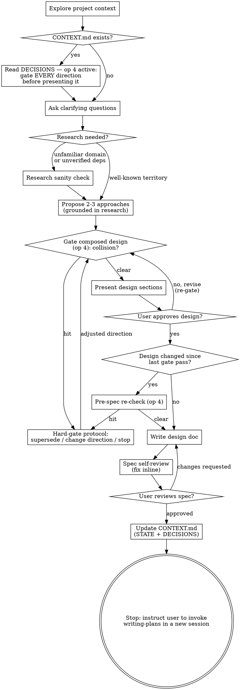

# Brainstorming Early Gate — Design

**Date:** 2026-07-11
**Status:** approved design, pending implementation
**Scope:** `skills/brainstorming/SKILL.md` only

## Problem

Brainstorming's only hard op-4 checkpoint sits at step 8 — after the user has approved the design section by section. That is approve-then-warn: a collision with a recorded decision surfaces only after the approval dialogue was invested, invalidating it.

Contributing weaknesses in the current skill text (post-`0ca016b`):

1. The flow diagram shows the conflict gate only as the post-approval diamond; the early check (step 2) is a plain box with no collision edge. A model following the diagram sees enforcement only late.
2. Step 2's gating obligation names only "the request or an approach you are about to propose". Design content composed from Q&A answers, and revisions made during the approval loop, have no explicit gate before being presented.
3. The revision edge ("no, revise → Present design sections") bypasses any gate node.

Prior art confirms brainstorming is the outlier: writing-plans gates "before writing any task", executing-plans gates at start (step 3), subagent-driven-development gates before dispatching Task 1. project-registry op 4's own "When" clause already lists "a clarifying-question set, proposed approaches, an approved design" as gate inputs — brainstorming implements only a subset.

## Decision

Gate every direction before presenting it; demote the post-approval check to a conditional pre-spec re-check (approach A). The user never approves — or even sees — a direction that collides with an active D-entry, except through the hard-gate protocol.

## Changes

### Checklist steps 2, 7, 8 (verbatim replacements)

> 2. **Project registry check (active)** — if `docs/superpowers/CONTEXT.md` exists, read DECISIONS and hold the active entries for the whole session (project-registry op 4, conflict gate). Standing obligations: never ask a clarifying question an active D-entry already answers — declare the assumption with its ID instead; and gate EVERY direction before presenting it — a clarifying-question set, proposed approaches, a composed design, a revision: the moment it collides with an active entry, run the gate protocol instead of presenting it.
>
> 7. **Gate, then present design** — run op 4 against the composed design before showing it; then present in sections scaled to their complexity, get user approval after each section. Any revision passes the gate again before being re-presented.
>
> 8. **Pre-spec re-check (safety net)** — if any design content changed or was added since its last op-4 pass (e.g. amendments accepted during the approval dialogue), run op 4 once more before writing the spec; otherwise skip — the design was already gated. A collision stops work until your human partner picks supersede / change direction / stop.

Step numbering 1–13 is preserved; Refactoring Mode's pointers to steps 3/4/6/7/12 remain valid.

### Process Flow digraph (full replacement)

Deliberate simplifications: gating of clarifying-question sets and approach lists stays in the step-2 text and the relabeled start node — separate diamonds for them would clutter the graph. The hard-gate protocol's "stop" outcome ends the session; the diagram shows only the continue paths (a/b).

### Prose ("The Process") — two new bullets

- **Exploring approaches:** an approach that collides with an active D-entry is never listed as a plain option — either drop it, or, if you believe it is the right direction, present the collision through the hard-gate protocol first.
- **Presenting the design:** run op 4 on the composed design before the first section goes out; re-gate any revised or added content before re-presenting it.

## Invariants

- **D-018** intact: all four check points survive; the safety net remains pre-spec (now conditional).
- **D-020** intact: every behavior keyed on `docs/superpowers/CONTEXT.md` existing.
- **D-017** intact: the hard-gate protocol lives only in project-registry; brainstorming references it.
- `skills/project-registry/SKILL.md` untouched — its op-4 "When" clause already covers all newly gated inputs.

## Approaches considered

- **B — wording-only patch** (broaden step 2, add a diagram edge, keep step 8 as-is): rejected on trade-offs — keeps approve-then-warn.
- **C — move the gate wholesale** (single pre-presentation gate, delete step 8): rejected on trade-offs — no net for content emerging during the approval dialogue.

## Testing

Pressure-test scenario for the eval harness (`evals/`, superpowers-evals): fixture repo with a CONTEXT.md containing an active `✗` entry. Four variants, judged before/after the skill-text change:

1. Collision in the initial request → gate fires before the first clarifying question.
2. Collision in a candidate approach → the approach is not listed as a plain option (dropped or gated).
3. Colliding amendment accepted during the approval dialogue → caught by the pre-spec re-check before the spec is written.
4. No collision anywhere → op 4 stays silent; no gate noise.

## Registry

On spec approval, record:

> D-021 ✓ brainstorming gates every direction before presenting it (question set, approaches, composed design, revisions); pre-spec check is a conditional re-check only — never approve-then-warn [2026-07-11](specs/2026-07-11-brainstorming-early-gate-design.md)
