<!-- The imperative "You MUST use this…" description is a deliberate, tested
     exception to the "Use when…" convention: the 2026-07-04 discriminator A/B
     run showed the "Use when…" rewrite regressed auto-triggering. Evidence:
     docs workspace, superpowers-j2v evals, 2026-07-04-audit-followups.md. -->

# Brainstorming Ideas Into Designs

Help turn ideas into fully formed designs and specs through natural collaborative dialogue.

Start by understanding the current project context, then ask questions one at a time to refine the idea. Once you understand what you're building, present the design and get user approval.

<HARD-GATE>
Do NOT invoke any implementation skill, write any code, scaffold any project, or take any implementation action until you have presented a design and the user has approved it. This applies to EVERY project regardless of perceived simplicity.
</HARD-GATE>

## Anti-Pattern: "This Is Too Simple To Need A Design"

Every project goes through this process. A todo list, a single-function utility, a config change — all of them. "Simple" projects are where unexamined assumptions cause the most wasted work. The design can be short (a few sentences for truly simple projects), but you MUST present it and get approval.

## Refactoring Mode

**When:** Restructuring code without changing behavior.

Checklist still applies, with these adaptations:
- **Step 3:** Skip (refactoring is structural, not visual)
- **Step 4:** Focus on what's wrong with current structure, boundaries to change, invariants to preserve
- **Step 6:** Propose structural options (extract module, split file, introduce interface, etc.)
- **Step 7:** Present target structure, not new functionality
- **Step 12:** Update CONTEXT.md STATE if structure changes. Usually no new D-entries — behavior unchanged; a direction condemned or reversed during the session was already recorded by op 3 at the moment it happened.

## Checklist

You MUST create a task for each of these items and complete them in order:

1. **Explore project context** — check files, docs, recent commits
2. **Project registry check (active)** — if `docs/superpowers/CONTEXT.md` exists, read DECISIONS and hold the active entries for the whole session (project-registry op 4, conflict gate). Standing obligations: never ask a clarifying question an active D-entry already answers — declare the assumption with its ID instead; and gate EVERY direction before presenting it — a clarifying-question set, proposed approaches, a composed design, a revision: the moment it collides with an active entry, run the gate protocol instead of presenting it.
3. **Offer the visual companion just-in-time** — NOT upfront. The first time a question would genuinely be clearer shown than described, offer it then (its own message); on approval its browser tab opens for you. If no visual question ever arises, never offer it. See the Visual Companion section below.
4. **Ask clarifying questions** — one at a time, understand purpose/constraints/success criteria
5. **Research check (two tiers)** — quick tier: verify key assumptions before proposing (prior art, library/API existence, domain patterns); skip when domain and tools are well-known. Then, in the same message where your clarifying questions end and BEFORE any approach, **write the research verdict** (format in the Deep Research section): name each design decision that is still genuinely open and give it one line — either `research candidate` plus which of the four criteria it hits (unfamiliar domain, architecture choice, library comparison, contested prior art), or `quick tier` plus the fact that settles it. A decision the existing code, an active D-entry, or your human partner's answers already fix is not open — don't list it; if that leaves nothing to list, write no verdict and go to step 6. Every decision the verdict marks a research candidate MUST go into a deep-research proposal, as its own message, before step 6, and dispatch only after your human partner accepts. An unwritten verdict is an unmade decision. See the Deep Research section below.
6. **Propose 2-3 approaches** — with trade-offs and your recommendation, grounded in research findings
7. **Gate, then present design** — run op 4 against the composed design before showing it; then present in sections scaled to their complexity, get user approval after each section. Any revision passes the gate again before being re-presented.
8. **Pre-spec re-check (safety net)** — if any design content changed or was added since its last op-4 pass (e.g. amendments accepted during the approval dialogue), run op 4 once more before writing the spec; otherwise skip — the design was already gated. A collision stops work until your human partner picks supersede / change direction / stop.
9. **Write design doc** — save to `docs/superpowers/specs/YYYY-MM-DD-<topic>-design.md` and commit; if deep research ran, the spec carries a decisions section and the full findings go to `docs/superpowers/research/YYYY-MM-DD-<topic>-analysis.md`, committed with it
10. **Spec self-review** — quick inline check for placeholders, contradictions, ambiguity, scope (see below)
11. **User reviews written spec** — ask user to review the spec file before proceeding
12. **Update CONTEXT.md** — create or update using project-registry skill (op 1 or 2): add the spec's STATE line, record the session's decisions as D-entries (✓ adopted; ✗ for directions explicitly condemned). Commit.
13. **Stop and hand off** — do NOT invoke writing-plans in this session; tell the user to start a fresh session and invoke writing-plans there

## Process Flow

```dot
digraph brainstorming {
    "Explore project context" [shape=box];
    "CONTEXT.md exists?" [shape=diamond];
    "Read DECISIONS — op 4 active:\ngate EVERY direction\nbefore presenting it" [shape=box];
    "Ask clarifying questions" [shape=box];
    "Research needed?" [shape=diamond];
    "Research sanity check (quick)" [shape=box];
    "Open decision needs\ndeep research?" [shape=diamond];
    "Propose deep research (own message):\nquestions, mode, subagent count" [shape=box];
    "Human partner accepts?" [shape=diamond];
    "Dispatch parallel read-only\nresearch subagents (one message)" [shape=box];
    "Present findings; partner approves\neach decision separately" [shape=box];
    "Propose 2-3 approaches\n(grounded in research)" [shape=box];
    "Gate composed design\n(op 4): collision?" [shape=diamond];
    "Hard-gate protocol:\nsupersede / change direction / stop" [shape=box];
    "Present design sections" [shape=box];
    "User approves design?" [shape=diamond];
    "Design changed since\nlast gate pass?" [shape=diamond];
    "Pre-spec re-check (op 4)" [shape=box];
    "Write design doc\n(+ research analysis file)" [shape=box];
    "Spec self-review\n(fix inline)" [shape=box];
    "User reviews spec?" [shape=diamond];
    "Update CONTEXT.md\n(STATE + DECISIONS)" [shape=box];
    "Stop: instruct user to invoke\nwriting-plans in a new session" [shape=doublecircle];

    "Explore project context" -> "CONTEXT.md exists?";
    "CONTEXT.md exists?" -> "Read DECISIONS — op 4 active:\ngate EVERY direction\nbefore presenting it" [label="yes"];
    "CONTEXT.md exists?" -> "Ask clarifying questions" [label="no"];
    "Read DECISIONS — op 4 active:\ngate EVERY direction\nbefore presenting it" -> "Ask clarifying questions";
    "Ask clarifying questions" -> "Research needed?";
    "Research needed?" -> "Research sanity check (quick)" [label="unfamiliar domain\nor unverified deps"];
    "Research needed?" -> "Open decision needs\ndeep research?" [label="well-known territory"];
    "Research sanity check (quick)" -> "Open decision needs\ndeep research?";
    "Open decision needs\ndeep research?" -> "Propose deep research (own message):\nquestions, mode, subagent count" [label="yes"];
    "Open decision needs\ndeep research?" -> "Propose 2-3 approaches\n(grounded in research)" [label="no"];
    "Propose deep research (own message):\nquestions, mode, subagent count" -> "Human partner accepts?";
    "Human partner accepts?" -> "Dispatch parallel read-only\nresearch subagents (one message)" [label="yes\n(list may be trimmed)"];
    "Human partner accepts?" -> "Propose 2-3 approaches\n(grounded in research)" [label="declined"];
    "Dispatch parallel read-only\nresearch subagents (one message)" -> "Present findings; partner approves\neach decision separately";
    "Present findings; partner approves\neach decision separately" -> "Propose 2-3 approaches\n(grounded in research)";
    "Propose 2-3 approaches\n(grounded in research)" -> "Propose deep research (own message):\nquestions, mode, subagent count" [label="per-approach mode:\ndeepen each sketch"];
    "Propose 2-3 approaches\n(grounded in research)" -> "Gate composed design\n(op 4): collision?";
    "Gate composed design\n(op 4): collision?" -> "Hard-gate protocol:\nsupersede / change direction / stop" [label="hit"];
    "Hard-gate protocol:\nsupersede / change direction / stop" -> "Gate composed design\n(op 4): collision?" [label="adjusted direction"];
    "Gate composed design\n(op 4): collision?" -> "Present design sections" [label="clear"];
    "Present design sections" -> "User approves design?";
    "User approves design?" -> "Gate composed design\n(op 4): collision?" [label="no, revise\n(re-gate)"];
    "User approves design?" -> "Design changed since\nlast gate pass?" [label="yes"];
    "Design changed since\nlast gate pass?" -> "Pre-spec re-check (op 4)" [label="yes"];
    "Design changed since\nlast gate pass?" -> "Write design doc\n(+ research analysis file)" [label="no"];
    "Pre-spec re-check (op 4)" -> "Write design doc\n(+ research analysis file)" [label="clear"];
    "Pre-spec re-check (op 4)" -> "Hard-gate protocol:\nsupersede / change direction / stop" [label="hit"];
    "Write design doc\n(+ research analysis file)" -> "Spec self-review\n(fix inline)";
    "Spec self-review\n(fix inline)" -> "User reviews spec?";
    "User reviews spec?" -> "Write design doc\n(+ research analysis file)" [label="changes requested"];
    "User reviews spec?" -> "Update CONTEXT.md\n(STATE + DECISIONS)" [label="approved"];
    "Update CONTEXT.md\n(STATE + DECISIONS)" -> "Stop: instruct user to invoke\nwriting-plans in a new session";
}
```

**The terminal state is stopping with a hand-off message.** Do NOT invoke writing-plans, frontend-design, mcp-builder, or any other implementation skill in this session. After brainstorming, this session ends — tell the user to start a fresh session and invoke writing-plans there. The fresh session picks up the committed spec and CONTEXT.md and produces the implementation plan.

## The Process

**Understanding the idea:**

- Check out the current project state first (files, docs, recent commits)
- Before asking detailed questions, assess scope: if the request describes multiple independent subsystems (e.g., "build a platform with chat, file storage, billing, and analytics"), flag this immediately. Don't spend questions refining details of a project that needs to be decomposed first.
- If the project is too large for a single spec, help the user decompose into sub-projects: what are the independent pieces, how do they relate, what order should they be built? Then brainstorm the first sub-project through the normal design flow. Each sub-project gets its own spec → plan → implementation cycle.
- For appropriately-scoped projects, ask questions one at a time to refine the idea
- Prefer multiple choice questions when possible, but open-ended is fine too
- Only one question per message - if a topic needs more exploration, break it into multiple questions
- Focus on understanding: purpose, constraints, success criteria
- Before asking, check the active D-entries (step 2): a question an active entry already answers is not asked — declare the assumption with its ID ("assuming per D-014: runner = operator")

**Research check — quick tier:**

Before proposing approaches, verify that key assumptions hold. This is a quick check, not exhaustive research.

- **Prior art**: Search for existing libraries, tools, or patterns that solve the same problem. If something well-maintained already exists, propose using it rather than building from scratch.
- **Dependency verification**: If you plan to suggest a specific library or API, confirm it exists, is maintained, and supports the version/features you'd reference.
- **Domain patterns**: When working in an unfamiliar domain, search for established patterns before reasoning from general knowledge.

Skip this step when the domain and tooling are well-known. When you do research, briefly share what you found before proposing approaches — "I checked and X library handles this, Y is deprecated, Z pattern is standard in this ecosystem."

When the quick check is not enough — an open decision turns on an architecture choice, a library comparison, or a domain whose patterns you would otherwise reason about from memory — propose the deep tier instead of guessing. See the Deep Research section below; it never runs unproposed and never runs unaccepted.

**Exploring approaches:**

- Ground proposals in research findings — reference specific libraries, APIs, or patterns discovered
- Propose 2-3 different approaches with trade-offs
- Present options conversationally with your recommendation and reasoning
- Lead with your recommended option and explain why
- An approach that collides with an active D-entry is never listed as a plain option — either drop it, or, if you believe it is the right direction, present the collision through the hard-gate protocol first
- The moment your human partner condemns a direction ("don't do X", "that was a mistake") or reverses a recorded decision, record it via project-registry op 3 (immediate write) — negative decisions never wait for the step-12 gate write

**Presenting the design:**

- Once you believe you understand what you're building, present the design
- Run op 4 on the composed design before the first section goes out; re-gate any revised or added content before re-presenting it
- Scale each section to its complexity: a few sentences if straightforward, up to 200-300 words if nuanced
- Ask after each section whether it looks right so far
- Cover: architecture, components, data flow, error handling, testing
- Be ready to go back and clarify if something doesn't make sense

**Design for isolation and clarity:**

- Break the system into smaller units that each have one clear purpose, communicate through well-defined interfaces, and can be understood and tested independently
- For each unit, you should be able to answer: what does it do, how do you use it, and what does it depend on?
- Can someone understand what a unit does without reading its internals? Can you change the internals without breaking consumers? If not, the boundaries need work.
- Smaller, well-bounded units are also easier for you to work with - you reason better about code you can hold in context at once, and your edits are more reliable when files are focused. When a file grows large, that's often a signal that it's doing too much.

**Working in existing codebases:**

- Explore the current structure before proposing changes. Follow existing patterns.
- Where existing code has problems that affect the work (e.g., a file that's grown too large, unclear boundaries, tangled responsibilities), include targeted improvements as part of the design - the way a good developer improves code they're working in.
- Don't propose unrelated refactoring. Stay focused on what serves the current goal.

## After the Design

**Documentation:**

- Write the validated design (spec) to `docs/superpowers/specs/YYYY-MM-DD-<topic>-design.md`
  - (User preferences for spec location override this default)
- If deep research ran, write the full findings to `docs/superpowers/research/YYYY-MM-DD-<topic>-analysis.md` and commit it together with the spec — the spec keeps the decisions and their short rationales; the analysis file keeps the rejected options, the comparisons, and the sources
- Use elements-of-style:writing-clearly-and-concisely skill if available
- Commit the design document to git

**Spec Self-Review:**
After writing the spec document, look at it with fresh eyes:

1. **Placeholder scan:** Any "TBD", "TODO", incomplete sections, or vague requirements? Fix them.
2. **Internal consistency:** Do any sections contradict each other? Does the architecture match the feature descriptions?
3. **Scope check:** Is this focused enough for a single implementation plan, or does it need decomposition?
4. **Ambiguity check:** Could any requirement be interpreted two different ways? If so, pick one and make it explicit.

Fix any issues inline. No need to re-review — just fix and move on.

**User Review Gate:**
After the spec review loop passes, ask the user to review the written spec before proceeding:

> "Spec written and committed to `<path>`. Please review it and let me know if you want to make any changes before we start writing out the implementation plan."

Wait for the user's response. If they request changes, make them and re-run the spec review loop. Only proceed once the user approves.

**Update CONTEXT.md:**

After the user approves the spec, update the project registry using the project-registry skill:
- If `docs/superpowers/CONTEXT.md` does not exist → create it (op 1)
- If it exists → update it (op 2 — record decisions)
- This adds the spec's STATE line and records D-entries: ✓ per the recording litmus, ✗ for directions explicitly condemned during the session
- Commit the CONTEXT.md changes

**Stop here — hand off to a fresh session:**

- Do NOT invoke writing-plans or any other implementation skill in this session
- Tell the user the brainstorming session is complete and they should start a fresh Claude session and invoke the writing-plans skill there
- The fresh session will pick up the committed spec and CONTEXT.md and produce the implementation plan
- Suggested hand-off message: "Brainstorming complete. Spec committed to `<path>` and CONTEXT.md updated. Start a fresh session and invoke `superpowers:writing-plans` to create the implementation plan."

## Key Principles

- **One question at a time** - Don't overwhelm with multiple questions
- **Multiple choice preferred** - Easier to answer than open-ended when possible
- **YAGNI ruthlessly** - Remove unnecessary features from all designs
- **Explore alternatives** - Always propose 2-3 approaches before settling
- **Incremental validation** - Present design, get approval before moving on
- **Be flexible** - Go back and clarify when something doesn't make sense

## Visual Companion

A browser-based companion for showing mockups, diagrams, and visual options during brainstorming. Available as a tool — not a mode. Accepting the companion means it's available for questions that benefit from visual treatment; it does NOT mean every question goes through the browser.

**Offering the companion (just-in-time):** Do NOT offer it upfront. Wait until a question would genuinely be clearer shown than told — a real mockup / layout / diagram question, not merely a UI *topic*. The first time that happens, offer it then, as its own message:
> "This next part might be easier if I show you — I can put together mockups, diagrams, and comparisons in a browser tab as we go. It's still new and can be token-intensive. Want me to? I'll open it for you."

**This offer MUST be its own message.** Only the offer — no clarifying question, summary, or other content. Wait for the user's response. If they accept, start the server with `--open` so their browser opens to the first screen automatically. If they decline, continue text-only and don't offer again unless they raise it.

**Per-question decision:** Even after the user accepts, decide FOR EACH QUESTION whether to use the browser or the terminal. The test: **would the user understand this better by seeing it than reading it?**

- **Use the browser** for content that IS visual — mockups, wireframes, layout comparisons, architecture diagrams, side-by-side visual designs
- **Use the terminal** for content that is text — requirements questions, conceptual choices, tradeoff lists, A/B/C/D text options, scope decisions

A question about a UI topic is not automatically a visual question. "What does personality mean in this context?" is a conceptual question — use the terminal. "Which wizard layout works better?" is a visual question — use the browser.

If they agree to the companion, read the detailed guide before proceeding:
`skills/brainstorming/visual-companion.md`

## Deep Research

Parallel read-only research subagents that settle open design decisions before the design is presented. Available as a tool — not a mode. Most brainstorms never need it: the quick tier (step 5) settles most questions, and a decision an active D-entry already answers is never a research question.

**The research verdict — write it, don't just think it.** When your clarifying questions are done, every design decision still open gets one line in that message, before any approach:

> **Research verdict** — offline merge strategy: research candidate (architecture choice, contested prior art)
> **Research verdict** — storage format: quick tier (SQLite, already used by the sync layer)

Then every line that says `research candidate` becomes a proposal before any approach is presented — not "may". Presenting 2-3 approaches with a recommendation forecloses the decision: from then on your human partner is choosing inside an option space you built from memory, and the question research would have answered is never asked. Propose first; approaches come after they accept or decline.

**Do NOT propose it** when the domain and tooling are well-known and the quick tier already settled the question, when an active D-entry answers it (declare the assumption with its ID instead), or when one sentence from your human partner answers it. A tier that proposes itself everywhere is worse than no tier.

**Proposing deep research (just-in-time):** every decision your verdict marked a research candidate goes into one proposal, as its own message:

> "Three decisions here need more than a quick check: <Q1>, <Q2>, <Q3>. I can dispatch 3 read-only research subagents in parallel — one per decision — and come back with options, trade-offs, and a recommendation for each. It's token-intensive. Want me to? Trim or edit the question list first if any of these are already settled for you."

**This proposal MUST be its own message.** Only the proposal — no clarifying question, no approaches, no design content. Wait for the answer. Nothing is dispatched until your human partner accepts; they may trim or edit the question list, and you dispatch exactly what they approved. If they decline, continue on the quick tier and don't propose again unless a new decision warrants it.

**Modes — pick one and name it in the proposal:**

- **Per-decision** — one open decision = one research question = one subagent. Runs before you propose approaches; the findings feed them.
- **Per-approach** — sketch 2-3 approaches first, then one subagent deepens each (feasibility, prior art, risks). Runs after the sketch, before your recommendation.

**Subagents never decide.** They are read-only fact-finders — codebase, web, library docs. They write no files and pick no direction. You synthesize, your human partner approves each decision separately, and every approved direction still passes the op-4 gate before it is presented.

**Red Flags — a verdict line resting on any of these is a research candidate, not a quick-tier settle:**

| Thought | Reality |
|---------|---------|
| "I already know the options here" | Naming the options is not comparing them. You are being asked which one survives contact with this problem, and that is the part you have not checked. |
| "I'll lay out the trade-offs and let my human partner choose" | They can only choose inside the option space you wrote from memory. The proposal is what gives them the choice of checking that space first. |
| "There's no mature library for this" / "that one is unmaintained" | That is a checkable fact about the world and you did not check it. What exists, what is maintained, what is deprecated — research questions, not recollections. |
| "The constraints we've settled already narrow this to one option" | Re-read the active entries. A constraint that rules out one option almost never picks the winner among the rest. If no active D-entry answers the question, it is still open. |
| "This is too token-intensive to be worth it here" | That call is your human partner's, and the proposal exists to hand it to them. Deciding the cost for them means deciding the design question for them. |

If they accept, read the detailed guide before dispatching:
`skills/brainstorming/research-subagents.md`
