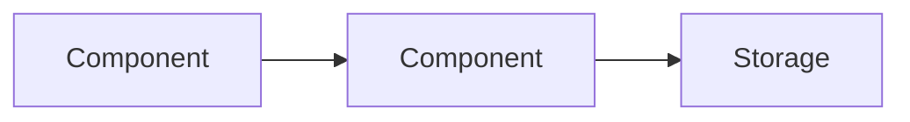

# PROJECT.md Template

Use this template when creating PROJECT.md for the first time.

```markdown
# PROJECT: [Name]

## SPECIFICATIONS

### Overview

- **Purpose:** [one sentence]
- **Domain:** [problem domain]

### Tech Stack

| Layer | Technology |
|-------|-----------|
| Language | |
| Framework | |
| Build | |
| Storage | |
| Testing | |

### Source Structure

- `src/` — [role]
- `src/components/` — [role]
- `src/lib/` — [role]

### Architecture

[Use bullet points for component responsibilities, tables for data contracts, mermaid diagrams for flows]



- **Component A** — [responsibility]
- **Component B** — [responsibility]

| Interface | Input | Output |
|-----------|-------|--------|
| | | |

### Development Setup

- **Prerequisites:** [required runtimes, tools, versions]
- **Install:** [install command]
- **Run:** [run command]

## STATE

Specs in development:

- [Spec title](specs/YYYY-MM-DD-feature-design.md)

## REQUIREMENTS

| ID | Requirement | Rationale | Status | Features |
|----|-------------|-----------|--------|----------|

**Status:** `active` (accepted, not yet built) · `implemented` (shipped) · `deprecated` (superseded)

## FEATURES

| ID | Feature | Date | Requirements |
|----|---------|------|-------------|
```
