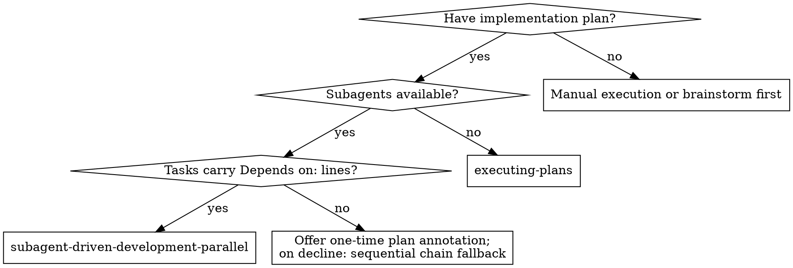
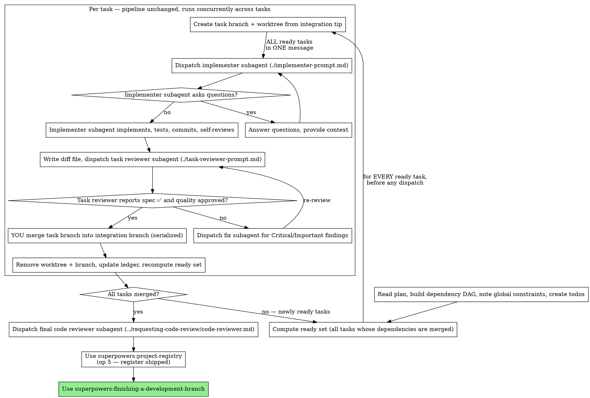

# Subagent-Driven Development — Parallel

Execute plan by dispatching a fresh implementer subagent per task, a task review (spec compliance + code quality) after each, and a broad whole-branch review at the end. Independent tasks run concurrently: the plan's `Depends on:` lines form a dependency DAG, and every task whose dependencies are all merged is dispatched immediately.

**Why subagents:** You delegate tasks to specialized agents with isolated context. By precisely crafting their instructions and context, you ensure they stay focused and succeed at their task. They should never inherit your session's context or history — you construct exactly what they need. This also preserves your own context for coordination work.

**Core principle:** Fresh subagent per task + task review (spec + quality) + broad final review + DAG-scheduled concurrency = high quality, minimal wall-clock

**Narration:** between tool calls, narrate at most one short line — the
ledger and the tool results carry the record.

**Continuous execution:** Do not pause to check in with your human partner between tasks. Execute all tasks from the plan without stopping. The only reasons to stop are: BLOCKED status you cannot resolve, ambiguity that genuinely prevents progress, or all tasks complete. "Should I continue?" prompts and progress summaries waste their time — they asked you to execute the plan, so execute it.

## When to Use



**vs. Executing Plans (no subagents):**
- Fresh subagent per task (no context pollution)
- Review after each task (spec compliance + code quality), broad review at the end
- Faster iteration (no human-in-loop between tasks)
- Independent tasks run concurrently — wall-clock scales with the DAG's critical path, not the task count

**vs. sequential superpowers:subagent-driven-development:** same per-task pipeline and quality gates; this skill schedules independent tasks concurrently. On a fully chained plan the DAG degenerates to sequential execution. If your human partner asks for strictly sequential execution, invoke superpowers:subagent-driven-development explicitly — that is the escape hatch.

## The Process



## Task States and Ready-Set Scheduling

Track every task through: `pending → ready → implementing → reviewing → fixing → merged`.

A task is **ready** when ALL its `Depends on:` tasks are **merged** — not merely review-clean. Its implementer branches from the integration branch tip, and only a merge puts the interfaces it consumes there.

Scheduling is event-driven — no wave barriers:

- Dispatch every ready task's implementer immediately, in ONE message — multiple dispatches run concurrently in the background.
- On each completion notification, advance that one task's pipeline a single step: implementer DONE → review package + task reviewer; review clean → merge; findings → fix subagent; fix reported → re-review.
- After every merge, recompute the ready set and dispatch newly ready tasks in the same turn.
- Never hold newly ready work until other running tasks finish — a slow task must not block independent DAG branches.

Inside a task nothing is parallel: its TDD cycle, review loop, and fixes stay strictly sequential in its own worktree.

**Failures don't stall the DAG:** handle BLOCKED, NEEDS_CONTEXT, and DONE_WITH_CONCERNS per task exactly as in Handling Implementer Status while the other pipelines keep running. A failed task's dependents stay pending; independent DAG branches continue. If a blocker is unresolvable, dispatch no new work and stop per the escalation rules.

**Legacy plans (no `Depends on:` lines):** treat the plan as a chain — Task N depends on Task N−1 — and offer your human partner a one-time annotation of the plan with real `Depends on:` lines before starting. On decline, execute the chain (sequential behavior).

## Pre-Flight Plan Review

Before the first dispatch, ensure the integration worktree exists (**REQUIRED SUB-SKILL:** superpowers:using-git-worktrees); its branch is the integration branch B. If `docs/superpowers/CONTEXT.md` exists, run project-registry op 4 (conflict gate) over the plan's tasks — the plan may predate a newer decision; registry gates belong to YOU, the coordinator, never to subagents. Mid-execution, the moment your human partner condemns a direction or reverses a recorded decision, record it via project-registry op 3 (immediate write) before dispatching further work. Then scan the plan once for conflicts:

- tasks that contradict each other or the plan's Global Constraints
- a dependency DAG problem: a cycle in the `Depends on:` lines; an interface
  a task Consumes that no declared dependency Produces (a missing edge); or
  two tasks with no dependency path between them whose `Files:` blocks
  overlap — they could run concurrently, so force an edge or a plan fix
- anything the plan explicitly mandates that the review rubric treats as a
  defect (a test that asserts nothing, verbatim duplication of a logic block)

Present everything you find to your human partner as one batched question —
each finding beside the plan text that mandates it, asking which governs —
before execution begins, not one interrupt per discovery mid-plan. If the
scan is clean, proceed without comment. The review loop remains the net for
conflicts that only emerge from implementation.

## Worktree-per-Task Protocol

- Create the integration worktree ONCE (superpowers:using-git-worktrees) with integration branch B. The plan and the progress ledger live here. **If your human partner declines worktree isolation, this skill does not apply — say so and use superpowers:subagent-driven-development instead.** Concurrent tasks in one checkout race git state and void every test result; there is no in-place variant of this protocol.
- When task T becomes ready, create its branch and worktree from the current tip of B and record the branch point — it is the task's review BASE:
  `git worktree add -b task/T <integration-worktree>-task-T B` (run from the integration worktree). Task worktrees are siblings of the integration worktree, one directory per task, named after it — an integration worktree at `../myproj-sync` gives `../myproj-sync-task-3`.
- The dispatch prompt names the task worktree path as the working directory. The implementer, every fix subagent, and every re-review for T use that same path. Do NOT use harness-native per-dispatch worktree isolation — the worktree must persist across the implementer → reviewer → fixer chain. A native worktree tool may stand in for the raw `git worktree add` only if it yields a persistent, named worktree that survives that whole chain.
- Task artifacts (brief, report, review package) live in the task worktree's own `.superpowers/sdd/`: run `scripts/task-brief` and `scripts/review-package` from inside the task worktree, pointing task-brief at the plan file in the integration worktree. The progress ledger is the exception — ONE file, in the integration worktree.
- The review pipeline per task is unchanged from sequential SDD (report file → review package over `BASE..task/T` → task reviewer → fix subagent → re-review); it simply runs concurrently across tasks.
- **Merging is yours, and serialized.** After a clean review, merge task/T into B — one merge at a time, never delegated to a subagent. On merge conflict, dispatch a fix subagent to rebase task/T onto B and resolve; a rebase invalidates the prior review verdict — the approved diff no longer exists — so regenerate the review package for the post-rebase range and re-review before merging.
- After a merge: `git worktree remove <task-worktree-path>`, `git branch -d task/T`, update the task's ledger line, recompute the ready set.

## Model Selection

Fixed two-model scheme with per-role effort. Do NOT set the
controller/session model or effort here — the operator sets those
(`/model opus`, `/effort high`). Per-role effort is delivered by two
predefined agents (`sdd-reviewer`, `sdd-rescue`) because the dispatch tool
honors `model` per call but exposes **no inline effort parameter** — an
inline `effort:` field is silently ignored, so a dispatched subagent
inherits the session effort unless it targets a predefined agent whose
frontmatter sets `effort`. The `sdd-reviewer` / `sdd-rescue` definitions are
stored under [deploy/agents/](../../deploy/agents/) — install them per that
directory's README so the dispatch names resolve.

**Normal implementer** (all implementation tasks): dispatch `general-purpose`
with `model: sonnet`. Effort inherits from the session — do NOT set effort
inline (ignored).

**Task reviewer AND final whole-branch reviewer:** dispatch the `sdd-reviewer`
agent (sonnet/xhigh).

**Fix subagent** (Critical/Important task findings, and the single fixer for
final-review findings): dispatch the `sdd-rescue` agent (opus/high) — a bad
fix triggers a re-review loop, so fixes get opus's minimal-diff, high-robustness
profile; the `sdd-reviewer` reviewer re-checks every fix anyway.

**BLOCKED escalation** ("needs more reasoning"): dispatch the `sdd-rescue`
agent (opus/high) — one decisive jump, NOT an effort ladder.

**Always specify the dispatch target explicitly** — the agent type
(`sdd-reviewer`, `sdd-rescue`), or `general-purpose` + `model: sonnet`. An
omitted model inherits your session's model — often the most capable and
most expensive — which silently defeats this routing. Per-role effort is
delivered by the two predefined agents because the dispatch tool exposes no
inline effort parameter.

**Turn count beats token price.** Wall-clock and context cost scale with how
many turns a subagent takes, and models below sonnet/medium routinely take
2-3× the turns on multi-step work — costing more overall. Never drop below
sonnet/medium for real work.

## Handling Implementer Status

Implementer subagents report one of four statuses. Handle each appropriately:

**DONE:** Generate the review package (`scripts/review-package BASE HEAD`, from this skill's directory — it prints the unique file path it wrote; BASE is the commit you recorded before dispatching the implementer — never `HEAD~1`, which silently drops all but the last commit of a multi-commit task), then dispatch the task reviewer with the printed path.

**DONE_WITH_CONCERNS:** The implementer completed the work but flagged doubts. Read the concerns before proceeding. If the concerns are about correctness or scope, address them before review. If they're observations (e.g., "this file is getting large"), note them and proceed to review.

**NEEDS_CONTEXT:** The implementer needs information that wasn't provided. Provide the missing context and re-dispatch.

**BLOCKED:** The implementer cannot complete the task. Assess the blocker:
1. If it's a context problem, provide more context and re-dispatch with the same model
2. If the task requires more reasoning, re-dispatch the "needs more reasoning"
   block via the `sdd-rescue` agent (opus/high) — one decisive jump
3. If the task is too large, break it into smaller pieces
4. If the plan itself is wrong, escalate to the human

**Never** ignore an escalation or force the same model to retry without changes. If the implementer said it's stuck, something needs to change.

## Verification Contract

Marking a task complete is a completion claim —
superpowers:verification-before-completion governs it. In this workflow
the required evidence is: the implementer's report file containing the
test commands and their output (TDD evidence), plus the task reviewer's
verdicts on the diff. Do not re-run the implementer's suite to
double-check a clean report — but never mark a task complete without
both pieces of evidence on file. The fresh full-suite verification
happens once, in superpowers:finishing-a-development-branch.

## Gated Testing Mode

When the project declares `## Gated testing` (activation, batch cycle, rounds: superpowers:test-driven-development — Gated Testing Mode), the plan groups tasks into phases with **Gate RED / Gate GREEN** steps. This section carves out the rules above; without the declaration it does not apply.

**Gates are legitimate stops.** Continuous Execution yields at gate steps: with the default operator runner you STOP, post the round request, and wait for the pasted output. (`Runner: claude` → run the round yourself and continue.) Gates belong to YOU, the main agent — subagents never emit round requests, never run gated tests, never talk to the operator.

**Phase orchestration** (within a gated phase, replaces the per-task dispatch order):

1. ONE test-writer subagent for the whole phase, working on the integration branch B directly (no task worktree — its RED commits must be in B before implementers branch off): dispatch it (implementer template) with every task's brief, instructed to execute ONLY the test-writing and RED-commit steps of each brief, to run at most the declared local subset, and never to attempt gated tests.
2. YOU run Gate RED, in the integration worktree. Invalid RED → fix subagent scoped to the affected test files → narrowed re-round.
3. After Gate RED, run the phase's tasks per this skill's scheduling: branch + worktree per ready task off B, honoring the `Depends on:` edges between the phase's tasks; per-task review; serialized merges into B. Tasks outside the phase stay pending. Every gated-phase dispatch (test-writer, implementer, fixer, reviewer) carries one line: `Gated testing mode — local subset: <command or none>; gated tests run only at gates, by the controller.`
4. Task reviewer per task, as usual — but mark a task complete only after the phase's Gate GREEN.
5. When every task of the phase is merged into B, YOU run Gate GREEN (full suite, no filter, in the integration worktree). Failures → ONE fix subagent with the complete findings, working on B directly → re-round. Refactor only after green.

**Verification Contract, gated:** for gated tests the required evidence is the round output YOU hold, recorded in the round ledger (`.superpowers/rounds.md`). Implementer reports NAME the gated tests covering their change instead of pasting their output; local-subset tests keep normal TDD evidence in the report. Task-complete requires all three: implementer report + reviewer verdicts + the covering Gate GREEN round.

## Handling Reviewer ⚠️ Items

The task reviewer may report "⚠️ Cannot verify from diff" items — requirements
that live in unchanged code or span tasks. These do not block the rest of the
review, but you must resolve each one yourself before marking the task
complete: you hold the plan and cross-task context the reviewer
lacks. If you confirm an item is a real gap, treat it as a failed spec
review — send it back to the implementer and re-review.

## Constructing Reviewer Prompts

Per-task reviews are task-scoped gates. The broad review happens once, at the
final whole-branch review. When you fill a reviewer template:

- Do not add open-ended directives like "check all uses" or "run race tests
  if useful" without a concrete, task-specific reason
- Do not ask a reviewer to re-run tests the implementer already ran on the
  same code — the implementer's report carries the test evidence
- Do not pre-judge findings for the reviewer — never instruct a reviewer to
  ignore or not flag a specific issue. If you believe a finding would be a
  false positive, let the reviewer raise it and adjudicate it in the review
  loop. If the prompt you are writing contains "do not flag," "don't treat X
  as a defect," "at most Minor," or "the plan chose" — stop: you are
  pre-judging, usually to spare yourself a review loop.
- The global-constraints block you hand the reviewer is its attention
  lens. Copy the binding requirements verbatim from the plan's Global
  Constraints section or the spec: exact values, exact formats, and the
  stated relationships between components ("same layout as X", "matches
  Y"). The reviewer's template already carries the process rules (YAGNI,
  test hygiene, review method) — the constraints block is for what THIS
  project's spec demands.
- Hand the reviewer its diff as a file: run this skill's
  `scripts/review-package BASE HEAD` and pass the reviewer the file path
  it prints (or, without bash: `git log --oneline`, `git diff --stat`,
  and `git diff -U10` for the range, redirected to one uniquely named
  file). The output never enters your own context, and the reviewer sees
  the commit list, stat summary, and full diff with context in one Read
  call. Use the BASE you recorded before dispatching the implementer —
  never `HEAD~1`, which silently truncates multi-commit tasks.
- A dispatch prompt describes one task, not the session's history. Do not
  paste accumulated prior-task summaries ("state after Tasks 1-3") into
  later dispatches — a real session's dispatch hit 42k chars of which 99%
  was pasted history. A fresh subagent needs its task, the interfaces it
  touches, and the global constraints. Nothing else.
- Dispatch fix subagents for Critical and Important findings. Record Minor
  findings in the progress ledger as you go, and point the final
  whole-branch review at that list so it can triage which must be fixed
  before merge. A roll-up nobody reads is a silent discard.
- A finding labeled plan-mandated — or any finding that conflicts with
  what the plan's text requires — is the human's decision, like any plan
  contradiction: present the finding and the plan text, ask which governs.
  Do not dismiss the finding because the plan mandates it, and do not
  dispatch a fix that contradicts the plan without asking.
- The final whole-branch review gets a package too: run
  `scripts/review-package MERGE_BASE HEAD` (MERGE_BASE = the commit the
  branch started from, e.g. `git merge-base main HEAD`) and include the
  printed path in the final review dispatch, so the final reviewer reads
  one file instead of re-deriving the branch diff with git commands.
- Every fix dispatch carries the implementer contract: the fix subagent
  re-runs the tests covering its change and reports the results. Name the
  covering test files in the dispatch — a one-line fix does not need the
  whole suite. Before re-dispatching the reviewer, confirm the fix report
  contains the covering tests, the command run, and the output; dispatch
  the re-review once all three are present.
- If the final whole-branch review returns findings, dispatch ONE fix
  subagent with the complete findings list — not one fixer per finding.
  Per-finding fixers each rebuild context and re-run suites; a real
  session's final-review fix wave cost more than all its tasks combined.

## File Handoffs

Everything you paste into a dispatch prompt — and everything a subagent
prints back — stays resident in your context for the rest of the session
and is re-read on every later turn. Hand artifacts over as files — in this skill, run the scripts inside the task's own worktree (Worktree-per-Task Protocol) so each concurrent task keeps its own `.superpowers/sdd/` workspace:

- **Task brief:** before dispatching an implementer, run this skill's
  `scripts/task-brief PLAN_FILE N` — it extracts the task's full text to a
  uniquely named file and prints the path. Compose the dispatch so the
  brief stays the single source of requirements. Your dispatch should
  contain: (1) one line on where this task fits in the project; (2) the
  brief path, introduced as "read this first — it is your requirements,
  with the exact values to use verbatim"; (3) interfaces and decisions
  from earlier tasks that the brief cannot know; (4) your resolution of
  any ambiguity you noticed in the brief; (5) the report-file path and
  report contract. Exact values (numbers, magic strings, signatures, test
  cases) appear only in the brief.
- **Report file:** name the implementer's report file after the brief
  (brief `…/task-N-brief.md` → report `…/task-N-report.md`) and put it in
  the dispatch prompt. The implementer writes the full report there and
  returns only status, commits, a one-line test summary, and concerns.
- **Reviewer inputs:** the task reviewer gets three paths — the same brief
  file, the report file, and the review package — plus the global
  constraints that bind the task.
- Fix dispatches append their fix report (with test results) to the same
  report file and return a short summary; re-reviews read the updated file.

## Durable Progress

Conversation memory does not survive compaction. In real sessions,
controllers that lost their place have re-dispatched entire completed task
sequences — the single most expensive failure observed. Track progress in
a ledger file, not only in todos.

- At skill start, check for a ledger:
  `cat "$(git rev-parse --show-toplevel)/.superpowers/sdd/progress.md"`. Tasks listed there
  as complete are DONE — do not re-dispatch them; resume at the first task
  not marked complete.
- On every task state change, rewrite that task's ledger line in the same
  message as your other bookkeeping:
  `Task N: <state> — branch task/N, worktree <path>, commits <base7>..<head7>, reviews: <verdicts>`.
  After the merge the line ends as:
  `Task N: merged — commits <base7>..<head7>, reviews clean`.
- The ledger is your recovery map: the commits it names exist in git even
  when your context no longer remembers creating them. After compaction,
  trust the ledger and `git log` over your own recollection. Reconstruct
  scheduler state from the ledger plus `git log` (merged tasks are in B's
  history) and `git worktree list` (live task worktrees are in-flight
  tasks); a task recorded as merged is never re-dispatched.
- `git clean -fdx` will destroy the ledger (it's git-ignored scratch); if
  that happens, recover from `git log`.

## Prompt Templates

- [implementer-prompt.md](implementer-prompt.md) - Dispatch implementer subagent
- [task-reviewer-prompt.md](task-reviewer-prompt.md) - Dispatch task reviewer subagent (spec compliance + code quality)
- Final whole-branch review: use superpowers:requesting-code-review's [code-reviewer.md](../requesting-code-review/code-reviewer.md)

**Dispatch every reviewer through the `sdd-reviewer` agent** (sonnet/xhigh) with the templates above — never a specialized/registered code-review agent (e.g. `feature-dev:code-reviewer`), even when one is available and looks purpose-built. Such agents override the template with their own methodology; `sdd-reviewer` is a bare passthrough that carries only model and effort, so the template still governs. This routing is fixed, not a per-dispatch judgment call: implementer → `general-purpose`+`sonnet`, task/final reviewer → `sdd-reviewer`, fixer + BLOCKED "needs more reasoning" → `sdd-rescue`.

## Example Workflow

```
You: I'm using Subagent-Driven Development — Parallel to execute this plan.

[Read plan once; build the DAG from Depends on: lines —
 Task 1: none; Task 2: none; Task 3: after 1, 2; Task 4: after 3]
[Create todos; ensure integration worktree with branch B]

Ready set: {1, 2}

[Create task/1 and task/2 branches + worktrees off B; run task-brief for
 each in its own worktree]
[ONE message: dispatch implementer for Task 1 AND implementer for Task 2]

Task 1 implementer: DONE — 5/5 passing, committed.
[Run review-package in task-1 worktree; dispatch task reviewer]
Task 1 reviewer: Spec ✅. Task quality: Approved.
[YOU merge task/1 into B; remove worktree + branch; ledger:
 Task 1: merged — commits a1b2c3d..d4e5f6a, reviews clean]
Ready set: {} — Task 3 still waits for Task 2

Task 2 implementer: DONE — 8/8 passing.
[review-package; dispatch task reviewer]
Task 2 reviewer: Spec ❌ — missing progress reporting. Important: magic number.
[Dispatch fix subagent in the task-2 worktree]
Fixer: fixed both, covering tests re-run, report appended.
[Regenerate review package; re-review]
Task 2 reviewer: Spec ✅. Task quality: Approved.
[YOU merge task/2 into B — merge conflicts with Task 1's changes:
 dispatch fix subagent to rebase task/2 onto B; rebase invalidates the
 verdict → regenerate package for the post-rebase range → re-review →
 clean → merge]
Ready set: {3}

[Create task/3 branch + worktree from B tip; dispatch implementer]
...Task 3 merges → ready set {4} → Task 4 merges.

[Dispatch final code reviewer: sdd-reviewer agent +
 requesting-code-review/code-reviewer.md over MERGE_BASE..B]
Final reviewer: All requirements met, ready to merge.

[Use superpowers:project-registry (op 5 — register shipped)]
[Use superpowers:finishing-a-development-branch]

Done!
```

## Advantages

**vs. Manual execution:**
- Subagents follow TDD naturally
- Fresh context per task (no confusion)
- Parallel-safe (subagents don't interfere)
- Subagent can ask questions (before AND during work)

**vs. Executing Plans:**
- Fresh subagent per task (isolated context)
- Automatic per-task review gates
- Continuous progress (no waiting)

**Efficiency gains:**
- Wall-clock scales with the DAG's critical path, not the task count
- Controller curates exactly what context is needed; bulk artifacts move
  as files, not pasted text
- Subagent gets complete information upfront
- Questions surfaced before work begins (not after)

**Quality gates:**
- Self-review catches issues before handoff
- Task review carries two verdicts: spec compliance and code quality
- Review loops ensure fixes actually work
- Spec compliance prevents over/under-building
- Code quality ensures implementation is well-built

**Cost:**
- More subagent invocations (implementer + reviewer per task)
- Controller does more prep work (extracting all tasks upfront)
- Review loops add iterations
- But catches issues early (cheaper than debugging later)

## Red Flags

**Never:**
- Start implementation on main/master branch without explicit user consent
- Skip task review, or accept a report missing either verdict (spec compliance AND task quality are both required)
- Proceed with unfixed issues
- Run two subagents concurrently in the same worktree
- Dispatch a task whose dependencies are not ALL merged (review-clean is not merged)
- Merge a branch state that was not itself review-approved — a rebase or any post-review commit invalidates the verdict; re-review first
- Delegate a merge or a gate to a subagent — merges and gates are yours
- Run two tasks concurrently whose `Files:` blocks overlap
- Make a subagent read the whole plan file (hand it its task brief —
  `scripts/task-brief` — instead)
- Skip scene-setting context (subagent needs to understand where task fits)
- Ignore subagent questions (answer before letting them proceed)
- Accept "close enough" on spec compliance (reviewer found spec issues = not done)
- Skip review loops (reviewer found issues = implementer fixes = review again)
- Let implementer self-review replace actual review (both are needed)
- Tell a reviewer what not to flag, or pre-rate a finding's severity in the
  dispatch prompt ("treat it as Minor at most") — the plan's example code is
  a starting point, not evidence that its weaknesses were chosen
- Dispatch a task reviewer without a diff file — generate it first
  (`scripts/review-package BASE HEAD`) and name the printed path in the
  prompt
- Merge/finalize a task while its review has open Critical/Important issues
- Re-dispatch a task the progress ledger already marks complete — check
  the ledger (and `git log`) after any compaction or resume
- Dispatch any reviewer via a specialized/registered code-review agent (e.g. `feature-dev:code-reviewer`) instead of the `sdd-reviewer` agent + the reviewer template

**If subagent asks questions:**
- Answer clearly and completely
- Provide additional context if needed
- Don't rush them into implementation

**If reviewer finds issues:**
- Implementer (same subagent) fixes them
- Reviewer reviews again
- Repeat until approved
- Don't skip the re-review

**If subagent fails task:**
- Dispatch fix subagent with specific instructions
- Don't try to fix manually (context pollution)

## Integration

**Required workflow skills:**
- **superpowers:using-git-worktrees** - Ensures isolated workspace (creates one or verifies existing)
- **superpowers:writing-plans** - Creates the plan this skill executes
- **superpowers:requesting-code-review** - Code review template for the final whole-branch review
- **superpowers:project-registry** - Register shipped feature in CONTEXT.md (op 5) after final review, before finishing
- **superpowers:finishing-a-development-branch** - Complete development after all tasks

**Subagents should use:**
- **superpowers:test-driven-development** - Subagents follow TDD for each task, unless the task brief explicitly waives it

**Alternative workflows:**
- **superpowers:subagent-driven-development** - Sequential fallback: tightly-coupled plans, or when your human partner asks for strictly sequential execution
- **superpowers:executing-plans** - Use when subagent dispatch is unavailable
