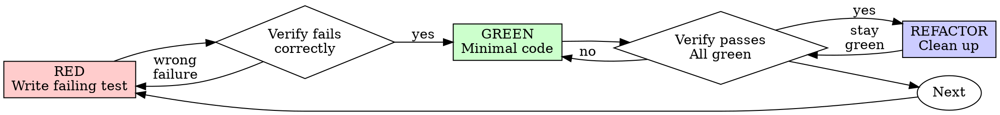

# Test-Driven Development (TDD)

## Overview

Write the test first. Watch it fail. Write minimal code to pass.

**Core principle:** If you didn't watch the test fail, you don't know if it tests the right thing.

**Violating the letter of the rules is violating the spirit of the rules.**

## When to Use

**Always:**
- New features
- Bug fixes
- Refactoring
- Behavior changes

**Exceptions (ask your human partner):**
- Throwaway prototypes
- Generated code
- Configuration files

Thinking "skip TDD just this once"? Stop. That's rationalization.

## The Iron Law

```
NO PRODUCTION CODE WITHOUT A FAILING TEST FIRST
```

Write code before the test? Delete it. Start over.

**No exceptions:**
- Don't keep it as "reference"
- Don't "adapt" it while writing tests
- Don't look at it
- Delete means delete

Implement fresh from tests. Period.

## Red-Green-Refactor



### RED - Write Failing Test

Write one minimal test showing what should happen.

<Good>
```typescript
test('retries failed operations 3 times', async () => {
  let attempts = 0;
  const operation = () => {
    attempts++;
    if (attempts < 3) throw new Error('fail');
    return 'success';
  };

  const result = await retryOperation(operation);

  expect(result).toBe('success');
  expect(attempts).toBe(3);
});
```
Clear name, tests real behavior, one thing
</Good>

<Bad>
```typescript
test('retry works', async () => {
  const mock = jest.fn()
    .mockRejectedValueOnce(new Error())
    .mockRejectedValueOnce(new Error())
    .mockResolvedValueOnce('success');
  await retryOperation(mock);
  expect(mock).toHaveBeenCalledTimes(3);
});
```
Vague name, tests mock not code
</Bad>

**Requirements:**
- One behavior
- Clear name
- Real code (no mocks unless unavoidable)

### Verify RED - Watch It Fail

**MANDATORY. Never skip.**

```bash
npm test path/to/test.test.ts
```

Confirm:
- Test fails (not errors)
- Failure message is expected
- Fails because feature missing (not typos)

**Test passes?** You're testing existing behavior. Fix test.

**Test errors?** Fix error, re-run until it fails correctly.

### GREEN - Minimal Code

Write simplest code to pass the test.

<Good>
```typescript
async function retryOperation<T>(fn: () => Promise<T>): Promise<T> {
  for (let i = 0; i < 3; i++) {
    try {
      return await fn();
    } catch (e) {
      if (i === 2) throw e;
    }
  }
  throw new Error('unreachable');
}
```
Just enough to pass
</Good>

<Bad>
```typescript
async function retryOperation<T>(
  fn: () => Promise<T>,
  options?: {
    maxRetries?: number;
    backoff?: 'linear' | 'exponential';
    onRetry?: (attempt: number) => void;
  }
): Promise<T> {
  // YAGNI
}
```
Over-engineered
</Bad>

Don't add features, refactor other code, or "improve" beyond the test.

### Verify GREEN - Watch It Pass

**MANDATORY.**

```bash
npm test path/to/test.test.ts
```

Confirm:
- Test passes
- Other tests still pass
- Output pristine (no errors, warnings)

**Test fails?** Fix code, not test.

**Other tests fail?** Fix now.

### REFACTOR - Clean Up

After green only:
- Remove duplication
- Improve names
- Extract helpers

Keep tests green. Don't add behavior.

### Repeat

Next failing test for next feature.

## Good Tests

| Quality | Good | Bad |
|---------|------|-----|
| **Minimal** | One thing. "and" in name? Split it. | `test('validates email and domain and whitespace')` |
| **Clear** | Name describes behavior | `test('test1')` |
| **Shows intent** | Demonstrates desired API | Obscures what code should do |

## Why Order Matters

**"I'll write tests after to verify it works"**

Tests written after code pass immediately. Passing immediately proves nothing:
- Might test wrong thing
- Might test implementation, not behavior
- Might miss edge cases you forgot
- You never saw it catch the bug

Test-first forces you to see the test fail, proving it actually tests something.

**"I already manually tested all the edge cases"**

Manual testing is ad-hoc. You think you tested everything but:
- No record of what you tested
- Can't re-run when code changes
- Easy to forget cases under pressure
- "It worked when I tried it" ≠ comprehensive

Automated tests are systematic. They run the same way every time.

**"Deleting X hours of work is wasteful"**

Sunk cost fallacy. The time is already gone. Your choice now:
- Delete and rewrite with TDD (X more hours, high confidence)
- Keep it and add tests after (30 min, low confidence, likely bugs)

The "waste" is keeping code you can't trust. Working code without real tests is technical debt.

**"TDD is dogmatic, being pragmatic means adapting"**

TDD IS pragmatic:
- Finds bugs before commit (faster than debugging after)
- Prevents regressions (tests catch breaks immediately)
- Documents behavior (tests show how to use code)
- Enables refactoring (change freely, tests catch breaks)

"Pragmatic" shortcuts = debugging in production = slower.

**"Tests after achieve the same goals - it's spirit not ritual"**

No. Tests-after answer "What does this do?" Tests-first answer "What should this do?"

Tests-after are biased by your implementation. You test what you built, not what's required. You verify remembered edge cases, not discovered ones.

Tests-first force edge case discovery before implementing. Tests-after verify you remembered everything (you didn't).

30 minutes of tests after ≠ TDD. You get coverage, lose proof tests work.

## Common Rationalizations

| Excuse | Reality |
|--------|---------|
| "Too simple to test" | Simple code breaks. Test takes 30 seconds. |
| "I'll test after" | Tests passing immediately prove nothing. |
| "Tests after achieve same goals" | Tests-after = "what does this do?" Tests-first = "what should this do?" |
| "Already manually tested" | Ad-hoc ≠ systematic. No record, can't re-run. |
| "Deleting X hours is wasteful" | Sunk cost fallacy. Keeping unverified code is technical debt. |
| "Keep as reference, write tests first" | You'll adapt it. That's testing after. Delete means delete. |
| "Need to explore first" | Fine. Throw away exploration, start with TDD. |
| "Test hard = design unclear" | Listen to test. Hard to test = hard to use. |
| "TDD will slow me down" | TDD faster than debugging. Pragmatic = test-first. |
| "Manual test faster" | Manual doesn't prove edge cases. You'll re-test every change. |
| "Existing code has no tests" | You're improving it. Add tests for existing code. |

## Red Flags - STOP and Start Over

- Code before test
- Test after implementation
- Test passes immediately
- Can't explain why test failed
- Tests added "later"
- Rationalizing "just this once"
- "I already manually tested it"
- "Tests after achieve the same purpose"
- "It's about spirit not ritual"
- "Keep as reference" or "adapt existing code"
- "Already spent X hours, deleting is wasteful"
- "TDD is dogmatic, I'm being pragmatic"
- "This is different because..."

**All of these mean: Delete code. Start over with TDD.**

## Example: Bug Fix

**Bug:** Empty email accepted

**RED**
```typescript
test('rejects empty email', async () => {
  const result = await submitForm({ email: '' });
  expect(result.error).toBe('Email required');
});
```

**Verify RED**
```bash
$ npm test
FAIL: expected 'Email required', got undefined
```

**GREEN**
```typescript
function submitForm(data: FormData) {
  if (!data.email?.trim()) {
    return { error: 'Email required' };
  }
  // ...
}
```

**Verify GREEN**
```bash
$ npm test
PASS
```

**REFACTOR**
Extract validation for multiple fields if needed.

## Verification Checklist

Before marking work complete:

- [ ] Every new function/method has a test
- [ ] Watched each test fail before implementing
- [ ] Each test failed for expected reason (feature missing, not typo)
- [ ] Wrote minimal code to pass each test
- [ ] All tests pass
- [ ] Output pristine (no errors, warnings)
- [ ] Tests use real code (mocks only if unavoidable)
- [ ] Edge cases and errors covered

Can't check all boxes? You skipped TDD. Start over.

## When Stuck

| Problem | Solution |
|---------|----------|
| Don't know how to test | Write wished-for API. Write assertion first. Ask your human partner. |
| Test too complicated | Design too complicated. Simplify interface. |
| Must mock everything | Code too coupled. Use dependency injection. |
| Test setup huge | Extract helpers. Still complex? Simplify design. |

## Debugging Integration

Bug found? Write failing test reproducing it. Follow TDD cycle. Test proves fix and prevents regression.

Never fix bugs without a test.

## Testing Anti-Patterns

When adding mocks or test utilities, read [testing-anti-patterns.md](testing-anti-patterns.md) to avoid common pitfalls:
- Testing mock behavior instead of real behavior
- Adding test-only methods to production classes
- Mocking without understanding dependencies

## Final Rule

```
Production code → test exists and failed first
Otherwise → not TDD
```

No exceptions without your human partner's permission.

## Gated Testing Mode

Some projects declare that (some or all) tests run on a system you cannot reach: an operator copies the files, runs one command, and pastes the output back — or you run the command on that system yourself. In this mode RED/GREEN verification is batched at explicit gates. Everything above stays true; only WHERE verification happens changes.

### Activation — explicit only

The literal heading `## Gated testing` in the project's CLAUDE.md activates the mode. Optional override lines beneath the heading — everything else is fixed by this section; there is no other configuration:

```markdown
## Gated testing
Runner: claude
Local subset: uv run pytest -m "not integration"
```

- `Runner: claude` — you execute round commands on the test system yourself. Default: operator (your human partner runs them and pastes the output).
- `Local subset: <command/filter>` — tests you CAN run locally; they keep the classic per-test cycle above. Default: none — all tests gated.

In-session activation: your human partner declares it ("I run the tests on X myself"). Confirm runner and local subset, then offer to persist the `## Gated testing` block in the project's CLAUDE.md.

**No declaration → this section does not exist for you. Classic TDD, unchanged. Never enter the mode silently.**

### Anti-Improvisation Rule

You cannot execute a test and no gated-testing declaration exists? **STOP and ask your human partner.** Never write implementation on top of an unverified RED. Writing test and implementation back-to-back because "the test is obviously correct" is testing after, with extra steps.

### The Iron Law, Gated

```
NO IMPLEMENTATION FOR A TASK BEFORE THE PHASE'S RED GATE
CONFIRMS ITS TESTS FAIL FOR THE RIGHT REASON
```

### Batch Cycle (per plan phase)

A phase is a group of 2–5 related tasks drawn by superpowers:writing-plans; gates are explicit plan steps.

1. Write ALL the phase's gated tests — one RED commit per task. Tests for later tasks build on the plan's Interfaces blocks, not on implemented code.
2. **Gate RED** — round over the phase's new tests only.
3. Implement ALL the phase's tasks — one GREEN commit per task. Local-subset tests keep the classic per-test micro-cycle while you implement.
4. **Gate GREEN** — round over the FULL suite, no filter.
5. Refactor — only after Gate GREEN. Then the next phase.

### Round Request

Produce this at every gate. `Runner: claude` → execute the command yourself; otherwise post it and WAIT for your human partner's pasted output.

```
ROUND <n> — RED|GREEN, phase "<name>"
Source:  <worktree root>
Files:   <relative paths of files to copy>
Command: <single short one-line command>
Expected: <e.g. "6 failed, 0 errors — all new tests">
Paste back: the run's summary counts + every failure/error with its message; passing tests stay out of the paste
```

The `Paste back:` line is part of every round request, verbatim — it tells the operator what to return. The counts and the failures carry the whole verdict; a full per-test log only burns context.

- `<n>` is global within the feature branch. Append to the round ledger — `.superpowers/rounds.md` at the repo root — one line when a round is issued and one when its verdict is judged — EXACTLY these one-line formats, no extra fields or lines: `ROUND <n> RED|GREEN phase "<name>" — issued` / `ROUND <n> verdict: <what the output showed>`. A narrowed re-round may append `(narrowed: <files>)` to its issued line. After context compaction, trust the ledger.
- Use output-friendly flags (e.g. `pytest -q --tb=short`) — pastes must stay small.

### Valid RED — judge every new test in the output

| Round shows | Verdict | Action |
|---|---|---|
| Assertion failure on the missing behavior | Valid RED | proceed |
| Clean "object/module does not exist" error | Valid RED | proceed |
| Test-file syntax error, fixture/collection error, connection error | INVALID | fix the tests → re-round narrowed to the affected files |

Gate GREEN failures: fix the code — never the test — then a narrowed or full GREEN re-round. A phase ends only green.

### Evidence Freshness

Round output verifies ONLY the exact code state the round was generated for. Any later edit — code or tests — invalidates it. Claim only what the output shows.

### Commit Discipline (gated mode only)

Within a phase: every task's RED commit(s) land before any task's GREEN commit(s), never mixed — git log mirrors the round structure, RED-first, GREEN-second.

### Gated Rationalizations

| Excuse | Reality |
|--------|---------|
| "I can't run it, but the test is obviously correct" | Unverified RED. Gate round or STOP and ask. |
| "I'll draft the implementation while the round is out" | Implementation before RED verification. Wait at the gate. |
| "The operator is busy — one combined RED+GREEN round saves a trip" | The phase IS the batching. Gates stay separate. |
| "The round passed an hour ago; my edit was trivial" | Any edit invalidates round evidence. Re-round. |
| "Only one test errored — close enough to RED" | Every test must fail for the right reason. Fix tests, narrowed re-round. |
| "I'll work autonomously and ask for one verification at the end, instead of stopping at each gate" | Skips every gate, not just merges two. Gate each phase as you go — no single end-of-task check. |
| "The module doesn't exist yet — that's the RED state, no need to run it" | A diagnostic (missing file, import error) is not a round. Gate it for a Valid RED verdict. |
| "I can't run it locally, so I'll prepare the commands and keep implementing" | Preparing a command is not gating. STOP before writing implementation, don't just queue the ask. |
| "Every step landed as a RED/GREEN commit, so TDD was followed" | Commit shape without verified round output proves nothing. Claim only what a round showed. |
| "I ran the assertions by hand with plain python — not pytest, but enough to proceed" | An improvised verification channel is not a round. Only gate output counts. |
| "I'll write the tests as plain asserts, runnable through a channel the gate doesn't block" | Engineering tests to dodge the gate. Gated tests go through the gate, period. |
| "I'll run the gated command once, just to confirm it's really unavailable" | Probing the gated command IS running gated tests. Trust the declaration; go straight to the round request. |
